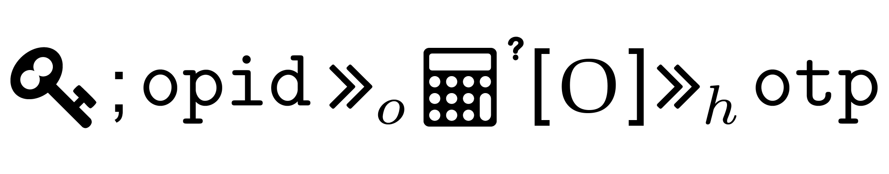
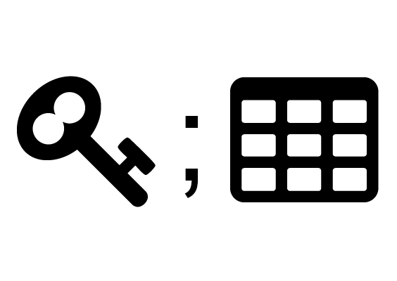
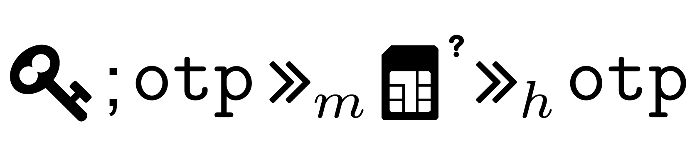
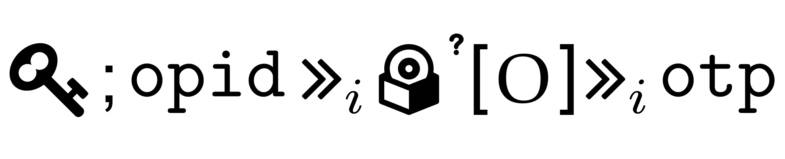
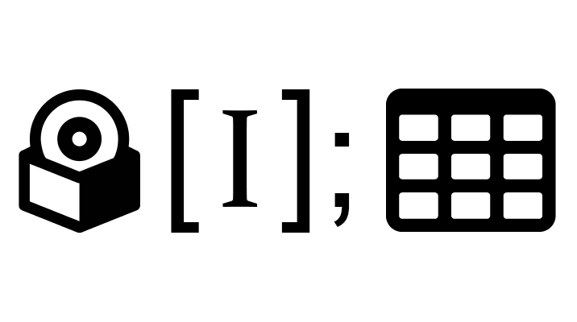
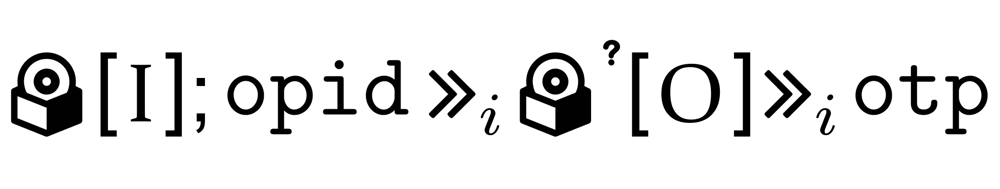

# Deutsche Bank

## Sources
[Main Website](https://www.deutsche-bank.de/pk.html),	[Account Info](https://www.deutsche-bank.de/pfb/content/pk-digital-banking-uebersicht.html),	[FAQs](https://www.deutsche-bank.de/pk/digital-banking/weitere-themen/faq-s.html),	[HW Authenticator](https://www.deutsche-bank.de/pfb/data/docs/pk-digital-banking-photo-tan-bedienungsanleitung-lesegeraet.pdf),	[SW Authenticator](https://www.deutsche-bank.de/pk/digital-banking/sicherheit/phototan.html),	[SMS](https://www.deutsche-bank.de/pfb/content/pk-digital-banking-mobile-tan.html), [Mobile App](https://play.google.com/store/apps/details?id=com.db.pwcc.dbmobile),	[App Authenticator](https://play.google.com/store/apps/details?id=com.db.pbc.phototan.db),	[Interactive Demo](https://secure.deutsche-bank.de/pbc/trxmdemokonto/loginpin/goto.do),	[Video Tutorial](https://www.youtube.com/watch?v=UxXXrSWCRsc),	 [Video Overview](https://www.youtube.com/watch?v=iUlRmDM4opQ) 

## Implementation details

### Identity proofing

- Local branch

### Authenticators

| 		| QR Code Reader | Look-up Secret | SIM card | Software Authenticator | Fingerprint |
| --- | --- | --- | --- | --- | --- |  
| Request 	| Enrollment | Branch | Remote | Remote | Remote |
| Delivery	| Remote | Branch | -- | Remote | -- |
| Activation	| Remote | Branch | Remote| Remote | Remote |

### Exemptions
Login only

### Internet payments

- Credentials + QR Code Reader (Authenticator - HW device)

| | DT | AD | SS | ES | SE | MB | MM |
|---|---|---|---|---|---|---|---|
| | - | - | - | - | - | - | - |

- Credentials + Look-up secret

- Credentials + SIM card

- Credentials + SW Authenticator

### Mobile payments

- Credentials + Look-up secret

| | DT | AD | SS | ES | SE | MB | MM |
|---|---|---|---|---|---|---|---|
|  | - | - | <i class="fas fa-skull"></i> | <i class="fas fa-skull"></i> | <i class="fas fa-skull"></i> | - | <i class="fas fa-skull"></i> |

- Credentials + Software Device (App)

- Fingerprint + Look-up secret

- Fingerprint + SW Authenticator 

### Requirements

See [this page]({{ site.github.url }}/survey/requirements-best-practices.md) for details

| RL1 | RL2 | RL3 | RL4 | RL5 | RL6 | RL7 | RL8 | RL9 |
|---|---|---|---|---|---|---|---|---|
| <i class="fa fa-star"></i> | <i class="fa fa-star"></i> | <i class="fa fa-star"></i> | <i class="fa fa-star-half-alt"></i> | <i class="fa fa-star-half-alt"></i> | <i class="fa fa-star-half-alt"></i> | <i class="fa fa-star"></i> | <i class="fa fa-star-half-alt"></i> | <i class="fa fa-star-half-alt"></i> |

### Best Practices

See [this page]({{ site.github.url }}/survey/requirements-best-practices.md) for details

| BP1 | BP2 | BP3 | BP4 | BP5 | BP6 | BP7 | BP8 |
|---|---|---|---|---|---|---|---|
| <i class="far fa-star"></i> | <i class="fa fa-star-half-alt"></i> | <i class="fa fa-star"></i> | <i class="fa fa-star-half-alt"></i> |<i class="fa fa-star"></i> | <i class="fa fa-star-half-alt"></i> |<i class="fa fa-star-half-alt"></i> | <i class="fa fa-star"></i> |

