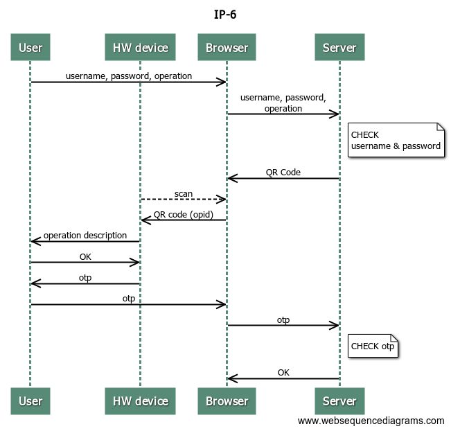
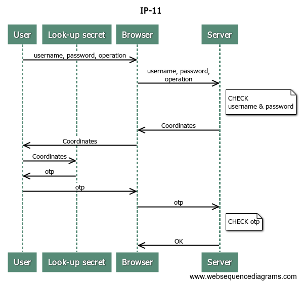

# Deutsche Bank

### Identity proofing

- Local branch

### Authenticators
- QR Code reader (Authenticator device) [O]
- Look-up secret
- SIM card
- Software Authenticator [O]
- Fingerprint (on smartphone)

### Binding and activation
- QR Code Reader
	 1. Request: consequent to enrollment
	 2. Delivery: at home (remote)
	 3. Activation: with activation letter (remote)
- Look-up secret
	1. Request: branch
	 2. Delivery: branch
	 3. Activation: branch - already active
- SIM card
	1. Request: remote
	 2. Delivery: --
	 3. Activation: remote
- Software Authenticator
	1. Request: remote
	2. Delivery: remote
	3. Activation: remote (leveraging SIM card)
- Fingerprint
	1. Request: remote
	2. Delivery: remote
	3. Activation: remote

### Exemptions
Login only

### Internet payments

- QR Code Reader (Authenticator - HW device)

- Look-up secret

- SIM card

- Software Device (App)

### Mobile payments

tbd

### Requirements 

|  RL1 | RL2 | RL3 | RL4 | RL5 | RL6 | RL7 | RL8 | RL9 |
|---|---|---|---|---|---|---|---|---|
| <i class="icon-star"></i> | <i class="icon-star"></i> | <i class="icon-star"></i> | <i class="icon-star-half-alt"></i> | <i class="icon-star-half-alt"></i> | <i class="icon-star-half-alt"></i> | <i class="icon-star"></i> | <i class="icon-star-half-alt"></i> | <i class="icon-star-half-alt"></i> |

### Best Practices

| BP1 | BP2 | BP3 | BP4 | BP5 | BP6 | BP7 | BP8 |
|---|---|---|---|---|---|---|---|
| <i class="icon-star-empty"></i> | <i class="icon-star-half-alt"></i> | <i class="icon-star"></i> | <i class="icon-star-half-alt"></i> |<i class="icon-star"></i> | <i class="icon-star-half-alt"></i> |<i class="icon-star-half-alt"></i> | <i class="icon-star"></i> |

