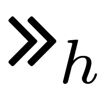
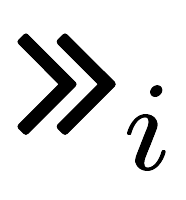
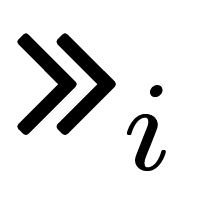
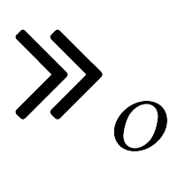
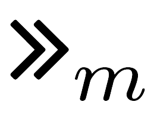
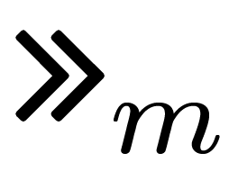
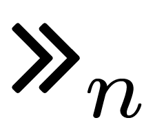

In this section, we evaluate the observed MFA protocols in terms of complexity (with the three values related to memory, manual operations and extra devices) and resistance
to the attacker models (namely Device Thief, Authenticator Duplicator, Shoulder Surfer, Eavesdropping Software, Social Engineer, Man in the Browser and Man in the Mobile)
and their combinations.

<h2>Internet Payments</h2>

<table class="mfa-protocols-table" id="ip-protocols-evaluation-table" style="text-align: center;">
<thead style="font-weight: bold; background-color: white;">
<th class="rotate">Label</th><th class="rotate">MFA Protocol representation</th><th class="rotate">
MEM
</th><th class="rotate">
OP
</th><th class="rotate">
 DEV 
</th><th class="rotate">
 DT
</th><th class="rotate">
AD
</th><th class="rotate">
SS
</th><th class="rotate">
ES
</th><th class="rotate">
SE
</th><th class="rotate">
MB
</th><th class="rotate">
MM
</th><th class="rotate">

	 DT∘AD
</th><th class="rotate">
DT∘SS
</th><th class="rotate">
DT∘ES
</th><th class="rotate">
DT∘SE
</th><th class="rotate">
DT∘MB
</th><th class="rotate">
DT∘MM
</th><th class="rotate">
AD∘SS
</th><th class="rotate">
AD∘ES
</th><th class="rotate">
AD∘SE
</th><th class="rotate">
AD∘MB
</th><th class="rotate">
AD∘MM
</th><th class="rotate">
SS∘ES
</th><th class="rotate">
SS∘SE
</th><th class="rotate">
SS∘MB
</th><th class="rotate">
SS∘MM
</th><th class="rotate">
ES∘SE
</th><th class="rotate">
ES∘MB
</th><th class="rotate">
ES∘MM
</th><th class="rotate">
SE∘MB
</th><th class="rotate">
SE∘MM
</th><th class="rotate">
MB∘MM
	 
</th><th class="rotate">
DT∘AD∘SS
</th><th class="rotate">
DT∘AD∘ES
</th><th class="rotate">
DT∘AD∘SE
</th><th class="rotate">
DT∘AD∘MB
</th><th class="rotate">
DT∘AD∘MM
</th><th class="rotate">
DT∘SS∘ES
</th><th class="rotate">
DT∘SS∘SE
</th><th class="rotate">
DT∘SS∘MB
</th><th class="rotate">
DT∘SS∘MM
</th><th class="rotate">
DT∘ES∘SE
</th><th class="rotate">
DT∘ES∘MB
</th><th class="rotate">
DT∘ES∘MM
</th><th class="rotate">
DT∘SE∘MB
</th><th class="rotate">
DT∘SE∘MM
</th><th class="rotate">
DT∘MB∘MM

</th><th class="rotate">
AD∘SS∘ES
</th><th class="rotate">
AD∘SS∘SE
</th><th class="rotate">
AD∘SS∘MB
</th><th class="rotate">
AD∘SS∘MM
</th><th class="rotate">
AD∘ES∘SE
</th><th class="rotate">
AD∘ES∘MB
</th><th class="rotate">
AD∘ES∘MM
</th><th class="rotate">
AD∘SE∘MB
</th><th class="rotate">
AD∘SE∘MM
</th><th class="rotate">
AD∘MB∘MM

</th><th class="rotate">
SS∘ES∘SE
</th><th class="rotate">
SS∘ES∘MB
</th><th class="rotate">
SS∘ES∘MM
</th><th class="rotate">
SS∘SE∘MB
</th><th class="rotate">
SS∘SE∘MM
</th><th class="rotate">
SS∘MB∘MM

</th><th class="rotate">
ES∘SE∘MB
</th><th class="rotate">
ES∘SE∘MM
</th><th class="rotate">
ES∘MB∘MM
</th><th class="rotate">
SE∘MB∘MM
</th>
</thead>
<tr id="IP-1">
<td>IP-1 </td>
<td class="protocol-column">; <i class="fas fa-calculator"></i>[O] otp</td>
<td> 1 </td><td> 1 </td><td> 1 </td><td> O </td><td> -- </td><td> <i class="fas fa-skull"></i> </td><td> <i class="fas fa-skull"></i> </td><td> <i class="fas fa-skull"></i> </td><td> <i class="fas fa-skull"></i> </td><td> -- </td><td> O </td><td> <i class="fas fa-check-circle"></i> </td><td> <i class="fas fa-check-circle"></i> </td><td> <i class="fas fa-check-circle"></i> </td><td> <i class="fas fa-check-circle"></i> </td><td> O </td><td> <i class="fas fa-check-circle"></i> </td><td> <i class="fas fa-check-circle"></i> </td><td> <i class="fas fa-check-circle"></i> </td><td> <i class="fas fa-check-circle"></i> </td><td> -- </td><td> <i class="fas fa-check-circle"></i> </td><td> <i class="fas fa-check-circle"></i> </td><td> <i class="fas fa-check-circle"></i> </td><td> <i class="fas fa-check-circle"></i> </td><td> <i class="fas fa-check-circle"></i> </td><td> <i class="fas fa-check-circle"></i> </td><td> <i class="fas fa-check-circle"></i> </td><td> <i class="fas fa-check-circle"></i> </td><td> <i class="fas fa-check-circle"></i> </td><td> <i class="fas fa-check-circle"></i> </td><td> <i class="fas fa-check-circle"></i> </td><td> <i class="fas fa-check-circle"></i> </td><td> <i class="fas fa-check-circle"></i> </td><td> <i class="fas fa-check-circle"></i> </td><td> O </td><td> <i class="fas fa-check-circle"></i> </td><td> <i class="fas fa-check-circle"></i> </td><td> <i class="fas fa-check-circle"></i> </td><td> <i class="fas fa-check-circle"></i> </td><td> <i class="fas fa-check-circle"></i> </td><td> <i class="fas fa-check-circle"></i> </td><td> <i class="fas fa-check-circle"></i> </td><td> <i class="fas fa-check-circle"></i> </td><td> <i class="fas fa-check-circle"></i> </td><td> <i class="fas fa-check-circle"></i> </td><td> <i class="fas fa-check-circle"></i> </td><td> <i class="fas fa-check-circle"></i> </td><td> <i class="fas fa-check-circle"></i> </td><td> <i class="fas fa-check-circle"></i> </td><td> <i class="fas fa-check-circle"></i> </td><td> <i class="fas fa-check-circle"></i> </td><td> <i class="fas fa-check-circle"></i> </td><td> <i class="fas fa-check-circle"></i> </td><td> <i class="fas fa-check-circle"></i> </td><td> <i class="fas fa-check-circle"></i> </td><td> <i class="fas fa-check-circle"></i> </td><td> <i class="fas fa-check-circle"></i> </td><td> <i class="fas fa-check-circle"></i> </td><td> <i class="fas fa-check-circle"></i> </td><td> <i class="fas fa-check-circle"></i> </td><td> <i class="fas fa-check-circle"></i> </td><td> <i class="fas fa-check-circle"></i> </td><td> <i class="fas fa-check-circle"></i> </td><td> <i class="fas fa-check-circle"></i> </td><td> <i class="fas fa-check-circle"></i></td>
</tr>
<tr id="IP-2">
<td>IP-2 </td>
<td class="protocol-column">; <i class="fas fa-calculator"></i>[O,K] otp</td>
<td> 2 </td><td> 1 </td><td> 1 </td><td> O </td><td> -- </td><td> <i class="fas fa-skull"></i> </td><td> <i class="fas fa-skull"></i> </td><td> <i class="fas fa-skull"></i> </td><td> <i class="fas fa-skull"></i> </td><td> -- </td><td> O </td><td> <i class="fas fa-check-circle"></i> </td><td> <i class="fas fa-check-circle"></i> </td><td> <i class="fas fa-check-circle"></i> </td><td> <i class="fas fa-check-circle"></i> </td><td> O </td><td> <i class="fas fa-check-circle"></i> </td><td> <i class="fas fa-check-circle"></i> </td><td> <i class="fas fa-check-circle"></i> </td><td> <i class="fas fa-check-circle"></i> </td><td> -- </td><td> <i class="fas fa-check-circle"></i> </td><td> <i class="fas fa-check-circle"></i> </td><td> <i class="fas fa-check-circle"></i> </td><td> <i class="fas fa-check-circle"></i> </td><td> <i class="fas fa-check-circle"></i> </td><td> <i class="fas fa-check-circle"></i> </td><td> <i class="fas fa-check-circle"></i> </td><td> <i class="fas fa-check-circle"></i> </td><td> <i class="fas fa-check-circle"></i> </td><td> <i class="fas fa-check-circle"></i> </td><td> <i class="fas fa-check-circle"></i> </td><td> <i class="fas fa-check-circle"></i> </td><td> <i class="fas fa-check-circle"></i> </td><td> <i class="fas fa-check-circle"></i> </td><td> O </td><td> <i class="fas fa-check-circle"></i> </td><td> <i class="fas fa-check-circle"></i> </td><td> <i class="fas fa-check-circle"></i> </td><td> <i class="fas fa-check-circle"></i> </td><td> <i class="fas fa-check-circle"></i> </td><td> <i class="fas fa-check-circle"></i> </td><td> <i class="fas fa-check-circle"></i> </td><td> <i class="fas fa-check-circle"></i> </td><td> <i class="fas fa-check-circle"></i> </td><td> <i class="fas fa-check-circle"></i> </td><td> <i class="fas fa-check-circle"></i> </td><td> <i class="fas fa-check-circle"></i> </td><td> <i class="fas fa-check-circle"></i> </td><td> <i class="fas fa-check-circle"></i> </td><td> <i class="fas fa-check-circle"></i> </td><td> <i class="fas fa-check-circle"></i> </td><td> <i class="fas fa-check-circle"></i> </td><td> <i class="fas fa-check-circle"></i> </td><td> <i class="fas fa-check-circle"></i> </td><td> <i class="fas fa-check-circle"></i> </td><td> <i class="fas fa-check-circle"></i> </td><td> <i class="fas fa-check-circle"></i> </td><td> <i class="fas fa-check-circle"></i> </td><td> <i class="fas fa-check-circle"></i> </td><td> <i class="fas fa-check-circle"></i> </td><td> <i class="fas fa-check-circle"></i> </td><td> <i class="fas fa-check-circle"></i> </td><td> <i class="fas fa-check-circle"></i> </td><td> <i class="fas fa-check-circle"></i> </td><td> <i class="fas fa-check-circle"></i></td>
</tr>
<tr id="IP-3">
<td>IP-3 </td>
<td class="protocol-column">
; opid <i class="fas fa-calculator"></i>?[O] otp

</td>
<td> 1 </td><td> 0 </td><td> 1 </td><td> O </td><td> -- </td><td> K </td><td> K </td><td> K </td><td> K </td><td> -- </td><td> O </td><td> <i class="fas fa-skull"></i> </td><td> <i class="fas fa-skull"></i> </td><td> <i class="fas fa-skull"></i> </td><td> <i class="fas fa-skull"></i> </td><td> O </td><td> K </td><td> K </td><td> K </td><td> K </td><td> -- </td><td> K </td><td> K </td><td> K </td><td> K </td><td> K </td><td> K </td><td> K </td><td> K </td><td> K </td><td> K </td><td> <i class="fas fa-check-circle"></i> </td><td> <i class="fas fa-check-circle"></i> </td><td> <i class="fas fa-check-circle"></i> </td><td> <i class="fas fa-check-circle"></i> </td><td> O </td><td> <i class="fas fa-check-circle"></i> </td><td> <i class="fas fa-check-circle"></i> </td><td> <i class="fas fa-check-circle"></i> </td><td> <i class="fas fa-check-circle"></i> </td><td> <i class="fas fa-check-circle"></i> </td><td> <i class="fas fa-check-circle"></i> </td><td> <i class="fas fa-check-circle"></i> </td><td> <i class="fas fa-check-circle"></i> </td><td> <i class="fas fa-check-circle"></i> </td><td> <i class="fas fa-check-circle"></i> </td><td> K </td><td> K </td><td> K </td><td> K </td><td> K </td><td> K </td><td> K </td><td> K </td><td> K </td><td> K </td><td> K </td><td> K </td><td> K </td><td> K </td><td> K </td><td> K </td><td> K </td><td> K </td><td> K </td><td> K</td>
</tr>
<tr id="IP-4">
<td>IP-4 </td>
<td class="protocol-column">; ; opid <i class="fas fa-calculator"></i>?[O] otp</td>
<td> 2 </td><td> 0 </td><td> 1 </td><td> O </td><td> -- </td><td> K2 </td><td> K2 </td><td> K2 </td><td> K2 </td><td> -- </td><td> O </td><td> <i class="fas fa-skull"></i> </td><td> <i class="fas fa-skull"></i> </td><td> <i class="fas fa-skull"></i> </td><td> <i class="fas fa-skull"></i> </td><td> O </td><td> K2 </td><td> K2 </td><td> K2 </td><td> K2 </td><td> -- </td><td> K2 </td><td> K2 </td><td> K2 </td><td> K2 </td><td> K2 </td><td> K2 </td><td> K2 </td><td> K2 </td><td> K2 </td><td> K2 </td><td> <i class="fas fa-check-circle"></i> </td><td> <i class="fas fa-check-circle"></i> </td><td> <i class="fas fa-check-circle"></i> </td><td> <i class="fas fa-check-circle"></i> </td><td> O </td><td> <i class="fas fa-check-circle"></i> </td><td> <i class="fas fa-check-circle"></i> </td><td> <i class="fas fa-check-circle"></i> </td><td> <i class="fas fa-check-circle"></i> </td><td> <i class="fas fa-check-circle"></i> </td><td> <i class="fas fa-check-circle"></i> </td><td> <i class="fas fa-check-circle"></i> </td><td> <i class="fas fa-check-circle"></i> </td><td> <i class="fas fa-check-circle"></i> </td><td> <i class="fas fa-check-circle"></i> </td><td> K2 </td><td> K2 </td><td> K2 </td><td> K2 </td><td> K2 </td><td> K2 </td><td> K2 </td><td> K2 </td><td> K2 </td><td> K2 </td><td> K2 </td><td> K2 </td><td> K2 </td><td> K2 </td><td> K2 </td><td> K2 </td><td> K2 </td><td> K2 </td><td> K2 </td><td> K2</td>
</tr>
<tr id="IP-5">
<td>IP-5 </td>
<td class="protocol-column">; opid <i class="fas fa-calculator"></i>?[O,K] otp</td>
<td> 2 </td><td> 0 </td><td> 1 </td><td> O </td><td> -- </td><td> K2 </td><td> K </td><td> K </td><td> K </td><td> -- </td><td> O </td><td> <i class="fas fa-skull"></i> </td><td> KO </td><td> KO </td><td> KO </td><td> O </td><td> K2 </td><td> K </td><td> K </td><td> K </td><td> -- </td><td> K2 </td><td> K2 </td><td> K2 </td><td> K2 </td><td> K </td><td> K </td><td> K </td><td> K </td><td> K </td><td> K </td><td> <i class="fas fa-check-circle"></i> </td><td> KO </td><td> KO </td><td> KO </td><td> O </td><td> <i class="fas fa-check-circle"></i> </td><td> <i class="fas fa-check-circle"></i> </td><td> <i class="fas fa-check-circle"></i> </td><td> <i class="fas fa-check-circle"></i> </td><td> KO </td><td> KO </td><td> KO </td><td> KO </td><td> KO </td><td> KO </td><td> K2 </td><td> K2 </td><td> K2 </td><td> K2 </td><td> K </td><td> K </td><td> K </td><td> K </td><td> K </td><td> K </td><td> K2 </td><td> K2 </td><td> K2 </td><td> K2 </td><td> K2 </td><td> K2 </td><td> K </td><td> K </td><td> K </td><td> K</td>
</tr>
<tr id="IP-6">
<td>IP-6 </td>
<td class="protocol-column">; opid <i class="fas fa-calculator"></i>?[O] otp</td>
<td> 1 </td><td> 1 </td><td> 1 </td><td> O </td><td> -- </td><td> K </td><td> K </td><td> K </td><td> K </td><td> -- </td><td> O </td><td> <i class="fas fa-skull"></i> </td><td> <i class="fas fa-skull"></i> </td><td> <i class="fas fa-skull"></i> </td><td> <i class="fas fa-skull"></i> </td><td> O </td><td> K </td><td> K </td><td> K </td><td> K </td><td> -- </td><td> K </td><td> K </td><td> K </td><td> K </td><td> K </td><td> K </td><td> K </td><td> K </td><td> K </td><td> K </td><td> <i class="fas fa-check-circle"></i> </td><td> <i class="fas fa-check-circle"></i> </td><td> <i class="fas fa-check-circle"></i> </td><td> <i class="fas fa-check-circle"></i> </td><td> O </td><td> <i class="fas fa-check-circle"></i> </td><td> <i class="fas fa-check-circle"></i> </td><td> <i class="fas fa-check-circle"></i> </td><td> <i class="fas fa-check-circle"></i> </td><td> <i class="fas fa-check-circle"></i> </td><td> <i class="fas fa-check-circle"></i> </td><td> <i class="fas fa-check-circle"></i> </td><td> <i class="fas fa-check-circle"></i> </td><td> <i class="fas fa-check-circle"></i> </td><td> <i class="fas fa-check-circle"></i> </td><td> K </td><td> K </td><td> K </td><td> K </td><td> K </td><td> K </td><td> K </td><td> K </td><td> K </td><td> K </td><td> K </td><td> K </td><td> K </td><td> K </td><td> K </td><td> K </td><td> K </td><td> K </td><td> K </td><td> K</td>
</tr>
<tr id="IP-7">
<td>IP-7 </td>
<td class="protocol-column">; opid <i class="fas fa-calculator"></i>?[O,K] otp</td>
<td> 2 </td><td> 1 </td><td> 1 </td><td> O </td><td> -- </td><td> K2 </td><td> K </td><td> K </td><td> K </td><td> -- </td><td> O </td><td> <i class="fas fa-skull"></i> </td><td> KO </td><td> KO </td><td> KO </td><td> O </td><td> K2 </td><td> K </td><td> K </td><td> K </td><td> -- </td><td> K2 </td><td> K2 </td><td> K2 </td><td> K2 </td><td> K </td><td> K </td><td> K </td><td> K </td><td> K </td><td> K </td><td> <i class="fas fa-check-circle"></i> </td><td> KO </td><td> KO </td><td> KO </td><td> O </td><td> <i class="fas fa-check-circle"></i> </td><td> <i class="fas fa-check-circle"></i> </td><td> <i class="fas fa-check-circle"></i> </td><td> <i class="fas fa-check-circle"></i> </td><td> KO </td><td> KO </td><td> KO </td><td> KO </td><td> KO </td><td> KO </td><td> K2 </td><td> K2 </td><td> K2 </td><td> K2 </td><td> K </td><td> K </td><td> K </td><td> K </td><td> K </td><td> K </td><td> K2 </td><td> K2 </td><td> K2 </td><td> K2 </td><td> K2 </td><td> K2 </td><td> K </td><td> K </td><td> K </td><td> K</td>
</tr>
<tr id="IP-8">
<td>IP-8 </td>
<td class="protocol-column">; opid <i class="fas fa-calculator"></i>[O,K] otp </td>
<td> 2 </td><td> 2 </td><td> 1 </td><td> O </td><td> -- </td><td> K2 </td><td> K </td><td> <i class="fas fa-skull"></i> </td><td> <i class="fas fa-skull"></i> </td><td> -- </td><td> O </td><td> <i class="fas fa-skull"></i> </td><td> KO </td><td> <i class="fas fa-check-circle"></i> </td><td> <i class="fas fa-check-circle"></i> </td><td> O </td><td> K2 </td><td> K </td><td> <i class="fas fa-check-circle"></i> </td><td> <i class="fas fa-check-circle"></i> </td><td> -- </td><td> K2 </td><td> <i class="fas fa-check-circle"></i> </td><td> <i class="fas fa-check-circle"></i> </td><td> K2 </td><td> <i class="fas fa-check-circle"></i> </td><td> <i class="fas fa-check-circle"></i> </td><td> K </td><td> <i class="fas fa-check-circle"></i> </td><td> <i class="fas fa-check-circle"></i> </td><td> <i class="fas fa-check-circle"></i> </td><td> <i class="fas fa-check-circle"></i> </td><td> KO </td><td> <i class="fas fa-check-circle"></i> </td><td> <i class="fas fa-check-circle"></i> </td><td> O </td><td> <i class="fas fa-check-circle"></i> </td><td> <i class="fas fa-check-circle"></i> </td><td> <i class="fas fa-check-circle"></i> </td><td> <i class="fas fa-check-circle"></i> </td><td> <i class="fas fa-check-circle"></i> </td><td> <i class="fas fa-check-circle"></i> </td><td> KO </td><td> <i class="fas fa-check-circle"></i> </td><td> <i class="fas fa-check-circle"></i> </td><td> <i class="fas fa-check-circle"></i> </td><td> K2 </td><td> <i class="fas fa-check-circle"></i> </td><td> <i class="fas fa-check-circle"></i> </td><td> K2 </td><td> <i class="fas fa-check-circle"></i> </td><td> <i class="fas fa-check-circle"></i> </td><td> K </td><td> <i class="fas fa-check-circle"></i> </td><td> <i class="fas fa-check-circle"></i> </td><td> <i class="fas fa-check-circle"></i> </td><td> <i class="fas fa-check-circle"></i> </td><td> <i class="fas fa-check-circle"></i> </td><td> K2 </td><td> <i class="fas fa-check-circle"></i> </td><td> <i class="fas fa-check-circle"></i> </td><td> <i class="fas fa-check-circle"></i> </td><td> <i class="fas fa-check-circle"></i> </td><td> <i class="fas fa-check-circle"></i> </td><td> <i class="fas fa-check-circle"></i> </td><td> <i class="fas fa-check-circle"></i></td>
</tr>
<tr id="IP-9">
<td>IP-9 </td>
<td class="protocol-column">; ; opid <i class="fas fa-calculator"></i>[O,K] otp </td>
<td> 3 </td><td> 2 </td><td> 1 </td><td> O </td><td> -- </td><td> K3 </td><td> K2 </td><td> <i class="fas fa-skull"></i> </td><td> <i class="fas fa-skull"></i> </td><td> -- </td><td> O </td><td> <i class="fas fa-skull"></i> </td><td> K2O </td><td> <i class="fas fa-check-circle"></i> </td><td> <i class="fas fa-check-circle"></i> </td><td> O </td><td> K3 </td><td> K2 </td><td> <i class="fas fa-check-circle"></i> </td><td> <i class="fas fa-check-circle"></i> </td><td> -- </td><td> K3 </td><td> <i class="fas fa-check-circle"></i> </td><td> <i class="fas fa-check-circle"></i> </td><td> K3 </td><td> <i class="fas fa-check-circle"></i> </td><td> <i class="fas fa-check-circle"></i> </td><td> K2 </td><td> <i class="fas fa-check-circle"></i> </td><td> <i class="fas fa-check-circle"></i> </td><td> <i class="fas fa-check-circle"></i> </td><td> <i class="fas fa-check-circle"></i> </td><td> K2O </td><td> <i class="fas fa-check-circle"></i> </td><td> <i class="fas fa-check-circle"></i> </td><td> O </td><td> <i class="fas fa-check-circle"></i> </td><td> <i class="fas fa-check-circle"></i> </td><td> <i class="fas fa-check-circle"></i> </td><td> <i class="fas fa-check-circle"></i> </td><td> <i class="fas fa-check-circle"></i> </td><td> <i class="fas fa-check-circle"></i> </td><td> K2O </td><td> <i class="fas fa-check-circle"></i> </td><td> <i class="fas fa-check-circle"></i> </td><td> <i class="fas fa-check-circle"></i> </td><td> K3 </td><td> <i class="fas fa-check-circle"></i> </td><td> <i class="fas fa-check-circle"></i> </td><td> K3 </td><td> <i class="fas fa-check-circle"></i> </td><td> <i class="fas fa-check-circle"></i> </td><td> K2 </td><td> <i class="fas fa-check-circle"></i> </td><td> <i class="fas fa-check-circle"></i> </td><td> <i class="fas fa-check-circle"></i> </td><td> <i class="fas fa-check-circle"></i> </td><td> <i class="fas fa-check-circle"></i> </td><td> K3 </td><td> <i class="fas fa-check-circle"></i> </td><td> <i class="fas fa-check-circle"></i> </td><td> <i class="fas fa-check-circle"></i> </td><td> <i class="fas fa-check-circle"></i> </td><td> <i class="fas fa-check-circle"></i> </td><td> <i class="fas fa-check-circle"></i> </td><td> <i class="fas fa-check-circle"></i></td>
</tr>
<tr id="IP-10">
<td>IP-10 </td>
<td class="protocol-column">; opid <i class="fas fa-calculator"></i>?[O,K] otp </td>
<td> 2 </td><td> 2 </td><td> 1 </td><td> O </td><td> -- </td><td> K2 </td><td> K </td><td> K </td><td> K </td><td> -- </td><td> O </td><td> <i class="fas fa-skull"></i> </td><td> KO </td><td> KO </td><td> KO </td><td> O </td><td> K2 </td><td> K </td><td> K </td><td> K </td><td> -- </td><td> K2 </td><td> K2 </td><td> K2 </td><td> K2 </td><td> K </td><td> K </td><td> K </td><td> K </td><td> K </td><td> K </td><td> <i class="fas fa-check-circle"></i> </td><td> KO </td><td> KO </td><td> KO </td><td> O </td><td> <i class="fas fa-check-circle"></i> </td><td> <i class="fas fa-check-circle"></i> </td><td> <i class="fas fa-check-circle"></i> </td><td> <i class="fas fa-check-circle"></i> </td><td> KO </td><td> KO </td><td> KO </td><td> KO </td><td> KO </td><td> KO </td><td> K2 </td><td> K2 </td><td> K2 </td><td> K2 </td><td> K </td><td> K </td><td> K </td><td> K </td><td> K </td><td> K </td><td> K2 </td><td> K2 </td><td> K2 </td><td> K2 </td><td> K2 </td><td> K2 </td><td> K </td><td> K </td><td> K </td><td> K</td>
</tr>
<tr id="IP-11">
<td>IP-11 </td>
<td class="protocol-column">; <i class="fas fa-table"></i></td>
<td> 1 </td><td> 1 </td><td> 1 </td><td> O </td><td> O </td><td> <i class="fas fa-skull"></i> </td><td> <i class="fas fa-skull"></i> </td><td> <i class="fas fa-skull"></i> </td><td> <i class="fas fa-skull"></i> </td><td> -- </td><td> O </td><td> <i class="fas fa-check-circle"></i> </td><td> <i class="fas fa-check-circle"></i> </td><td> <i class="fas fa-check-circle"></i> </td><td> <i class="fas fa-check-circle"></i> </td><td> O </td><td> <i class="fas fa-check-circle"></i> </td><td> <i class="fas fa-check-circle"></i> </td><td> <i class="fas fa-check-circle"></i> </td><td> <i class="fas fa-check-circle"></i> </td><td> O </td><td> <i class="fas fa-check-circle"></i> </td><td> <i class="fas fa-check-circle"></i> </td><td> <i class="fas fa-check-circle"></i> </td><td> <i class="fas fa-check-circle"></i> </td><td> <i class="fas fa-check-circle"></i> </td><td> <i class="fas fa-check-circle"></i> </td><td> <i class="fas fa-check-circle"></i> </td><td> <i class="fas fa-check-circle"></i> </td><td> <i class="fas fa-check-circle"></i> </td><td> <i class="fas fa-check-circle"></i> </td><td> <i class="fas fa-check-circle"></i> </td><td> <i class="fas fa-check-circle"></i> </td><td> <i class="fas fa-check-circle"></i> </td><td> <i class="fas fa-check-circle"></i> </td><td> O </td><td> <i class="fas fa-check-circle"></i> </td><td> <i class="fas fa-check-circle"></i> </td><td> <i class="fas fa-check-circle"></i> </td><td> <i class="fas fa-check-circle"></i> </td><td> <i class="fas fa-check-circle"></i> </td><td> <i class="fas fa-check-circle"></i> </td><td> <i class="fas fa-check-circle"></i> </td><td> <i class="fas fa-check-circle"></i> </td><td> <i class="fas fa-check-circle"></i> </td><td> <i class="fas fa-check-circle"></i> </td><td> <i class="fas fa-check-circle"></i> </td><td> <i class="fas fa-check-circle"></i> </td><td> <i class="fas fa-check-circle"></i> </td><td> <i class="fas fa-check-circle"></i> </td><td> <i class="fas fa-check-circle"></i> </td><td> <i class="fas fa-check-circle"></i> </td><td> <i class="fas fa-check-circle"></i> </td><td> <i class="fas fa-check-circle"></i> </td><td> <i class="fas fa-check-circle"></i> </td><td> <i class="fas fa-check-circle"></i> </td><td> <i class="fas fa-check-circle"></i> </td><td> <i class="fas fa-check-circle"></i> </td><td> <i class="fas fa-check-circle"></i> </td><td> <i class="fas fa-check-circle"></i> </td><td> <i class="fas fa-check-circle"></i> </td><td> <i class="fas fa-check-circle"></i> </td><td> <i class="fas fa-check-circle"></i> </td><td> <i class="fas fa-check-circle"></i> </td><td> <i class="fas fa-check-circle"></i> </td><td> <i class="fas fa-check-circle"></i></td>
</tr>
<tr id="IP-12">
<td>IP-12 </td>
<td class="protocol-column">; ; <i class="fas fa-table"></i></td>
<td> 2 </td><td> 1 </td><td> 1 </td><td> O </td><td> O </td><td> <i class="fas fa-skull"></i> </td><td> <i class="fas fa-skull"></i> </td><td> <i class="fas fa-skull"></i> </td><td> <i class="fas fa-skull"></i> </td><td> -- </td><td> O </td><td> <i class="fas fa-check-circle"></i> </td><td> <i class="fas fa-check-circle"></i> </td><td> <i class="fas fa-check-circle"></i> </td><td> <i class="fas fa-check-circle"></i> </td><td> O </td><td> <i class="fas fa-check-circle"></i> </td><td> <i class="fas fa-check-circle"></i> </td><td> <i class="fas fa-check-circle"></i> </td><td> <i class="fas fa-check-circle"></i> </td><td> O </td><td> <i class="fas fa-check-circle"></i> </td><td> <i class="fas fa-check-circle"></i> </td><td> <i class="fas fa-check-circle"></i> </td><td> <i class="fas fa-check-circle"></i> </td><td> <i class="fas fa-check-circle"></i> </td><td> <i class="fas fa-check-circle"></i> </td><td> <i class="fas fa-check-circle"></i> </td><td> <i class="fas fa-check-circle"></i> </td><td> <i class="fas fa-check-circle"></i> </td><td> <i class="fas fa-check-circle"></i> </td><td> <i class="fas fa-check-circle"></i> </td><td> <i class="fas fa-check-circle"></i> </td><td> <i class="fas fa-check-circle"></i> </td><td> <i class="fas fa-check-circle"></i> </td><td> O </td><td> <i class="fas fa-check-circle"></i> </td><td> <i class="fas fa-check-circle"></i> </td><td> <i class="fas fa-check-circle"></i> </td><td> <i class="fas fa-check-circle"></i> </td><td> <i class="fas fa-check-circle"></i> </td><td> <i class="fas fa-check-circle"></i> </td><td> <i class="fas fa-check-circle"></i> </td><td> <i class="fas fa-check-circle"></i> </td><td> <i class="fas fa-check-circle"></i> </td><td> <i class="fas fa-check-circle"></i> </td><td> <i class="fas fa-check-circle"></i> </td><td> <i class="fas fa-check-circle"></i> </td><td> <i class="fas fa-check-circle"></i> </td><td> <i class="fas fa-check-circle"></i> </td><td> <i class="fas fa-check-circle"></i> </td><td> <i class="fas fa-check-circle"></i> </td><td> <i class="fas fa-check-circle"></i> </td><td> <i class="fas fa-check-circle"></i> </td><td> <i class="fas fa-check-circle"></i> </td><td> <i class="fas fa-check-circle"></i> </td><td> <i class="fas fa-check-circle"></i> </td><td> <i class="fas fa-check-circle"></i> </td><td> <i class="fas fa-check-circle"></i> </td><td> <i class="fas fa-check-circle"></i> </td><td> <i class="fas fa-check-circle"></i> </td><td> <i class="fas fa-check-circle"></i> </td><td> <i class="fas fa-check-circle"></i> </td><td> <i class="fas fa-check-circle"></i> </td><td> <i class="fas fa-check-circle"></i> </td><td> <i class="fas fa-check-circle"></i></td>
</tr>
<tr id="IP-13">
<td>IP-13 </td>
<td class="protocol-column">; opid ?[O,K] otp </td>
<td> 2 </td><td> 0 </td><td> 0 </td><td> O </td><td> O </td><td> K2 </td><td> K2 </td><td> K </td><td> K </td><td> -- </td><td> O </td><td> <i class="fas fa-skull"></i> </td><td> <i class="fas fa-skull"></i> </td><td> KO </td><td> KO </td><td> O </td><td> <i class="fas fa-skull"></i> </td><td> <i class="fas fa-skull"></i> </td><td> KO </td><td> KO </td><td> O </td><td> K2 </td><td> K2 </td><td> K2 </td><td> K2 </td><td> K2 </td><td> K2 </td><td> K2 </td><td> K </td><td> K </td><td> K </td><td> <i class="fas fa-check-circle"></i> </td><td> <i class="fas fa-check-circle"></i> </td><td> KO </td><td> KO </td><td> O </td><td> <i class="fas fa-check-circle"></i> </td><td> <i class="fas fa-check-circle"></i> </td><td> <i class="fas fa-check-circle"></i> </td><td> <i class="fas fa-check-circle"></i> </td><td> <i class="fas fa-check-circle"></i> </td><td> <i class="fas fa-check-circle"></i> </td><td> <i class="fas fa-check-circle"></i> </td><td> KO </td><td> KO </td><td> KO </td><td> <i class="fas fa-check-circle"></i> </td><td> <i class="fas fa-check-circle"></i> </td><td> <i class="fas fa-check-circle"></i> </td><td> <i class="fas fa-check-circle"></i> </td><td> <i class="fas fa-check-circle"></i> </td><td> <i class="fas fa-check-circle"></i> </td><td> <i class="fas fa-check-circle"></i> </td><td> KO </td><td> KO </td><td> KO </td><td> K2 </td><td> K2 </td><td> K2 </td><td> K2 </td><td> K2 </td><td> K2 </td><td> K2 </td><td> K2 </td><td> K2 </td><td> K</td>
</tr>
<tr id="IP-14">
<td>IP-14 </td>
<td class="protocol-column">; otp <i class="fas fa-sim-card"></i> otp </td>
<td> 1 </td><td> 1 </td><td> 1 </td><td> O </td><td> -- </td><td> K </td><td> K </td><td> <i class="fas fa-skull"></i> </td><td> <i class="fas fa-skull"></i> </td><td> O </td><td> O </td><td> <i class="fas fa-skull"></i> </td><td> <i class="fas fa-skull"></i> </td><td> <i class="fas fa-check-circle"></i> </td><td> <i class="fas fa-check-circle"></i> </td><td> O </td><td> K </td><td> K </td><td> <i class="fas fa-check-circle"></i> </td><td> <i class="fas fa-check-circle"></i> </td><td> O </td><td> K </td><td> <i class="fas fa-check-circle"></i> </td><td> <i class="fas fa-check-circle"></i> </td><td> <i class="fas fa-skull"></i> </td><td> <i class="fas fa-check-circle"></i> </td><td> <i class="fas fa-check-circle"></i> </td><td> <i class="fas fa-skull"></i> </td><td> <i class="fas fa-check-circle"></i> </td><td> <i class="fas fa-check-circle"></i> </td><td> <i class="fas fa-check-circle"></i> </td><td> <i class="fas fa-check-circle"></i> </td><td> <i class="fas fa-check-circle"></i> </td><td> <i class="fas fa-check-circle"></i> </td><td> <i class="fas fa-check-circle"></i> </td><td> O </td><td> <i class="fas fa-check-circle"></i> </td><td> <i class="fas fa-check-circle"></i> </td><td> <i class="fas fa-check-circle"></i> </td><td> <i class="fas fa-check-circle"></i> </td><td> <i class="fas fa-check-circle"></i> </td><td> <i class="fas fa-check-circle"></i> </td><td> <i class="fas fa-check-circle"></i> </td><td> <i class="fas fa-check-circle"></i> </td><td> <i class="fas fa-check-circle"></i> </td><td> <i class="fas fa-check-circle"></i> </td><td> K </td><td> <i class="fas fa-check-circle"></i> </td><td> <i class="fas fa-check-circle"></i> </td><td> <i class="fas fa-check-circle"></i> </td><td> <i class="fas fa-check-circle"></i> </td><td> <i class="fas fa-check-circle"></i> </td><td> <i class="fas fa-check-circle"></i> </td><td> <i class="fas fa-check-circle"></i> </td><td> <i class="fas fa-check-circle"></i> </td><td> <i class="fas fa-check-circle"></i> </td><td> <i class="fas fa-check-circle"></i> </td><td> <i class="fas fa-check-circle"></i> </td><td> <i class="fas fa-check-circle"></i> </td><td> <i class="fas fa-check-circle"></i> </td><td> <i class="fas fa-check-circle"></i> </td><td> <i class="fas fa-check-circle"></i> </td><td> <i class="fas fa-check-circle"></i> </td><td> <i class="fas fa-check-circle"></i> </td><td> <i class="fas fa-check-circle"></i> </td><td> <i class="fas fa-check-circle"></i></td>
</tr>
<tr id="IP-15">
<td>IP-15 </td>
<td class="protocol-column">; otp <i class="fas fa-sim-card"></i>?[O] otp </td>
<td> 1 </td><td> 1 </td><td> 1 </td><td> O </td><td> -- </td><td> K </td><td> K </td><td> K </td><td> K </td><td> O </td><td> O </td><td> <i class="fas fa-skull"></i> </td><td> <i class="fas fa-skull"></i> </td><td> <i class="fas fa-skull"></i> </td><td> <i class="fas fa-skull"></i> </td><td> O </td><td> K </td><td> K </td><td> K </td><td> K </td><td> O </td><td> K </td><td> K </td><td> K </td><td> <i class="fas fa-skull"></i> </td><td> K </td><td> K </td><td> <i class="fas fa-skull"></i> </td><td> K </td><td> <i class="fas fa-skull"></i> </td><td> <i class="fas fa-skull"></i> </td><td> <i class="fas fa-check-circle"></i> </td><td> <i class="fas fa-check-circle"></i> </td><td> <i class="fas fa-check-circle"></i> </td><td> <i class="fas fa-check-circle"></i> </td><td> O </td><td> <i class="fas fa-check-circle"></i> </td><td> <i class="fas fa-check-circle"></i> </td><td> <i class="fas fa-check-circle"></i> </td><td> <i class="fas fa-check-circle"></i> </td><td> <i class="fas fa-check-circle"></i> </td><td> <i class="fas fa-check-circle"></i> </td><td> <i class="fas fa-check-circle"></i> </td><td> <i class="fas fa-check-circle"></i> </td><td> <i class="fas fa-check-circle"></i> </td><td> <i class="fas fa-check-circle"></i> </td><td> K </td><td> K </td><td> K </td><td> <i class="fas fa-check-circle"></i> </td><td> K </td><td> K </td><td> <i class="fas fa-check-circle"></i> </td><td> K </td><td> <i class="fas fa-check-circle"></i> </td><td> <i class="fas fa-check-circle"></i> </td><td> K </td><td> K </td><td> <i class="fas fa-check-circle"></i> </td><td> K </td><td> <i class="fas fa-check-circle"></i> </td><td> <i class="fas fa-check-circle"></i> </td><td> K </td><td> <i class="fas fa-check-circle"></i> </td><td> <i class="fas fa-check-circle"></i> </td><td> <i class="fas fa-check-circle"></i></td>
</tr>
<tr id="IP-16">
<td>IP-16 </td>
<td class="protocol-column">; ; otp <i class="fas fa-sim-card"></i> otp </td>
<td> 2 </td><td> 1 </td><td> 1 </td><td> O </td><td> -- </td><td> K2 </td><td> K2 </td><td> <i class="fas fa-skull"></i> </td><td> <i class="fas fa-skull"></i> </td><td> O </td><td> O </td><td> <i class="fas fa-skull"></i> </td><td> <i class="fas fa-skull"></i> </td><td> <i class="fas fa-check-circle"></i> </td><td> <i class="fas fa-check-circle"></i> </td><td> O </td><td> K2 </td><td> K2 </td><td> <i class="fas fa-check-circle"></i> </td><td> <i class="fas fa-check-circle"></i> </td><td> O </td><td> K2 </td><td> <i class="fas fa-check-circle"></i> </td><td> <i class="fas fa-check-circle"></i> </td><td> <i class="fas fa-skull"></i> </td><td> <i class="fas fa-check-circle"></i> </td><td> <i class="fas fa-check-circle"></i> </td><td> <i class="fas fa-skull"></i> </td><td> <i class="fas fa-check-circle"></i> </td><td> <i class="fas fa-check-circle"></i> </td><td> <i class="fas fa-check-circle"></i> </td><td> <i class="fas fa-check-circle"></i> </td><td> <i class="fas fa-check-circle"></i> </td><td> <i class="fas fa-check-circle"></i> </td><td> <i class="fas fa-check-circle"></i> </td><td> O </td><td> <i class="fas fa-check-circle"></i> </td><td> <i class="fas fa-check-circle"></i> </td><td> <i class="fas fa-check-circle"></i> </td><td> <i class="fas fa-check-circle"></i> </td><td> <i class="fas fa-check-circle"></i> </td><td> <i class="fas fa-check-circle"></i> </td><td> <i class="fas fa-check-circle"></i> </td><td> <i class="fas fa-check-circle"></i> </td><td> <i class="fas fa-check-circle"></i> </td><td> <i class="fas fa-check-circle"></i> </td><td> K2 </td><td> <i class="fas fa-check-circle"></i> </td><td> <i class="fas fa-check-circle"></i> </td><td> <i class="fas fa-check-circle"></i> </td><td> <i class="fas fa-check-circle"></i> </td><td> <i class="fas fa-check-circle"></i> </td><td> <i class="fas fa-check-circle"></i> </td><td> <i class="fas fa-check-circle"></i> </td><td> <i class="fas fa-check-circle"></i> </td><td> <i class="fas fa-check-circle"></i> </td><td> <i class="fas fa-check-circle"></i> </td><td> <i class="fas fa-check-circle"></i> </td><td> <i class="fas fa-check-circle"></i> </td><td> <i class="fas fa-check-circle"></i> </td><td> <i class="fas fa-check-circle"></i> </td><td> <i class="fas fa-check-circle"></i> </td><td> <i class="fas fa-check-circle"></i> </td><td> <i class="fas fa-check-circle"></i> </td><td> <i class="fas fa-check-circle"></i> </td><td> <i class="fas fa-check-circle"></i></td>
</tr>
<tr id="IP-17">
<td>IP-17 </td>
<td class="protocol-column">; ; otp <i class="fas fa-sim-card"></i> otp</td>
<td> 2 </td><td> 1 </td><td> 1 </td><td> O </td><td> -- </td><td> K2 </td><td> K2 </td><td> <i class="fas fa-skull"></i> </td><td> <i class="fas fa-skull"></i> </td><td> O </td><td> O </td><td> <i class="fas fa-skull"></i> </td><td> <i class="fas fa-skull"></i> </td><td> <i class="fas fa-check-circle"></i> </td><td> <i class="fas fa-check-circle"></i> </td><td> O </td><td> K2 </td><td> K2 </td><td> <i class="fas fa-check-circle"></i> </td><td> <i class="fas fa-check-circle"></i> </td><td> O </td><td> K2 </td><td> <i class="fas fa-check-circle"></i> </td><td> <i class="fas fa-check-circle"></i> </td><td> <i class="fas fa-skull"></i> </td><td> <i class="fas fa-check-circle"></i> </td><td> <i class="fas fa-check-circle"></i> </td><td> <i class="fas fa-skull"></i> </td><td> <i class="fas fa-check-circle"></i> </td><td> <i class="fas fa-check-circle"></i> </td><td> <i class="fas fa-check-circle"></i> </td><td> <i class="fas fa-check-circle"></i> </td><td> <i class="fas fa-check-circle"></i> </td><td> <i class="fas fa-check-circle"></i> </td><td> <i class="fas fa-check-circle"></i> </td><td> O </td><td> <i class="fas fa-check-circle"></i> </td><td> <i class="fas fa-check-circle"></i> </td><td> <i class="fas fa-check-circle"></i> </td><td> <i class="fas fa-check-circle"></i> </td><td> <i class="fas fa-check-circle"></i> </td><td> <i class="fas fa-check-circle"></i> </td><td> <i class="fas fa-check-circle"></i> </td><td> <i class="fas fa-check-circle"></i> </td><td> <i class="fas fa-check-circle"></i> </td><td> <i class="fas fa-check-circle"></i> </td><td> K2 </td><td> <i class="fas fa-check-circle"></i> </td><td> <i class="fas fa-check-circle"></i> </td><td> <i class="fas fa-check-circle"></i> </td><td> <i class="fas fa-check-circle"></i> </td><td> <i class="fas fa-check-circle"></i> </td><td> <i class="fas fa-check-circle"></i> </td><td> <i class="fas fa-check-circle"></i> </td><td> <i class="fas fa-check-circle"></i> </td><td> <i class="fas fa-check-circle"></i> </td><td> <i class="fas fa-check-circle"></i> </td><td> <i class="fas fa-check-circle"></i> </td><td> <i class="fas fa-check-circle"></i> </td><td> <i class="fas fa-check-circle"></i> </td><td> <i class="fas fa-check-circle"></i> </td><td> <i class="fas fa-check-circle"></i> </td><td> <i class="fas fa-check-circle"></i> </td><td> <i class="fas fa-check-circle"></i> </td><td> <i class="fas fa-check-circle"></i> </td><td> <i class="fas fa-check-circle"></i></td>
</tr>
<tr id="IP-18">
<td>IP-18 </td>
<td class="protocol-column">; [O] otp</td>
<td> 1 </td><td> 1 </td><td> 0 </td><td> O </td><td> O </td><td> <i class="fas fa-skull"></i> </td><td> <i class="fas fa-skull"></i> </td><td> <i class="fas fa-skull"></i> </td><td> <i class="fas fa-skull"></i> </td><td> O </td><td> O </td><td> <i class="fas fa-check-circle"></i> </td><td> <i class="fas fa-check-circle"></i> </td><td> <i class="fas fa-check-circle"></i> </td><td> <i class="fas fa-check-circle"></i> </td><td> O </td><td> <i class="fas fa-check-circle"></i> </td><td> <i class="fas fa-check-circle"></i> </td><td> <i class="fas fa-check-circle"></i> </td><td> <i class="fas fa-check-circle"></i> </td><td> O </td><td> <i class="fas fa-check-circle"></i> </td><td> <i class="fas fa-check-circle"></i> </td><td> <i class="fas fa-check-circle"></i> </td><td> <i class="fas fa-check-circle"></i> </td><td> <i class="fas fa-check-circle"></i> </td><td> <i class="fas fa-check-circle"></i> </td><td> <i class="fas fa-check-circle"></i> </td><td> <i class="fas fa-check-circle"></i> </td><td> <i class="fas fa-check-circle"></i> </td><td> <i class="fas fa-check-circle"></i> </td><td> <i class="fas fa-check-circle"></i> </td><td> <i class="fas fa-check-circle"></i> </td><td> <i class="fas fa-check-circle"></i> </td><td> <i class="fas fa-check-circle"></i> </td><td> O </td><td> <i class="fas fa-check-circle"></i> </td><td> <i class="fas fa-check-circle"></i> </td><td> <i class="fas fa-check-circle"></i> </td><td> <i class="fas fa-check-circle"></i> </td><td> <i class="fas fa-check-circle"></i> </td><td> <i class="fas fa-check-circle"></i> </td><td> <i class="fas fa-check-circle"></i> </td><td> <i class="fas fa-check-circle"></i> </td><td> <i class="fas fa-check-circle"></i> </td><td> <i class="fas fa-check-circle"></i> </td><td> <i class="fas fa-check-circle"></i> </td><td> <i class="fas fa-check-circle"></i> </td><td> <i class="fas fa-check-circle"></i> </td><td> <i class="fas fa-check-circle"></i> </td><td> <i class="fas fa-check-circle"></i> </td><td> <i class="fas fa-check-circle"></i> </td><td> <i class="fas fa-check-circle"></i> </td><td> <i class="fas fa-check-circle"></i> </td><td> <i class="fas fa-check-circle"></i> </td><td> <i class="fas fa-check-circle"></i> </td><td> <i class="fas fa-check-circle"></i> </td><td> <i class="fas fa-check-circle"></i> </td><td> <i class="fas fa-check-circle"></i> </td><td> <i class="fas fa-check-circle"></i> </td><td> <i class="fas fa-check-circle"></i> </td><td> <i class="fas fa-check-circle"></i> </td><td> <i class="fas fa-check-circle"></i> </td><td> <i class="fas fa-check-circle"></i> </td><td> <i class="fas fa-check-circle"></i> </td><td> <i class="fas fa-check-circle"></i></td>
</tr>
<tr id="IP-19">
<td>IP-19 </td>
<td class="protocol-column">; [O,K] otp </td>
<td> 2 </td><td> 1 </td><td> 0 </td><td> O </td><td> O </td><td> <i class="fas fa-skull"></i> </td><td> <i class="fas fa-skull"></i> </td><td> <i class="fas fa-skull"></i> </td><td> <i class="fas fa-skull"></i> </td><td> KO </td><td> O </td><td> <i class="fas fa-check-circle"></i> </td><td> <i class="fas fa-check-circle"></i> </td><td> <i class="fas fa-check-circle"></i> </td><td> <i class="fas fa-check-circle"></i> </td><td> KO </td><td> <i class="fas fa-check-circle"></i> </td><td> <i class="fas fa-check-circle"></i> </td><td> <i class="fas fa-check-circle"></i> </td><td> <i class="fas fa-check-circle"></i> </td><td> KO </td><td> <i class="fas fa-check-circle"></i> </td><td> <i class="fas fa-check-circle"></i> </td><td> <i class="fas fa-check-circle"></i> </td><td> <i class="fas fa-check-circle"></i> </td><td> <i class="fas fa-check-circle"></i> </td><td> <i class="fas fa-check-circle"></i> </td><td> <i class="fas fa-check-circle"></i> </td><td> <i class="fas fa-check-circle"></i> </td><td> <i class="fas fa-check-circle"></i> </td><td> <i class="fas fa-check-circle"></i> </td><td> <i class="fas fa-check-circle"></i> </td><td> <i class="fas fa-check-circle"></i> </td><td> <i class="fas fa-check-circle"></i> </td><td> <i class="fas fa-check-circle"></i> </td><td> KO </td><td> <i class="fas fa-check-circle"></i> </td><td> <i class="fas fa-check-circle"></i> </td><td> <i class="fas fa-check-circle"></i> </td><td> <i class="fas fa-check-circle"></i> </td><td> <i class="fas fa-check-circle"></i> </td><td> <i class="fas fa-check-circle"></i> </td><td> <i class="fas fa-check-circle"></i> </td><td> <i class="fas fa-check-circle"></i> </td><td> <i class="fas fa-check-circle"></i> </td><td> <i class="fas fa-check-circle"></i> </td><td> <i class="fas fa-check-circle"></i> </td><td> <i class="fas fa-check-circle"></i> </td><td> <i class="fas fa-check-circle"></i> </td><td> <i class="fas fa-check-circle"></i> </td><td> <i class="fas fa-check-circle"></i> </td><td> <i class="fas fa-check-circle"></i> </td><td> <i class="fas fa-check-circle"></i> </td><td> <i class="fas fa-check-circle"></i> </td><td> <i class="fas fa-check-circle"></i> </td><td> <i class="fas fa-check-circle"></i> </td><td> <i class="fas fa-check-circle"></i> </td><td> <i class="fas fa-check-circle"></i> </td><td> <i class="fas fa-check-circle"></i> </td><td> <i class="fas fa-check-circle"></i> </td><td> <i class="fas fa-check-circle"></i> </td><td> <i class="fas fa-check-circle"></i> </td><td> <i class="fas fa-check-circle"></i> </td><td> <i class="fas fa-check-circle"></i> </td><td> <i class="fas fa-check-circle"></i> </td><td> <i class="fas fa-check-circle"></i></td>
</tr>
<tr id="IP-20">
<td>IP-20 </td>
<td class="protocol-column">; [O,I] otp </td>
<td> 1 </td><td> 1 </td><td> 0 </td><td> O </td><td> O </td><td> <i class="fas fa-skull"></i> </td><td> <i class="fas fa-skull"></i> </td><td> <i class="fas fa-skull"></i> </td><td> <i class="fas fa-skull"></i> </td><td> OI </td><td> O </td><td> <i class="fas fa-check-circle"></i> </td><td> <i class="fas fa-check-circle"></i> </td><td> <i class="fas fa-check-circle"></i> </td><td> <i class="fas fa-check-circle"></i> </td><td> OI </td><td> <i class="fas fa-check-circle"></i> </td><td> <i class="fas fa-check-circle"></i> </td><td> <i class="fas fa-check-circle"></i> </td><td> <i class="fas fa-check-circle"></i> </td><td> OI </td><td> <i class="fas fa-check-circle"></i> </td><td> <i class="fas fa-check-circle"></i> </td><td> <i class="fas fa-check-circle"></i> </td><td> <i class="fas fa-check-circle"></i> </td><td> <i class="fas fa-check-circle"></i> </td><td> <i class="fas fa-check-circle"></i> </td><td> <i class="fas fa-check-circle"></i> </td><td> <i class="fas fa-check-circle"></i> </td><td> <i class="fas fa-check-circle"></i> </td><td> <i class="fas fa-check-circle"></i> </td><td> <i class="fas fa-check-circle"></i> </td><td> <i class="fas fa-check-circle"></i> </td><td> <i class="fas fa-check-circle"></i> </td><td> <i class="fas fa-check-circle"></i> </td><td> OI </td><td> <i class="fas fa-check-circle"></i> </td><td> <i class="fas fa-check-circle"></i> </td><td> <i class="fas fa-check-circle"></i> </td><td> <i class="fas fa-check-circle"></i> </td><td> <i class="fas fa-check-circle"></i> </td><td> <i class="fas fa-check-circle"></i> </td><td> <i class="fas fa-check-circle"></i> </td><td> <i class="fas fa-check-circle"></i> </td><td> <i class="fas fa-check-circle"></i> </td><td> <i class="fas fa-check-circle"></i> </td><td> <i class="fas fa-check-circle"></i> </td><td> <i class="fas fa-check-circle"></i> </td><td> <i class="fas fa-check-circle"></i> </td><td> <i class="fas fa-check-circle"></i> </td><td> <i class="fas fa-check-circle"></i> </td><td> <i class="fas fa-check-circle"></i> </td><td> <i class="fas fa-check-circle"></i> </td><td> <i class="fas fa-check-circle"></i> </td><td> <i class="fas fa-check-circle"></i> </td><td> <i class="fas fa-check-circle"></i> </td><td> <i class="fas fa-check-circle"></i> </td><td> <i class="fas fa-check-circle"></i> </td><td> <i class="fas fa-check-circle"></i> </td><td> <i class="fas fa-check-circle"></i> </td><td> <i class="fas fa-check-circle"></i> </td><td> <i class="fas fa-check-circle"></i> </td><td> <i class="fas fa-check-circle"></i> </td><td> <i class="fas fa-check-circle"></i> </td><td> <i class="fas fa-check-circle"></i> </td><td> <i class="fas fa-check-circle"></i></td>
</tr>
<tr id="IP-21">
<td>IP-21 </td>
<td class="protocol-column">; opid ?[O] otp </td>
<td> 1 </td><td> 1 </td><td> 0 </td><td> O </td><td> O </td><td> K </td><td> K </td><td> K </td><td> K </td><td> O </td><td> O </td><td> <i class="fas fa-skull"></i> </td><td> <i class="fas fa-skull"></i> </td><td> <i class="fas fa-skull"></i> </td><td> <i class="fas fa-skull"></i> </td><td> O </td><td> <i class="fas fa-skull"></i> </td><td> <i class="fas fa-skull"></i> </td><td> <i class="fas fa-skull"></i> </td><td> <i class="fas fa-skull"></i> </td><td> O </td><td> K </td><td> K </td><td> K </td><td> <i class="fas fa-skull"></i> </td><td> K </td><td> K </td><td> <i class="fas fa-skull"></i> </td><td> K </td><td> <i class="fas fa-skull"></i> </td><td> <i class="fas fa-skull"></i> </td><td> <i class="fas fa-check-circle"></i> </td><td> <i class="fas fa-check-circle"></i> </td><td> <i class="fas fa-check-circle"></i> </td><td> <i class="fas fa-check-circle"></i> </td><td> O </td><td> <i class="fas fa-check-circle"></i> </td><td> <i class="fas fa-check-circle"></i> </td><td> <i class="fas fa-check-circle"></i> </td><td> <i class="fas fa-check-circle"></i> </td><td> <i class="fas fa-check-circle"></i> </td><td> <i class="fas fa-check-circle"></i> </td><td> <i class="fas fa-check-circle"></i> </td><td> <i class="fas fa-check-circle"></i> </td><td> <i class="fas fa-check-circle"></i> </td><td> <i class="fas fa-check-circle"></i> </td><td> <i class="fas fa-check-circle"></i> </td><td> <i class="fas fa-check-circle"></i> </td><td> <i class="fas fa-check-circle"></i> </td><td> <i class="fas fa-check-circle"></i> </td><td> <i class="fas fa-check-circle"></i> </td><td> <i class="fas fa-check-circle"></i> </td><td> <i class="fas fa-check-circle"></i> </td><td> <i class="fas fa-check-circle"></i> </td><td> <i class="fas fa-check-circle"></i> </td><td> <i class="fas fa-check-circle"></i> </td><td> K </td><td> K </td><td> <i class="fas fa-check-circle"></i> </td><td> K </td><td> <i class="fas fa-check-circle"></i> </td><td> <i class="fas fa-check-circle"></i> </td><td> K </td><td> <i class="fas fa-check-circle"></i> </td><td> <i class="fas fa-check-circle"></i> </td><td> <i class="fas fa-check-circle"></i></td>
</tr>
<tr id="IP-22">
<td>IP-22 </td>
<td class="protocol-column">; opid [O,K] otp </td>
<td> 2 </td><td> 1 </td><td> 0 </td><td> O </td><td> O </td><td> K2 </td><td> K2 </td><td> <i class="fas fa-skull"></i> </td><td> <i class="fas fa-skull"></i> </td><td> KO </td><td> O </td><td> <i class="fas fa-skull"></i> </td><td> <i class="fas fa-skull"></i> </td><td> <i class="fas fa-check-circle"></i> </td><td> <i class="fas fa-check-circle"></i> </td><td> KO </td><td> <i class="fas fa-skull"></i> </td><td> <i class="fas fa-skull"></i> </td><td> <i class="fas fa-check-circle"></i> </td><td> <i class="fas fa-check-circle"></i> </td><td> KO </td><td> K2 </td><td> <i class="fas fa-check-circle"></i> </td><td> <i class="fas fa-check-circle"></i> </td><td> <i class="fas fa-skull"></i> </td><td> <i class="fas fa-check-circle"></i> </td><td> <i class="fas fa-check-circle"></i> </td><td> <i class="fas fa-skull"></i> </td><td> <i class="fas fa-check-circle"></i> </td><td> <i class="fas fa-check-circle"></i> </td><td> <i class="fas fa-check-circle"></i> </td><td> <i class="fas fa-check-circle"></i> </td><td> <i class="fas fa-check-circle"></i> </td><td> <i class="fas fa-check-circle"></i> </td><td> <i class="fas fa-check-circle"></i> </td><td> KO </td><td> <i class="fas fa-check-circle"></i> </td><td> <i class="fas fa-check-circle"></i> </td><td> <i class="fas fa-check-circle"></i> </td><td> <i class="fas fa-check-circle"></i> </td><td> <i class="fas fa-check-circle"></i> </td><td> <i class="fas fa-check-circle"></i> </td><td> <i class="fas fa-check-circle"></i> </td><td> <i class="fas fa-check-circle"></i> </td><td> <i class="fas fa-check-circle"></i> </td><td> <i class="fas fa-check-circle"></i> </td><td> <i class="fas fa-check-circle"></i> </td><td> <i class="fas fa-check-circle"></i> </td><td> <i class="fas fa-check-circle"></i> </td><td> <i class="fas fa-check-circle"></i> </td><td> <i class="fas fa-check-circle"></i> </td><td> <i class="fas fa-check-circle"></i> </td><td> <i class="fas fa-check-circle"></i> </td><td> <i class="fas fa-check-circle"></i> </td><td> <i class="fas fa-check-circle"></i> </td><td> <i class="fas fa-check-circle"></i> </td><td> <i class="fas fa-check-circle"></i> </td><td> <i class="fas fa-check-circle"></i> </td><td> <i class="fas fa-check-circle"></i> </td><td> <i class="fas fa-check-circle"></i> </td><td> <i class="fas fa-check-circle"></i> </td><td> <i class="fas fa-check-circle"></i> </td><td> <i class="fas fa-check-circle"></i> </td><td> <i class="fas fa-check-circle"></i> </td><td> <i class="fas fa-check-circle"></i> </td><td> <i class="fas fa-check-circle"></i></td>
</tr>
<tr id="IP-23">
<td>IP-23 </td>
<td class="protocol-column">; opid ?[O,K] otp</td>
<td> 2 </td><td> 1 </td><td> 0 </td><td> O </td><td> O </td><td> K2 </td><td> K2 </td><td> K </td><td> K </td><td> KO </td><td> O </td><td> <i class="fas fa-skull"></i> </td><td> <i class="fas fa-skull"></i> </td><td> KO </td><td> KO </td><td> KO </td><td> <i class="fas fa-skull"></i> </td><td> <i class="fas fa-skull"></i> </td><td> KO </td><td> KO </td><td> KO </td><td> K2 </td><td> K2 </td><td> K2 </td><td> <i class="fas fa-skull"></i> </td><td> K2 </td><td> K2 </td><td> <i class="fas fa-skull"></i> </td><td> K </td><td> <i class="fas fa-skull"></i> </td><td> <i class="fas fa-skull"></i> </td><td> <i class="fas fa-check-circle"></i> </td><td> <i class="fas fa-check-circle"></i> </td><td> KO </td><td> KO </td><td> KO </td><td> <i class="fas fa-check-circle"></i> </td><td> <i class="fas fa-check-circle"></i> </td><td> <i class="fas fa-check-circle"></i> </td><td> <i class="fas fa-check-circle"></i> </td><td> <i class="fas fa-check-circle"></i> </td><td> <i class="fas fa-check-circle"></i> </td><td> <i class="fas fa-check-circle"></i> </td><td> KO </td><td> <i class="fas fa-check-circle"></i> </td><td> <i class="fas fa-check-circle"></i> </td><td> <i class="fas fa-check-circle"></i> </td><td> <i class="fas fa-check-circle"></i> </td><td> <i class="fas fa-check-circle"></i> </td><td> <i class="fas fa-check-circle"></i> </td><td> <i class="fas fa-check-circle"></i> </td><td> <i class="fas fa-check-circle"></i> </td><td> <i class="fas fa-check-circle"></i> </td><td> KO </td><td> <i class="fas fa-check-circle"></i> </td><td> <i class="fas fa-check-circle"></i> </td><td> K2 </td><td> K2 </td><td> <i class="fas fa-check-circle"></i> </td><td> K2 </td><td> <i class="fas fa-check-circle"></i> </td><td> <i class="fas fa-check-circle"></i> </td><td> K2 </td><td> <i class="fas fa-check-circle"></i> </td><td> <i class="fas fa-check-circle"></i> </td><td> <i class="fas fa-check-circle"></i></td>
</tr>
<tr id="IP-24">
<td>IP-24 </td>
<td class="protocol-column">; opid ?[O,K] otp </td>
<td> 2 </td><td> 2 </td><td> 0 </td><td> O </td><td> O </td><td> K2 </td><td> K2 </td><td> K </td><td> K </td><td> KO </td><td> O </td><td> <i class="fas fa-skull"></i> </td><td> <i class="fas fa-skull"></i> </td><td> KO </td><td> KO </td><td> KO </td><td> <i class="fas fa-skull"></i> </td><td> <i class="fas fa-skull"></i> </td><td> KO </td><td> KO </td><td> KO </td><td> K2 </td><td> K2 </td><td> K2 </td><td> <i class="fas fa-skull"></i> </td><td> K2 </td><td> K2 </td><td> <i class="fas fa-skull"></i> </td><td> K </td><td> <i class="fas fa-skull"></i> </td><td> <i class="fas fa-skull"></i> </td><td> <i class="fas fa-check-circle"></i> </td><td> <i class="fas fa-check-circle"></i> </td><td> KO </td><td> KO </td><td> KO </td><td> <i class="fas fa-check-circle"></i> </td><td> <i class="fas fa-check-circle"></i> </td><td> <i class="fas fa-check-circle"></i> </td><td> <i class="fas fa-check-circle"></i> </td><td> <i class="fas fa-check-circle"></i> </td><td> <i class="fas fa-check-circle"></i> </td><td> <i class="fas fa-check-circle"></i> </td><td> KO </td><td> <i class="fas fa-check-circle"></i> </td><td> <i class="fas fa-check-circle"></i> </td><td> <i class="fas fa-check-circle"></i> </td><td> <i class="fas fa-check-circle"></i> </td><td> <i class="fas fa-check-circle"></i> </td><td> <i class="fas fa-check-circle"></i> </td><td> <i class="fas fa-check-circle"></i> </td><td> <i class="fas fa-check-circle"></i> </td><td> <i class="fas fa-check-circle"></i> </td><td> KO </td><td> <i class="fas fa-check-circle"></i> </td><td> <i class="fas fa-check-circle"></i> </td><td> K2 </td><td> K2 </td><td> <i class="fas fa-check-circle"></i> </td><td> K2 </td><td> <i class="fas fa-check-circle"></i> </td><td> <i class="fas fa-check-circle"></i> </td><td> K2 </td><td> <i class="fas fa-check-circle"></i> </td><td> <i class="fas fa-check-circle"></i> </td><td> <i class="fas fa-check-circle"></i></td>
</tr>
<tr id="IP-25">
<td>IP-25 </td>
<td class="protocol-column">; opid ?[O,I] otp </td>
<td> 1 </td><td> 2 </td><td> 0 </td><td> O </td><td> O </td><td> K </td><td> K </td><td> K </td><td> K </td><td> OI </td><td> O </td><td> KO </td><td> KO </td><td> KO </td><td> KO </td><td> OI </td><td> KO </td><td> KO </td><td> KO </td><td> KO </td><td> OI </td><td> K </td><td> K </td><td> K </td><td> <i class="fas fa-skull"></i> </td><td> K </td><td> K </td><td> <i class="fas fa-skull"></i> </td><td> K </td><td> <i class="fas fa-skull"></i> </td><td> <i class="fas fa-skull"></i> </td><td> KO </td><td> KO </td><td> KO </td><td> KO </td><td> OI </td><td> KO </td><td> KO </td><td> KO </td><td> <i class="fas fa-check-circle"></i> </td><td> KO </td><td> KO </td><td> <i class="fas fa-check-circle"></i> </td><td> KO </td><td> <i class="fas fa-check-circle"></i> </td><td> <i class="fas fa-check-circle"></i> </td><td> KO </td><td> KO </td><td> KO </td><td> <i class="fas fa-check-circle"></i> </td><td> KO </td><td> KO </td><td> <i class="fas fa-check-circle"></i> </td><td> KO </td><td> <i class="fas fa-check-circle"></i> </td><td> <i class="fas fa-check-circle"></i> </td><td> K </td><td> K </td><td> <i class="fas fa-check-circle"></i> </td><td> K </td><td> <i class="fas fa-check-circle"></i> </td><td> <i class="fas fa-check-circle"></i> </td><td> K </td><td> <i class="fas fa-check-circle"></i> </td><td> <i class="fas fa-check-circle"></i> </td><td> <i class="fas fa-check-circle"></i></td>
</tr>
<tr id="IP-26">
<td>IP-26 </td>
<td class="protocol-column">; opid <i class="fas fa-mobile-alt"></i>?[O] otp</td>
<td> 1 </td><td> 0 </td><td> 0 </td><td> O </td><td> O </td><td> K </td><td> K </td><td> K </td><td> K </td><td> O </td><td> O </td><td> <i class="fas fa-skull"></i> </td><td> <i class="fas fa-skull"></i> </td><td> <i class="fas fa-skull"></i> </td><td> <i class="fas fa-skull"></i> </td><td> O </td><td> <i class="fas fa-skull"></i> </td><td> <i class="fas fa-skull"></i> </td><td> <i class="fas fa-skull"></i> </td><td> <i class="fas fa-skull"></i> </td><td> O </td><td> K </td><td> K </td><td> K </td><td> <i class="fas fa-skull"></i> </td><td> K </td><td> K </td><td> <i class="fas fa-skull"></i> </td><td> K </td><td> <i class="fas fa-skull"></i> </td><td> <i class="fas fa-skull"></i> </td><td> <i class="fas fa-check-circle"></i> </td><td> <i class="fas fa-check-circle"></i> </td><td> <i class="fas fa-check-circle"></i> </td><td> <i class="fas fa-check-circle"></i> </td><td> O </td><td> <i class="fas fa-check-circle"></i> </td><td> <i class="fas fa-check-circle"></i> </td><td> <i class="fas fa-check-circle"></i> </td><td> <i class="fas fa-check-circle"></i> </td><td> <i class="fas fa-check-circle"></i> </td><td> <i class="fas fa-check-circle"></i> </td><td> <i class="fas fa-check-circle"></i> </td><td> <i class="fas fa-check-circle"></i> </td><td> <i class="fas fa-check-circle"></i> </td><td> <i class="fas fa-check-circle"></i> </td><td> <i class="fas fa-check-circle"></i> </td><td> <i class="fas fa-check-circle"></i> </td><td> <i class="fas fa-check-circle"></i> </td><td> <i class="fas fa-check-circle"></i> </td><td> <i class="fas fa-check-circle"></i> </td><td> <i class="fas fa-check-circle"></i> </td><td> <i class="fas fa-check-circle"></i> </td><td> <i class="fas fa-check-circle"></i> </td><td> <i class="fas fa-check-circle"></i> </td><td> <i class="fas fa-check-circle"></i> </td><td> K </td><td> K </td><td> <i class="fas fa-check-circle"></i> </td><td> K </td><td> <i class="fas fa-check-circle"></i> </td><td> <i class="fas fa-check-circle"></i> </td><td> K </td><td> <i class="fas fa-check-circle"></i> </td><td> <i class="fas fa-check-circle"></i> </td><td> <i class="fas fa-check-circle"></i></td>
</tr>
<tr id="IP-27">
<td>IP-27 </td>
<td>aK; opid <i class="fas fa-mobile-alt"></i>?[O,K] otp</td>
<td> 2 </td><td> 0 </td><td> 0 </td><td> O </td><td> O </td><td> K2 </td><td> K2 </td><td> K </td><td> K </td><td> KO </td><td> O </td><td> <i class="fas fa-skull"></i> </td><td> <i class="fas fa-skull"></i> </td><td> KO </td><td> KO </td><td> KO </td><td> <i class="fas fa-skull"></i> </td><td> <i class="fas fa-skull"></i> </td><td> KO </td><td> KO </td><td> KO </td><td> K2 </td><td> K2 </td><td> K2 </td><td> <i class="fas fa-skull"></i> </td><td> K2 </td><td> K2 </td><td> <i class="fas fa-skull"></i> </td><td> K </td><td> <i class="fas fa-skull"></i> </td><td> <i class="fas fa-skull"></i> </td><td> <i class="fas fa-check-circle"></i> </td><td> <i class="fas fa-check-circle"></i> </td><td> KO </td><td> KO </td><td> KO </td><td> <i class="fas fa-check-circle"></i> </td><td> <i class="fas fa-check-circle"></i> </td><td> <i class="fas fa-check-circle"></i> </td><td> <i class="fas fa-check-circle"></i> </td><td> <i class="fas fa-check-circle"></i> </td><td> <i class="fas fa-check-circle"></i> </td><td> <i class="fas fa-check-circle"></i> </td><td> KO </td><td> <i class="fas fa-check-circle"></i> </td><td> <i class="fas fa-check-circle"></i> </td><td> <i class="fas fa-check-circle"></i> </td><td> <i class="fas fa-check-circle"></i> </td><td> <i class="fas fa-check-circle"></i> </td><td> <i class="fas fa-check-circle"></i> </td><td> <i class="fas fa-check-circle"></i> </td><td> <i class="fas fa-check-circle"></i> </td><td> <i class="fas fa-check-circle"></i> </td><td> KO </td><td> <i class="fas fa-check-circle"></i> </td><td> <i class="fas fa-check-circle"></i> </td><td> K2 </td><td> K2 </td><td> <i class="fas fa-check-circle"></i> </td><td> K2 </td><td> <i class="fas fa-check-circle"></i> </td><td> <i class="fas fa-check-circle"></i> </td><td> K2 </td><td> <i class="fas fa-check-circle"></i> </td><td> <i class="fas fa-check-circle"></i> </td><td> <i class="fas fa-check-circle"></i></td>
</tr>
<tr id="IP-28">
<td>IP-28 </td>
<td class="protocol-column">; opid <i class="fas fa-mobile-alt"></i>?[O,I] otp</td>
<td> 1 </td><td> 0 </td><td> 0 </td><td> O </td><td> O </td><td> K </td><td> K </td><td> K </td><td> K </td><td> OI </td><td> O </td><td> KO </td><td> KO </td><td> KO </td><td> KO </td><td> OI </td><td> KO </td><td> KO </td><td> KO </td><td> KO </td><td> OI </td><td> K </td><td> K </td><td> K </td><td> <i class="fas fa-skull"></i> </td><td> K </td><td> K </td><td> <i class="fas fa-skull"></i> </td><td> K </td><td> <i class="fas fa-skull"></i> </td><td> <i class="fas fa-skull"></i> </td><td> KO </td><td> KO </td><td> KO </td><td> KO </td><td> OI </td><td> KO </td><td> KO </td><td> KO </td><td> <i class="fas fa-check-circle"></i> </td><td> KO </td><td> KO </td><td> <i class="fas fa-check-circle"></i> </td><td> KO </td><td> <i class="fas fa-check-circle"></i> </td><td> <i class="fas fa-check-circle"></i> </td><td> KO </td><td> KO </td><td> KO </td><td> <i class="fas fa-check-circle"></i> </td><td> KO </td><td> KO </td><td> <i class="fas fa-check-circle"></i> </td><td> KO </td><td> <i class="fas fa-check-circle"></i> </td><td> <i class="fas fa-check-circle"></i> </td><td> K </td><td> K </td><td> <i class="fas fa-check-circle"></i> </td><td> K </td><td> <i class="fas fa-check-circle"></i> </td><td> <i class="fas fa-check-circle"></i> </td><td> K </td><td> <i class="fas fa-check-circle"></i> </td><td> <i class="fas fa-check-circle"></i> </td><td> <i class="fas fa-check-circle"></i></td>
</tr>
<tr id="IP-29">
<td>IP-29 </td>
<td class="protocol-column">; ; opid <i class="fas fa-mobile-alt"></i>[O,K] otp</td>
<td> 3 </td><td> 0 </td><td> 0 </td><td> O </td><td> O </td><td> K3 </td><td> K3 </td><td> <i class="fas fa-skull"></i> </td><td> <i class="fas fa-skull"></i> </td><td> KO </td><td> O </td><td> <i class="fas fa-skull"></i> </td><td> <i class="fas fa-skull"></i> </td><td> <i class="fas fa-check-circle"></i> </td><td> <i class="fas fa-check-circle"></i> </td><td> KO </td><td> <i class="fas fa-skull"></i> </td><td> <i class="fas fa-skull"></i> </td><td> <i class="fas fa-check-circle"></i> </td><td> <i class="fas fa-check-circle"></i> </td><td> KO </td><td> K3 </td><td> <i class="fas fa-check-circle"></i> </td><td> <i class="fas fa-check-circle"></i> </td><td> <i class="fas fa-skull"></i> </td><td> <i class="fas fa-check-circle"></i> </td><td> <i class="fas fa-check-circle"></i> </td><td> <i class="fas fa-skull"></i> </td><td> <i class="fas fa-check-circle"></i> </td><td> <i class="fas fa-check-circle"></i> </td><td> <i class="fas fa-check-circle"></i> </td><td> <i class="fas fa-check-circle"></i> </td><td> <i class="fas fa-check-circle"></i> </td><td> <i class="fas fa-check-circle"></i> </td><td> <i class="fas fa-check-circle"></i> </td><td> KO </td><td> <i class="fas fa-check-circle"></i> </td><td> <i class="fas fa-check-circle"></i> </td><td> <i class="fas fa-check-circle"></i> </td><td> <i class="fas fa-check-circle"></i> </td><td> <i class="fas fa-check-circle"></i> </td><td> <i class="fas fa-check-circle"></i> </td><td> <i class="fas fa-check-circle"></i> </td><td> <i class="fas fa-check-circle"></i> </td><td> <i class="fas fa-check-circle"></i> </td><td> <i class="fas fa-check-circle"></i> </td><td> <i class="fas fa-check-circle"></i> </td><td> <i class="fas fa-check-circle"></i> </td><td> <i class="fas fa-check-circle"></i> </td><td> <i class="fas fa-check-circle"></i> </td><td> <i class="fas fa-check-circle"></i> </td><td> <i class="fas fa-check-circle"></i> </td><td> <i class="fas fa-check-circle"></i> </td><td> <i class="fas fa-check-circle"></i> </td><td> <i class="fas fa-check-circle"></i> </td><td> <i class="fas fa-check-circle"></i> </td><td> <i class="fas fa-check-circle"></i> </td><td> <i class="fas fa-check-circle"></i> </td><td> <i class="fas fa-check-circle"></i> </td><td> <i class="fas fa-check-circle"></i> </td><td> <i class="fas fa-check-circle"></i> </td><td> <i class="fas fa-check-circle"></i> </td><td> <i class="fas fa-check-circle"></i> </td><td> <i class="fas fa-check-circle"></i> </td><td> <i class="fas fa-check-circle"></i> </td><td> <i class="fas fa-check-circle"></i></td>
</tr>
<tr id="IP-30">
<td>IP-30 </td>
<td class="protocol-column">; ; opid <i class="fas fa-mobile-alt"></i>[O,I] otp</td>
<td> 2 </td><td> 0 </td><td> 0 </td><td> O </td><td> O </td><td> K2 </td><td> K2 </td><td> <i class="fas fa-skull"></i> </td><td> <i class="fas fa-skull"></i> </td><td> OI </td><td> O </td><td> K2O </td><td> K2O </td><td> <i class="fas fa-check-circle"></i> </td><td> <i class="fas fa-check-circle"></i> </td><td> OI </td><td> K2O </td><td> K2O </td><td> <i class="fas fa-check-circle"></i> </td><td> <i class="fas fa-check-circle"></i> </td><td> OI </td><td> K2 </td><td> <i class="fas fa-check-circle"></i> </td><td> <i class="fas fa-check-circle"></i> </td><td> <i class="fas fa-skull"></i> </td><td> <i class="fas fa-check-circle"></i> </td><td> <i class="fas fa-check-circle"></i> </td><td> <i class="fas fa-skull"></i> </td><td> <i class="fas fa-check-circle"></i> </td><td> <i class="fas fa-check-circle"></i> </td><td> <i class="fas fa-check-circle"></i> </td><td> K2O </td><td> K2O </td><td> <i class="fas fa-check-circle"></i> </td><td> <i class="fas fa-check-circle"></i> </td><td> OI </td><td> K2O </td><td> <i class="fas fa-check-circle"></i> </td><td> <i class="fas fa-check-circle"></i> </td><td> <i class="fas fa-check-circle"></i> </td><td> <i class="fas fa-check-circle"></i> </td><td> <i class="fas fa-check-circle"></i> </td><td> <i class="fas fa-check-circle"></i> </td><td> <i class="fas fa-check-circle"></i> </td><td> <i class="fas fa-check-circle"></i> </td><td> <i class="fas fa-check-circle"></i> </td><td> K2O </td><td> <i class="fas fa-check-circle"></i> </td><td> <i class="fas fa-check-circle"></i> </td><td> <i class="fas fa-check-circle"></i> </td><td> <i class="fas fa-check-circle"></i> </td><td> <i class="fas fa-check-circle"></i> </td><td> <i class="fas fa-check-circle"></i> </td><td> <i class="fas fa-check-circle"></i> </td><td> <i class="fas fa-check-circle"></i> </td><td> <i class="fas fa-check-circle"></i> </td><td> <i class="fas fa-check-circle"></i> </td><td> <i class="fas fa-check-circle"></i> </td><td> <i class="fas fa-check-circle"></i> </td><td> <i class="fas fa-check-circle"></i> </td><td> <i class="fas fa-check-circle"></i> </td><td> <i class="fas fa-check-circle"></i> </td><td> <i class="fas fa-check-circle"></i> </td><td> <i class="fas fa-check-circle"></i> </td><td> <i class="fas fa-check-circle"></i> </td><td> <i class="fas fa-check-circle"></i></td>
</tr>
<tr id="IP-31">
<td>IP-31 </td>
<td class="protocol-column">; opid <i class="fas fa-mobile-alt"></i>?[O,K] otp </td>
<td> 2 </td><td> 1 </td><td> 0 </td><td> O </td><td> O </td><td> K2 </td><td> K2 </td><td> K </td><td> K </td><td> KO </td><td> O </td><td> <i class="fas fa-skull"></i> </td><td> <i class="fas fa-skull"></i> </td><td> KO </td><td> KO </td><td> KO </td><td> <i class="fas fa-skull"></i> </td><td> <i class="fas fa-skull"></i> </td><td> KO </td><td> KO </td><td> KO </td><td> K2 </td><td> K2 </td><td> K2 </td><td> <i class="fas fa-skull"></i> </td><td> K2 </td><td> K2 </td><td> <i class="fas fa-skull"></i> </td><td> K </td><td> <i class="fas fa-skull"></i> </td><td> <i class="fas fa-skull"></i> </td><td> <i class="fas fa-check-circle"></i> </td><td> <i class="fas fa-check-circle"></i> </td><td> KO </td><td> KO </td><td> KO </td><td> <i class="fas fa-check-circle"></i> </td><td> <i class="fas fa-check-circle"></i> </td><td> <i class="fas fa-check-circle"></i> </td><td> <i class="fas fa-check-circle"></i> </td><td> <i class="fas fa-check-circle"></i> </td><td> <i class="fas fa-check-circle"></i> </td><td> <i class="fas fa-check-circle"></i> </td><td> KO </td><td> <i class="fas fa-check-circle"></i> </td><td> <i class="fas fa-check-circle"></i> </td><td> <i class="fas fa-check-circle"></i> </td><td> <i class="fas fa-check-circle"></i> </td><td> <i class="fas fa-check-circle"></i> </td><td> <i class="fas fa-check-circle"></i> </td><td> <i class="fas fa-check-circle"></i> </td><td> <i class="fas fa-check-circle"></i> </td><td> <i class="fas fa-check-circle"></i> </td><td> KO </td><td> <i class="fas fa-check-circle"></i> </td><td> <i class="fas fa-check-circle"></i> </td><td> K2 </td><td> K2 </td><td> <i class="fas fa-check-circle"></i> </td><td> K2 </td><td> <i class="fas fa-check-circle"></i> </td><td> <i class="fas fa-check-circle"></i> </td><td> K2 </td><td> <i class="fas fa-check-circle"></i> </td><td> <i class="fas fa-check-circle"></i> </td><td> <i class="fas fa-check-circle"></i></td>
</tr>
<tr id="IP-32">
<td>IP-32 </td>
<td class="protocol-column">; opid <i class="fas fa-mobile-alt"></i>?[O,I] otp </td>
<td> 1 </td><td> 1 </td><td> 0 </td><td> O </td><td> O </td><td> K </td><td> K </td><td> K </td><td> K </td><td> OI </td><td> O </td><td> KO </td><td> KO </td><td> KO </td><td> KO </td><td> OI </td><td> KO </td><td> KO </td><td> KO </td><td> KO </td><td> OI </td><td> K </td><td> K </td><td> K </td><td> <i class="fas fa-skull"></i> </td><td> K </td><td> K </td><td> <i class="fas fa-skull"></i> </td><td> K </td><td> <i class="fas fa-skull"></i> </td><td> <i class="fas fa-skull"></i> </td><td> KO </td><td> KO </td><td> KO </td><td> KO </td><td> OI </td><td> KO </td><td> KO </td><td> KO </td><td> <i class="fas fa-check-circle"></i> </td><td> KO </td><td> KO </td><td> <i class="fas fa-check-circle"></i> </td><td> KO </td><td> <i class="fas fa-check-circle"></i> </td><td> <i class="fas fa-check-circle"></i> </td><td> KO </td><td> KO </td><td> KO </td><td> <i class="fas fa-check-circle"></i> </td><td> KO </td><td> KO </td><td> <i class="fas fa-check-circle"></i> </td><td> KO </td><td> <i class="fas fa-check-circle"></i> </td><td> <i class="fas fa-check-circle"></i> </td><td> K </td><td> K </td><td> <i class="fas fa-check-circle"></i> </td><td> K </td><td> <i class="fas fa-check-circle"></i> </td><td> <i class="fas fa-check-circle"></i> </td><td> K </td><td> <i class="fas fa-check-circle"></i> </td><td> <i class="fas fa-check-circle"></i> </td><td> <i class="fas fa-check-circle"></i></td>
</tr>
</table>

<h2 style="margin-top:60px;">Mobile Payments</h2>

<table class="mfa-protocols-table" id="mp-protocols-evaluation-table" style="text-align: center;">
<thead style="font-weight: bold; background-color: white;">
<th class="rotate">Label</th><th class="rotate">MFA Protocol representation</th><th class="rotate">
MEM
</th><th class="rotate">
OP
</th><th class="rotate">
 DEV 
</th><th class="rotate">
 DT
</th><th class="rotate">
AD
</th><th class="rotate">
SS
</th><th class="rotate">
ES
</th><th class="rotate">
SE
</th><th class="rotate">
MB
</th><th class="rotate">
MM
</th><th class="rotate">

	 DT∘AD
</th><th class="rotate">
DT∘SS
</th><th class="rotate">
DT∘ES
</th><th class="rotate">
DT∘SE
</th><th class="rotate">
DT∘MB
</th><th class="rotate">
DT∘MM
</th><th class="rotate">
AD∘SS
</th><th class="rotate">
AD∘ES
</th><th class="rotate">
AD∘SE
</th><th class="rotate">
AD∘MB
</th><th class="rotate">
AD∘MM
</th><th class="rotate">
SS∘ES
</th><th class="rotate">
SS∘SE
</th><th class="rotate">
SS∘MB
</th><th class="rotate">
SS∘MM
</th><th class="rotate">
ES∘SE
</th><th class="rotate">
ES∘MB
</th><th class="rotate">
ES∘MM
</th><th class="rotate">
SE∘MB
</th><th class="rotate">
SE∘MM
</th><th class="rotate">
MB∘MM
	 
</th><th class="rotate">
DT∘AD∘SS
</th><th class="rotate">
DT∘AD∘ES
</th><th class="rotate">
DT∘AD∘SE
</th><th class="rotate">
DT∘AD∘MB
</th><th class="rotate">
DT∘AD∘MM
</th><th class="rotate">
DT∘SS∘ES
</th><th class="rotate">
DT∘SS∘SE
</th><th class="rotate">
DT∘SS∘MB
</th><th class="rotate">
DT∘SS∘MM
</th><th class="rotate">
DT∘ES∘SE
</th><th class="rotate">
DT∘ES∘MB
</th><th class="rotate">
DT∘ES∘MM
</th><th class="rotate">
DT∘SE∘MB
</th><th class="rotate">
DT∘SE∘MM
</th><th class="rotate">
DT∘MB∘MM

</th><th class="rotate">
AD∘SS∘ES
</th><th class="rotate">
AD∘SS∘SE
</th><th class="rotate">
AD∘SS∘MB
</th><th class="rotate">
AD∘SS∘MM
</th><th class="rotate">
AD∘ES∘SE
</th><th class="rotate">
AD∘ES∘MB
</th><th class="rotate">
AD∘ES∘MM
</th><th class="rotate">
AD∘SE∘MB
</th><th class="rotate">
AD∘SE∘MM
</th><th class="rotate">
AD∘MB∘MM

</th><th class="rotate">
SS∘ES∘SE
</th><th class="rotate">
SS∘ES∘MB
</th><th class="rotate">
SS∘ES∘MM
</th><th class="rotate">
SS∘SE∘MB
</th><th class="rotate">
SS∘SE∘MM
</th><th class="rotate">
SS∘MB∘MM

</th><th class="rotate">
ES∘SE∘MB
</th><th class="rotate">
ES∘SE∘MM
</th><th class="rotate">
ES∘MB∘MM
</th><th class="rotate">
SE∘MB∘MM
</th>
</thead>
<tr id="MP-1">
<td>MP-1 </td>
<td class="protocol-column">; <i class="fas fa-calculator"></i>[O]  otp</td>  
<td> 1 </td><td> 1 </td><td> 1 </td><td> O </td><td> -- </td><td> <i class="fas fa-skull"></i> </td><td> <i class="fas fa-skull"></i> </td><td> <i class="fas fa-skull"></i> </td><td> -- </td><td> <i class="fas fa-skull"></i> </td><td> O </td><td> <i class="fas fa-check-circle"></i> </td><td> <i class="fas fa-check-circle"></i> </td><td> <i class="fas fa-check-circle"></i> </td><td> O </td><td> <i class="fas fa-check-circle"></i> </td><td> <i class="fas fa-check-circle"></i> </td><td> <i class="fas fa-check-circle"></i> </td><td> <i class="fas fa-check-circle"></i> </td><td> -- </td><td> <i class="fas fa-check-circle"></i> </td><td> <i class="fas fa-check-circle"></i> </td><td> <i class="fas fa-check-circle"></i> </td><td> <i class="fas fa-check-circle"></i> </td><td> <i class="fas fa-check-circle"></i> </td><td> <i class="fas fa-check-circle"></i> </td><td> <i class="fas fa-check-circle"></i> </td><td> <i class="fas fa-check-circle"></i> </td><td> <i class="fas fa-check-circle"></i> </td><td> <i class="fas fa-check-circle"></i> </td><td> <i class="fas fa-check-circle"></i> </td><td> <i class="fas fa-check-circle"></i> </td><td> <i class="fas fa-check-circle"></i> </td><td> <i class="fas fa-check-circle"></i> </td><td> O </td><td> <i class="fas fa-check-circle"></i> </td><td> <i class="fas fa-check-circle"></i> </td><td> <i class="fas fa-check-circle"></i> </td><td> <i class="fas fa-check-circle"></i> </td><td> <i class="fas fa-check-circle"></i> </td><td> <i class="fas fa-check-circle"></i> </td><td> <i class="fas fa-check-circle"></i> </td><td> <i class="fas fa-check-circle"></i> </td><td> <i class="fas fa-check-circle"></i> </td><td> <i class="fas fa-check-circle"></i> </td><td> <i class="fas fa-check-circle"></i> </td><td> <i class="fas fa-check-circle"></i> </td><td> <i class="fas fa-check-circle"></i> </td><td> <i class="fas fa-check-circle"></i> </td><td> <i class="fas fa-check-circle"></i> </td><td> <i class="fas fa-check-circle"></i> </td><td> <i class="fas fa-check-circle"></i> </td><td> <i class="fas fa-check-circle"></i> </td><td> <i class="fas fa-check-circle"></i> </td><td> <i class="fas fa-check-circle"></i> </td><td> <i class="fas fa-check-circle"></i> </td><td> <i class="fas fa-check-circle"></i> </td><td> <i class="fas fa-check-circle"></i> </td><td> <i class="fas fa-check-circle"></i> </td><td> <i class="fas fa-check-circle"></i> </td><td> <i class="fas fa-check-circle"></i> </td><td> <i class="fas fa-check-circle"></i> </td><td> <i class="fas fa-check-circle"></i> </td><td> <i class="fas fa-check-circle"></i> </td><td> <i class="fas fa-check-circle"></i> </td><td> <i class="fas fa-check-circle"></i></td>
</tr>
<tr id="MP-2">
<td>MP-2</td>
<td class="protocol-column">;  <i class="fas fa-calculator"></i>[O,K]  otp</td>
<td> 2 </td><td> 1 </td><td> 1 </td><td> O </td><td> -- </td><td> <i class="fas fa-skull"></i> </td><td> <i class="fas fa-skull"></i> </td><td> <i class="fas fa-skull"></i> </td><td> -- </td><td> <i class="fas fa-skull"></i> </td><td> O </td><td> <i class="fas fa-check-circle"></i> </td><td> <i class="fas fa-check-circle"></i> </td><td> <i class="fas fa-check-circle"></i> </td><td> O </td><td> <i class="fas fa-check-circle"></i> </td><td> <i class="fas fa-check-circle"></i> </td><td> <i class="fas fa-check-circle"></i> </td><td> <i class="fas fa-check-circle"></i> </td><td> -- </td><td> <i class="fas fa-check-circle"></i> </td><td> <i class="fas fa-check-circle"></i> </td><td> <i class="fas fa-check-circle"></i> </td><td> <i class="fas fa-check-circle"></i> </td><td> <i class="fas fa-check-circle"></i> </td><td> <i class="fas fa-check-circle"></i> </td><td> <i class="fas fa-check-circle"></i> </td><td> <i class="fas fa-check-circle"></i> </td><td> <i class="fas fa-check-circle"></i> </td><td> <i class="fas fa-check-circle"></i> </td><td> <i class="fas fa-check-circle"></i> </td><td> <i class="fas fa-check-circle"></i> </td><td> <i class="fas fa-check-circle"></i> </td><td> <i class="fas fa-check-circle"></i> </td><td> O </td><td> <i class="fas fa-check-circle"></i> </td><td> <i class="fas fa-check-circle"></i> </td><td> <i class="fas fa-check-circle"></i> </td><td> <i class="fas fa-check-circle"></i> </td><td> <i class="fas fa-check-circle"></i> </td><td> <i class="fas fa-check-circle"></i> </td><td> <i class="fas fa-check-circle"></i> </td><td> <i class="fas fa-check-circle"></i> </td><td> <i class="fas fa-check-circle"></i> </td><td> <i class="fas fa-check-circle"></i> </td><td> <i class="fas fa-check-circle"></i> </td><td> <i class="fas fa-check-circle"></i> </td><td> <i class="fas fa-check-circle"></i> </td><td> <i class="fas fa-check-circle"></i> </td><td> <i class="fas fa-check-circle"></i> </td><td> <i class="fas fa-check-circle"></i> </td><td> <i class="fas fa-check-circle"></i> </td><td> <i class="fas fa-check-circle"></i> </td><td> <i class="fas fa-check-circle"></i> </td><td> <i class="fas fa-check-circle"></i> </td><td> <i class="fas fa-check-circle"></i> </td><td> <i class="fas fa-check-circle"></i> </td><td> <i class="fas fa-check-circle"></i> </td><td> <i class="fas fa-check-circle"></i> </td><td> <i class="fas fa-check-circle"></i> </td><td> <i class="fas fa-check-circle"></i> </td><td> <i class="fas fa-check-circle"></i> </td><td> <i class="fas fa-check-circle"></i> </td><td> <i class="fas fa-check-circle"></i> </td><td> <i class="fas fa-check-circle"></i> </td><td> <i class="fas fa-check-circle"></i></td>
</tr>
<tr id="MP-3">
<td>MP-3 </td>
<td class="protocol-column">; opid  <i class="fas fa-calculator"></i>[O,K]  otp</td>
<td> 2 </td><td> 2 </td><td> 1 </td><td> O </td><td> -- </td><td> K2 </td><td> K </td><td> <i class="fas fa-skull"></i> </td><td> -- </td><td> <i class="fas fa-skull"></i> </td><td> O </td><td> <i class="fas fa-skull"></i> </td><td> KO </td><td> <i class="fas fa-check-circle"></i> </td><td> O </td><td> <i class="fas fa-check-circle"></i> </td><td> K2 </td><td> K </td><td> <i class="fas fa-check-circle"></i> </td><td> -- </td><td> <i class="fas fa-check-circle"></i> </td><td> K2 </td><td> <i class="fas fa-check-circle"></i> </td><td> K2 </td><td> <i class="fas fa-check-circle"></i> </td><td> <i class="fas fa-check-circle"></i> </td><td> K </td><td> <i class="fas fa-check-circle"></i> </td><td> <i class="fas fa-check-circle"></i> </td><td> <i class="fas fa-check-circle"></i> </td><td> <i class="fas fa-check-circle"></i> </td><td> <i class="fas fa-check-circle"></i> </td><td> KO </td><td> <i class="fas fa-check-circle"></i> </td><td> O </td><td> <i class="fas fa-check-circle"></i> </td><td> <i class="fas fa-check-circle"></i> </td><td> <i class="fas fa-check-circle"></i> </td><td> <i class="fas fa-check-circle"></i> </td><td> <i class="fas fa-check-circle"></i> </td><td> <i class="fas fa-check-circle"></i> </td><td> KO </td><td> <i class="fas fa-check-circle"></i> </td><td> <i class="fas fa-check-circle"></i> </td><td> <i class="fas fa-check-circle"></i> </td><td> <i class="fas fa-check-circle"></i> </td><td> K2 </td><td> <i class="fas fa-check-circle"></i> </td><td> K2 </td><td> <i class="fas fa-check-circle"></i> </td><td> <i class="fas fa-check-circle"></i> </td><td> K </td><td> <i class="fas fa-check-circle"></i> </td><td> <i class="fas fa-check-circle"></i> </td><td> <i class="fas fa-check-circle"></i> </td><td> <i class="fas fa-check-circle"></i> </td><td> <i class="fas fa-check-circle"></i> </td><td> K2 </td><td> <i class="fas fa-check-circle"></i> </td><td> <i class="fas fa-check-circle"></i> </td><td> <i class="fas fa-check-circle"></i> </td><td> <i class="fas fa-check-circle"></i> </td><td> <i class="fas fa-check-circle"></i> </td><td> <i class="fas fa-check-circle"></i> </td><td> <i class="fas fa-check-circle"></i> </td><td> <i class="fas fa-check-circle"></i></td>
</tr>
<tr id="MP-4">
<td>MP-4 </td> 
<td class="protocol-column">;; opid  <i class="fas fa-calculator"></i>[O,K]  otp</td>
<td> 3 </td><td> 2 </td><td> 1 </td><td> O </td><td> -- </td><td> K3 </td><td> K2 </td><td> <i class="fas fa-skull"></i> </td><td> -- </td><td> <i class="fas fa-skull"></i> </td><td> O </td><td> <i class="fas fa-skull"></i> </td><td> K2O </td><td> <i class="fas fa-check-circle"></i> </td><td> O </td><td> <i class="fas fa-check-circle"></i> </td><td> K3 </td><td> K2 </td><td> <i class="fas fa-check-circle"></i> </td><td> -- </td><td> <i class="fas fa-check-circle"></i> </td><td> K3 </td><td> <i class="fas fa-check-circle"></i> </td><td> K3 </td><td> <i class="fas fa-check-circle"></i> </td><td> <i class="fas fa-check-circle"></i> </td><td> K2 </td><td> <i class="fas fa-check-circle"></i> </td><td> <i class="fas fa-check-circle"></i> </td><td> <i class="fas fa-check-circle"></i> </td><td> <i class="fas fa-check-circle"></i> </td><td> <i class="fas fa-check-circle"></i> </td><td> K2O </td><td> <i class="fas fa-check-circle"></i> </td><td> O </td><td> <i class="fas fa-check-circle"></i> </td><td> <i class="fas fa-check-circle"></i> </td><td> <i class="fas fa-check-circle"></i> </td><td> <i class="fas fa-check-circle"></i> </td><td> <i class="fas fa-check-circle"></i> </td><td> <i class="fas fa-check-circle"></i> </td><td> K2O </td><td> <i class="fas fa-check-circle"></i> </td><td> <i class="fas fa-check-circle"></i> </td><td> <i class="fas fa-check-circle"></i> </td><td> <i class="fas fa-check-circle"></i> </td><td> K3 </td><td> <i class="fas fa-check-circle"></i> </td><td> K3 </td><td> <i class="fas fa-check-circle"></i> </td><td> <i class="fas fa-check-circle"></i> </td><td> K2 </td><td> <i class="fas fa-check-circle"></i> </td><td> <i class="fas fa-check-circle"></i> </td><td> <i class="fas fa-check-circle"></i> </td><td> <i class="fas fa-check-circle"></i> </td><td> <i class="fas fa-check-circle"></i> </td><td> K3 </td><td> <i class="fas fa-check-circle"></i> </td><td> <i class="fas fa-check-circle"></i> </td><td> <i class="fas fa-check-circle"></i> </td><td> <i class="fas fa-check-circle"></i> </td><td> <i class="fas fa-check-circle"></i> </td><td> <i class="fas fa-check-circle"></i> </td><td> <i class="fas fa-check-circle"></i> </td><td> <i class="fas fa-check-circle"></i></td>
</tr>
<tr id="MP-5">
<td>MP-5 </td>
<td class="protocol-column">; opid  <i class="fas fa-calculator"></i>?[O,K]  otp</td>
<td> 2 </td><td> 2 </td><td> 1 </td><td> O </td><td> -- </td><td> K2 </td><td> K </td><td> K </td><td> -- </td><td> K </td><td> O </td><td> <i class="fas fa-skull"></i> </td><td> KO </td><td> KO </td><td> O </td><td> KO </td><td> K2 </td><td> K </td><td> K </td><td> -- </td><td> K </td><td> K2 </td><td> K2 </td><td> K2 </td><td> K2 </td><td> K </td><td> K </td><td> K </td><td> K </td><td> K </td><td> K </td><td> <i class="fas fa-check-circle"></i> </td><td> KO </td><td> KO </td><td> O </td><td> KO </td><td> <i class="fas fa-check-circle"></i> </td><td> <i class="fas fa-check-circle"></i> </td><td> <i class="fas fa-check-circle"></i> </td><td> <i class="fas fa-check-circle"></i> </td><td> KO </td><td> KO </td><td> KO </td><td> KO </td><td> KO </td><td> KO </td><td> K2 </td><td> K2 </td><td> K2 </td><td> K2 </td><td> K </td><td> K </td><td> K </td><td> K </td><td> K </td><td> K </td><td> K2 </td><td> K2 </td><td> K2 </td><td> K2 </td><td> K2 </td><td> K2 </td><td> K </td><td> K </td><td> K </td><td> K</td>
</tr>
<tr id="MP-6">
<td>MP-6 </td>
<td class="protocol-column"> ; opid  <i class="fas fa-calculator"></i>?[O]  otp</td>
<td> 1 </td><td> 0 </td><td> 1 </td><td> O </td><td> -- </td><td> K </td><td> K </td><td> K </td><td> -- </td><td> K </td><td> O </td><td> <i class="fas fa-skull"></i> </td><td> <i class="fas fa-skull"></i> </td><td> <i class="fas fa-skull"></i> </td><td> O </td><td> <i class="fas fa-skull"></i> </td><td> K </td><td> K </td><td> K </td><td> -- </td><td> K </td><td> K </td><td> K </td><td> K </td><td> K </td><td> K </td><td> K </td><td> K </td><td> K </td><td> K </td><td> K </td><td> <i class="fas fa-check-circle"></i> </td><td> <i class="fas fa-check-circle"></i> </td><td> <i class="fas fa-check-circle"></i> </td><td> O </td><td> <i class="fas fa-check-circle"></i> </td><td> <i class="fas fa-check-circle"></i> </td><td> <i class="fas fa-check-circle"></i> </td><td> <i class="fas fa-check-circle"></i> </td><td> <i class="fas fa-check-circle"></i> </td><td> <i class="fas fa-check-circle"></i> </td><td> <i class="fas fa-check-circle"></i> </td><td> <i class="fas fa-check-circle"></i> </td><td> <i class="fas fa-check-circle"></i> </td><td> <i class="fas fa-check-circle"></i> </td><td> <i class="fas fa-check-circle"></i> </td><td> K </td><td> K </td><td> K </td><td> K </td><td> K </td><td> K </td><td> K </td><td> K </td><td> K </td><td> K </td><td> K </td><td> K </td><td> K </td><td> K </td><td> K </td><td> K </td><td> K </td><td> K </td><td> K </td><td> K</td>
</tr>
<tr id="MP-7">
<td>MP-7</td>
<td class="protocol-column"> ;; opid  <i class="fas fa-calculator"></i>?[O]  otp</td>
<td> 2 </td><td> 0 </td><td> 1 </td><td> O </td><td> -- </td><td> K2 </td><td> K2 </td><td> K2 </td><td> -- </td><td> K2 </td><td> O </td><td> <i class="fas fa-skull"></i> </td><td> <i class="fas fa-skull"></i> </td><td> <i class="fas fa-skull"></i> </td><td> O </td><td> <i class="fas fa-skull"></i> </td><td> K2 </td><td> K2 </td><td> K2 </td><td> -- </td><td> K2 </td><td> K2 </td><td> K2 </td><td> K2 </td><td> K2 </td><td> K2 </td><td> K2 </td><td> K2 </td><td> K2 </td><td> K2 </td><td> K2 </td><td> <i class="fas fa-check-circle"></i> </td><td> <i class="fas fa-check-circle"></i> </td><td> <i class="fas fa-check-circle"></i> </td><td> O </td><td> <i class="fas fa-check-circle"></i> </td><td> <i class="fas fa-check-circle"></i> </td><td> <i class="fas fa-check-circle"></i> </td><td> <i class="fas fa-check-circle"></i> </td><td> <i class="fas fa-check-circle"></i> </td><td> <i class="fas fa-check-circle"></i> </td><td> <i class="fas fa-check-circle"></i> </td><td> <i class="fas fa-check-circle"></i> </td><td> <i class="fas fa-check-circle"></i> </td><td> <i class="fas fa-check-circle"></i> </td><td> <i class="fas fa-check-circle"></i> </td><td> K2 </td><td> K2 </td><td> K2 </td><td> K2 </td><td> K2 </td><td> K2 </td><td> K2 </td><td> K2 </td><td> K2 </td><td> K2 </td><td> K2 </td><td> K2 </td><td> K2 </td><td> K2 </td><td> K2 </td><td> K2 </td><td> K2 </td><td> K2 </td><td> K2 </td><td> K2</td>
</tr>
<tr id="MP-8">
<td>MP-8 </td>
<td class="protocol-column"> ; opid  <i class="fas fa-calculator"></i>?[O]  otp</td>
<td> 1 </td><td> 1 </td><td> 1 </td><td> O </td><td> -- </td><td> K </td><td> K </td><td> K </td><td> -- </td><td> K </td><td> O </td><td> <i class="fas fa-skull"></i> </td><td> <i class="fas fa-skull"></i> </td><td> <i class="fas fa-skull"></i> </td><td> O </td><td> <i class="fas fa-skull"></i> </td><td> K </td><td> K </td><td> K </td><td> -- </td><td> K </td><td> K </td><td> K </td><td> K </td><td> K </td><td> K </td><td> K </td><td> K </td><td> K </td><td> K </td><td> K </td><td> <i class="fas fa-check-circle"></i> </td><td> <i class="fas fa-check-circle"></i> </td><td> <i class="fas fa-check-circle"></i> </td><td> O </td><td> <i class="fas fa-check-circle"></i> </td><td> <i class="fas fa-check-circle"></i> </td><td> <i class="fas fa-check-circle"></i> </td><td> <i class="fas fa-check-circle"></i> </td><td> <i class="fas fa-check-circle"></i> </td><td> <i class="fas fa-check-circle"></i> </td><td> <i class="fas fa-check-circle"></i> </td><td> <i class="fas fa-check-circle"></i> </td><td> <i class="fas fa-check-circle"></i> </td><td> <i class="fas fa-check-circle"></i> </td><td> <i class="fas fa-check-circle"></i> </td><td> K </td><td> K </td><td> K </td><td> K </td><td> K </td><td> K </td><td> K </td><td> K </td><td> K </td><td> K </td><td> K </td><td> K </td><td> K </td><td> K </td><td> K </td><td> K </td><td> K </td><td> K </td><td> K </td><td> K</td>
</tr>
<tr id="MP-9">
<td>MP-9</td>
<td class="protocol-column"> ; opid  <i class="fas fa-calculator"></i>?[O,K]  otp</td>
<td> 2 </td><td> 1 </td><td> 1 </td><td> O </td><td> -- </td><td> K2 </td><td> K </td><td> K </td><td> -- </td><td> K </td><td> O </td><td> <i class="fas fa-skull"></i> </td><td> KO </td><td> KO </td><td> O </td><td> KO </td><td> K2 </td><td> K </td><td> K </td><td> -- </td><td> K </td><td> K2 </td><td> K2 </td><td> K2 </td><td> K2 </td><td> K </td><td> K </td><td> K </td><td> K </td><td> K </td><td> K </td><td> <i class="fas fa-check-circle"></i> </td><td> KO </td><td> KO </td><td> O </td><td> KO </td><td> <i class="fas fa-check-circle"></i> </td><td> <i class="fas fa-check-circle"></i> </td><td> <i class="fas fa-check-circle"></i> </td><td> <i class="fas fa-check-circle"></i> </td><td> KO </td><td> KO </td><td> KO </td><td> KO </td><td> KO </td><td> KO </td><td> K2 </td><td> K2 </td><td> K2 </td><td> K2 </td><td> K </td><td> K </td><td> K </td><td> K </td><td> K </td><td> K </td><td> K2 </td><td> K2 </td><td> K2 </td><td> K2 </td><td> K2 </td><td> K2 </td><td> K </td><td> K </td><td> K </td><td> K</td>
</tr>
<tr id="MP-10">
<td>MP-10</td>
<td class="protocol-column"> ; <i class="fas fa-table"></i></td>
<td> 1 </td><td> 1 </td><td> 1 </td><td> O </td><td> O </td><td> <i class="fas fa-skull"></i> </td><td> <i class="fas fa-skull"></i> </td><td> <i class="fas fa-skull"></i> </td><td> -- </td><td> <i class="fas fa-skull"></i> </td><td> O </td><td> <i class="fas fa-check-circle"></i> </td><td> <i class="fas fa-check-circle"></i> </td><td> <i class="fas fa-check-circle"></i> </td><td> O </td><td> <i class="fas fa-check-circle"></i> </td><td> <i class="fas fa-check-circle"></i> </td><td> <i class="fas fa-check-circle"></i> </td><td> <i class="fas fa-check-circle"></i> </td><td> O </td><td> <i class="fas fa-check-circle"></i> </td><td> <i class="fas fa-check-circle"></i> </td><td> <i class="fas fa-check-circle"></i> </td><td> <i class="fas fa-check-circle"></i> </td><td> <i class="fas fa-check-circle"></i> </td><td> <i class="fas fa-check-circle"></i> </td><td> <i class="fas fa-check-circle"></i> </td><td> <i class="fas fa-check-circle"></i> </td><td> <i class="fas fa-check-circle"></i> </td><td> <i class="fas fa-check-circle"></i> </td><td> <i class="fas fa-check-circle"></i> </td><td> <i class="fas fa-check-circle"></i> </td><td> <i class="fas fa-check-circle"></i> </td><td> <i class="fas fa-check-circle"></i> </td><td> O </td><td> <i class="fas fa-check-circle"></i> </td><td> <i class="fas fa-check-circle"></i> </td><td> <i class="fas fa-check-circle"></i> </td><td> <i class="fas fa-check-circle"></i> </td><td> <i class="fas fa-check-circle"></i> </td><td> <i class="fas fa-check-circle"></i> </td><td> <i class="fas fa-check-circle"></i> </td><td> <i class="fas fa-check-circle"></i> </td><td> <i class="fas fa-check-circle"></i> </td><td> <i class="fas fa-check-circle"></i> </td><td> <i class="fas fa-check-circle"></i> </td><td> <i class="fas fa-check-circle"></i> </td><td> <i class="fas fa-check-circle"></i> </td><td> <i class="fas fa-check-circle"></i> </td><td> <i class="fas fa-check-circle"></i> </td><td> <i class="fas fa-check-circle"></i> </td><td> <i class="fas fa-check-circle"></i> </td><td> <i class="fas fa-check-circle"></i> </td><td> <i class="fas fa-check-circle"></i> </td><td> <i class="fas fa-check-circle"></i> </td><td> <i class="fas fa-check-circle"></i> </td><td> <i class="fas fa-check-circle"></i> </td><td> <i class="fas fa-check-circle"></i> </td><td> <i class="fas fa-check-circle"></i> </td><td> <i class="fas fa-check-circle"></i> </td><td> <i class="fas fa-check-circle"></i> </td><td> <i class="fas fa-check-circle"></i> </td><td> <i class="fas fa-check-circle"></i> </td><td> <i class="fas fa-check-circle"></i> </td><td> <i class="fas fa-check-circle"></i> </td><td> <i class="fas fa-check-circle"></i></td>
</tr>
<tr id="MP-11">
<td>MP-11 </td>
<td class="protocol-column"> ;; <i class="fas fa-table"></i> </td>
<td> 2 </td><td> 1 </td><td> 1 </td><td> O </td><td> O </td><td> <i class="fas fa-skull"></i> </td><td> <i class="fas fa-skull"></i> </td><td> <i class="fas fa-skull"></i> </td><td> -- </td><td> <i class="fas fa-skull"></i> </td><td> O </td><td> <i class="fas fa-check-circle"></i> </td><td> <i class="fas fa-check-circle"></i> </td><td> <i class="fas fa-check-circle"></i> </td><td> O </td><td> <i class="fas fa-check-circle"></i> </td><td> <i class="fas fa-check-circle"></i> </td><td> <i class="fas fa-check-circle"></i> </td><td> <i class="fas fa-check-circle"></i> </td><td> O </td><td> <i class="fas fa-check-circle"></i> </td><td> <i class="fas fa-check-circle"></i> </td><td> <i class="fas fa-check-circle"></i> </td><td> <i class="fas fa-check-circle"></i> </td><td> <i class="fas fa-check-circle"></i> </td><td> <i class="fas fa-check-circle"></i> </td><td> <i class="fas fa-check-circle"></i> </td><td> <i class="fas fa-check-circle"></i> </td><td> <i class="fas fa-check-circle"></i> </td><td> <i class="fas fa-check-circle"></i> </td><td> <i class="fas fa-check-circle"></i> </td><td> <i class="fas fa-check-circle"></i> </td><td> <i class="fas fa-check-circle"></i> </td><td> <i class="fas fa-check-circle"></i> </td><td> O </td><td> <i class="fas fa-check-circle"></i> </td><td> <i class="fas fa-check-circle"></i> </td><td> <i class="fas fa-check-circle"></i> </td><td> <i class="fas fa-check-circle"></i> </td><td> <i class="fas fa-check-circle"></i> </td><td> <i class="fas fa-check-circle"></i> </td><td> <i class="fas fa-check-circle"></i> </td><td> <i class="fas fa-check-circle"></i> </td><td> <i class="fas fa-check-circle"></i> </td><td> <i class="fas fa-check-circle"></i> </td><td> <i class="fas fa-check-circle"></i> </td><td> <i class="fas fa-check-circle"></i> </td><td> <i class="fas fa-check-circle"></i> </td><td> <i class="fas fa-check-circle"></i> </td><td> <i class="fas fa-check-circle"></i> </td><td> <i class="fas fa-check-circle"></i> </td><td> <i class="fas fa-check-circle"></i> </td><td> <i class="fas fa-check-circle"></i> </td><td> <i class="fas fa-check-circle"></i> </td><td> <i class="fas fa-check-circle"></i> </td><td> <i class="fas fa-check-circle"></i> </td><td> <i class="fas fa-check-circle"></i> </td><td> <i class="fas fa-check-circle"></i> </td><td> <i class="fas fa-check-circle"></i> </td><td> <i class="fas fa-check-circle"></i> </td><td> <i class="fas fa-check-circle"></i> </td><td> <i class="fas fa-check-circle"></i> </td><td> <i class="fas fa-check-circle"></i> </td><td> <i class="fas fa-check-circle"></i> </td><td> <i class="fas fa-check-circle"></i> </td><td> <i class="fas fa-check-circle"></i></td>
</tr>
<tr id="MP-12">
<td>MP-12 </td>
<td class="protocol-column"> ; otp  <i class="fas fa-sim-card"></i> otp </td>
<td> 1 </td><td> 0 </td><td> 1 </td><td> O </td><td> -- </td><td> K </td><td> K </td><td> <i class="fas fa-skull"></i> </td><td> -- </td><td> <i class="fas fa-skull"></i> </td><td> O </td><td> <i class="fas fa-skull"></i> </td><td> <i class="fas fa-skull"></i> </td><td> <i class="fas fa-check-circle"></i> </td><td> O </td><td> <i class="fas fa-check-circle"></i> </td><td> K </td><td> K </td><td> <i class="fas fa-check-circle"></i> </td><td> -- </td><td> <i class="fas fa-check-circle"></i> </td><td> K </td><td> <i class="fas fa-check-circle"></i> </td><td> K </td><td> <i class="fas fa-check-circle"></i> </td><td> <i class="fas fa-check-circle"></i> </td><td> K </td><td> <i class="fas fa-check-circle"></i> </td><td> <i class="fas fa-check-circle"></i> </td><td> <i class="fas fa-check-circle"></i> </td><td> <i class="fas fa-check-circle"></i> </td><td> <i class="fas fa-check-circle"></i> </td><td> <i class="fas fa-check-circle"></i> </td><td> <i class="fas fa-check-circle"></i> </td><td> O </td><td> <i class="fas fa-check-circle"></i> </td><td> <i class="fas fa-check-circle"></i> </td><td> <i class="fas fa-check-circle"></i> </td><td> <i class="fas fa-check-circle"></i> </td><td> <i class="fas fa-check-circle"></i> </td><td> <i class="fas fa-check-circle"></i> </td><td> <i class="fas fa-check-circle"></i> </td><td> <i class="fas fa-check-circle"></i> </td><td> <i class="fas fa-check-circle"></i> </td><td> <i class="fas fa-check-circle"></i> </td><td> <i class="fas fa-check-circle"></i> </td><td> K </td><td> <i class="fas fa-check-circle"></i> </td><td> K </td><td> <i class="fas fa-check-circle"></i> </td><td> <i class="fas fa-check-circle"></i> </td><td> K </td><td> <i class="fas fa-check-circle"></i> </td><td> <i class="fas fa-check-circle"></i> </td><td> <i class="fas fa-check-circle"></i> </td><td> <i class="fas fa-check-circle"></i> </td><td> <i class="fas fa-check-circle"></i> </td><td> K </td><td> <i class="fas fa-check-circle"></i> </td><td> <i class="fas fa-check-circle"></i> </td><td> <i class="fas fa-check-circle"></i> </td><td> <i class="fas fa-check-circle"></i> </td><td> <i class="fas fa-check-circle"></i> </td><td> <i class="fas fa-check-circle"></i> </td><td> <i class="fas fa-check-circle"></i> </td><td> <i class="fas fa-check-circle"></i></td>
</tr>
<tr id="MP-13">
<td>MP-13</td>
<td class="protocol-column"> ; otp  <i class="fas fa-sim-card"></i>?otp </td>
<td> 1 </td><td> 0 </td><td> 1 </td><td> O </td><td> -- </td><td> K </td><td> K </td><td> K </td><td> -- </td><td> <i class="fas fa-skull"></i> </td><td> O </td><td> <i class="fas fa-skull"></i> </td><td> <i class="fas fa-skull"></i> </td><td> <i class="fas fa-skull"></i> </td><td> O </td><td> <i class="fas fa-check-circle"></i> </td><td> K </td><td> K </td><td> K </td><td> -- </td><td> <i class="fas fa-check-circle"></i> </td><td> K </td><td> K </td><td> K </td><td> <i class="fas fa-check-circle"></i> </td><td> K </td><td> K </td><td> <i class="fas fa-check-circle"></i> </td><td> K </td><td> <i class="fas fa-check-circle"></i> </td><td> <i class="fas fa-check-circle"></i> </td><td> <i class="fas fa-check-circle"></i> </td><td> <i class="fas fa-check-circle"></i> </td><td> <i class="fas fa-check-circle"></i> </td><td> O </td><td> <i class="fas fa-check-circle"></i> </td><td> <i class="fas fa-check-circle"></i> </td><td> <i class="fas fa-check-circle"></i> </td><td> <i class="fas fa-check-circle"></i> </td><td> <i class="fas fa-check-circle"></i> </td><td> <i class="fas fa-check-circle"></i> </td><td> <i class="fas fa-check-circle"></i> </td><td> <i class="fas fa-check-circle"></i> </td><td> <i class="fas fa-check-circle"></i> </td><td> <i class="fas fa-check-circle"></i> </td><td> <i class="fas fa-check-circle"></i> </td><td> K </td><td> K </td><td> K </td><td> <i class="fas fa-check-circle"></i> </td><td> K </td><td> K </td><td> <i class="fas fa-check-circle"></i> </td><td> K </td><td> <i class="fas fa-check-circle"></i> </td><td> <i class="fas fa-check-circle"></i> </td><td> K </td><td> K </td><td> <i class="fas fa-check-circle"></i> </td><td> K </td><td> <i class="fas fa-check-circle"></i> </td><td> <i class="fas fa-check-circle"></i> </td><td> K </td><td> <i class="fas fa-check-circle"></i> </td><td> <i class="fas fa-check-circle"></i> </td><td> <i class="fas fa-check-circle"></i></td>
</tr>
<tr id="MP-14">
<td>MP-14 </td>
<td class="protocol-column">;;  otp  <i class="fas fa-sim-card"></i> otp </td>
<td> 2 </td><td> 0 </td><td> 1 </td><td> O </td><td> -- </td><td> K2 </td><td> K2 </td><td> <i class="fas fa-skull"></i> </td><td> -- </td><td> <i class="fas fa-skull"></i> </td><td> O </td><td> <i class="fas fa-skull"></i> </td><td> <i class="fas fa-skull"></i> </td><td> <i class="fas fa-check-circle"></i> </td><td> O </td><td> <i class="fas fa-check-circle"></i> </td><td> K2 </td><td> K2 </td><td> <i class="fas fa-check-circle"></i> </td><td> -- </td><td> <i class="fas fa-check-circle"></i> </td><td> K2 </td><td> <i class="fas fa-check-circle"></i> </td><td> K2 </td><td> <i class="fas fa-check-circle"></i> </td><td> <i class="fas fa-check-circle"></i> </td><td> K2 </td><td> <i class="fas fa-check-circle"></i> </td><td> <i class="fas fa-check-circle"></i> </td><td> <i class="fas fa-check-circle"></i> </td><td> <i class="fas fa-check-circle"></i> </td><td> <i class="fas fa-check-circle"></i> </td><td> <i class="fas fa-check-circle"></i> </td><td> <i class="fas fa-check-circle"></i> </td><td> O </td><td> <i class="fas fa-check-circle"></i> </td><td> <i class="fas fa-check-circle"></i> </td><td> <i class="fas fa-check-circle"></i> </td><td> <i class="fas fa-check-circle"></i> </td><td> <i class="fas fa-check-circle"></i> </td><td> <i class="fas fa-check-circle"></i> </td><td> <i class="fas fa-check-circle"></i> </td><td> <i class="fas fa-check-circle"></i> </td><td> <i class="fas fa-check-circle"></i> </td><td> <i class="fas fa-check-circle"></i> </td><td> <i class="fas fa-check-circle"></i> </td><td> K2 </td><td> <i class="fas fa-check-circle"></i> </td><td> K2 </td><td> <i class="fas fa-check-circle"></i> </td><td> <i class="fas fa-check-circle"></i> </td><td> K2 </td><td> <i class="fas fa-check-circle"></i> </td><td> <i class="fas fa-check-circle"></i> </td><td> <i class="fas fa-check-circle"></i> </td><td> <i class="fas fa-check-circle"></i> </td><td> <i class="fas fa-check-circle"></i> </td><td> K2 </td><td> <i class="fas fa-check-circle"></i> </td><td> <i class="fas fa-check-circle"></i> </td><td> <i class="fas fa-check-circle"></i> </td><td> <i class="fas fa-check-circle"></i> </td><td> <i class="fas fa-check-circle"></i> </td><td> <i class="fas fa-check-circle"></i> </td><td> <i class="fas fa-check-circle"></i> </td><td> <i class="fas fa-check-circle"></i></td>
</tr>
<tr id="MP-15">
<td>MP-15</td>
<td class="protocol-column"> ; [O,K]  otp </td>
<td> 2 </td><td> 0 </td><td> 0 </td><td> O </td><td> O </td><td> K2 </td><td> K2 </td><td> <i class="fas fa-skull"></i> </td><td> -- </td><td> <i class="fas fa-skull"></i> </td><td> O </td><td> <i class="fas fa-skull"></i> </td><td> <i class="fas fa-skull"></i> </td><td> <i class="fas fa-check-circle"></i> </td><td> O </td><td> <i class="fas fa-check-circle"></i> </td><td> <i class="fas fa-skull"></i> </td><td> <i class="fas fa-skull"></i> </td><td> <i class="fas fa-check-circle"></i> </td><td> O </td><td> <i class="fas fa-check-circle"></i> </td><td> K2 </td><td> <i class="fas fa-check-circle"></i> </td><td> K2 </td><td> <i class="fas fa-check-circle"></i> </td><td> <i class="fas fa-check-circle"></i> </td><td> K2 </td><td> <i class="fas fa-check-circle"></i> </td><td> <i class="fas fa-check-circle"></i> </td><td> <i class="fas fa-check-circle"></i> </td><td> <i class="fas fa-check-circle"></i> </td><td> <i class="fas fa-check-circle"></i> </td><td> <i class="fas fa-check-circle"></i> </td><td> <i class="fas fa-check-circle"></i> </td><td> O </td><td> <i class="fas fa-check-circle"></i> </td><td> <i class="fas fa-check-circle"></i> </td><td> <i class="fas fa-check-circle"></i> </td><td> <i class="fas fa-check-circle"></i> </td><td> <i class="fas fa-check-circle"></i> </td><td> <i class="fas fa-check-circle"></i> </td><td> <i class="fas fa-check-circle"></i> </td><td> <i class="fas fa-check-circle"></i> </td><td> <i class="fas fa-check-circle"></i> </td><td> <i class="fas fa-check-circle"></i> </td><td> <i class="fas fa-check-circle"></i> </td><td> <i class="fas fa-check-circle"></i> </td><td> <i class="fas fa-check-circle"></i> </td><td> <i class="fas fa-check-circle"></i> </td><td> <i class="fas fa-check-circle"></i> </td><td> <i class="fas fa-check-circle"></i> </td><td> <i class="fas fa-check-circle"></i> </td><td> <i class="fas fa-check-circle"></i> </td><td> <i class="fas fa-check-circle"></i> </td><td> <i class="fas fa-check-circle"></i> </td><td> <i class="fas fa-check-circle"></i> </td><td> <i class="fas fa-check-circle"></i> </td><td> K2 </td><td> <i class="fas fa-check-circle"></i> </td><td> <i class="fas fa-check-circle"></i> </td><td> <i class="fas fa-check-circle"></i> </td><td> <i class="fas fa-check-circle"></i> </td><td> <i class="fas fa-check-circle"></i> </td><td> <i class="fas fa-check-circle"></i> </td><td> <i class="fas fa-check-circle"></i> </td><td> <i class="fas fa-check-circle"></i></td>
</tr>
<tr id="MP-16">
<td>MP-16</td>
<td class="protocol-column"> ; [O,I]  otp </td>
<td> 1 </td><td> 0 </td><td> 0 </td><td> O </td><td> O </td><td> K </td><td> K </td><td> <i class="fas fa-skull"></i> </td><td> -- </td><td> <i class="fas fa-skull"></i> </td><td> O </td><td> KO </td><td> KO </td><td> <i class="fas fa-check-circle"></i> </td><td> O </td><td> <i class="fas fa-check-circle"></i> </td><td> KO </td><td> KO </td><td> <i class="fas fa-check-circle"></i> </td><td> O </td><td> <i class="fas fa-check-circle"></i> </td><td> K </td><td> <i class="fas fa-check-circle"></i> </td><td> K </td><td> <i class="fas fa-check-circle"></i> </td><td> <i class="fas fa-check-circle"></i> </td><td> K </td><td> <i class="fas fa-check-circle"></i> </td><td> <i class="fas fa-check-circle"></i> </td><td> <i class="fas fa-check-circle"></i> </td><td> <i class="fas fa-check-circle"></i> </td><td> KO </td><td> KO </td><td> <i class="fas fa-check-circle"></i> </td><td> O </td><td> <i class="fas fa-check-circle"></i> </td><td> KO </td><td> <i class="fas fa-check-circle"></i> </td><td> KO </td><td> <i class="fas fa-check-circle"></i> </td><td> <i class="fas fa-check-circle"></i> </td><td> KO </td><td> <i class="fas fa-check-circle"></i> </td><td> <i class="fas fa-check-circle"></i> </td><td> <i class="fas fa-check-circle"></i> </td><td> <i class="fas fa-check-circle"></i> </td><td> KO </td><td> <i class="fas fa-check-circle"></i> </td><td> KO </td><td> <i class="fas fa-check-circle"></i> </td><td> <i class="fas fa-check-circle"></i> </td><td> KO </td><td> <i class="fas fa-check-circle"></i> </td><td> <i class="fas fa-check-circle"></i> </td><td> <i class="fas fa-check-circle"></i> </td><td> <i class="fas fa-check-circle"></i> </td><td> <i class="fas fa-check-circle"></i> </td><td> K </td><td> <i class="fas fa-check-circle"></i> </td><td> <i class="fas fa-check-circle"></i> </td><td> <i class="fas fa-check-circle"></i> </td><td> <i class="fas fa-check-circle"></i> </td><td> <i class="fas fa-check-circle"></i> </td><td> <i class="fas fa-check-circle"></i> </td><td> <i class="fas fa-check-circle"></i> </td><td> <i class="fas fa-check-circle"></i></td>
</tr>
<tr id="MP-17">
<td>MP-17</td>
<td class="protocol-column">; opid  [O]  otp </td>	
<td> 1 </td><td> 0 </td><td> 0 </td><td> O </td><td> O </td><td> K </td><td> K </td><td> <i class="fas fa-skull"></i> </td><td> -- </td><td> <i class="fas fa-skull"></i> </td><td> O </td><td> <i class="fas fa-skull"></i> </td><td> <i class="fas fa-skull"></i> </td><td> <i class="fas fa-check-circle"></i> </td><td> O </td><td> <i class="fas fa-check-circle"></i> </td><td> <i class="fas fa-skull"></i> </td><td> <i class="fas fa-skull"></i> </td><td> <i class="fas fa-check-circle"></i> </td><td> O </td><td> <i class="fas fa-check-circle"></i> </td><td> K </td><td> <i class="fas fa-check-circle"></i> </td><td> K </td><td> <i class="fas fa-check-circle"></i> </td><td> <i class="fas fa-check-circle"></i> </td><td> K </td><td> <i class="fas fa-check-circle"></i> </td><td> <i class="fas fa-check-circle"></i> </td><td> <i class="fas fa-check-circle"></i> </td><td> <i class="fas fa-check-circle"></i> </td><td> <i class="fas fa-check-circle"></i> </td><td> <i class="fas fa-check-circle"></i> </td><td> <i class="fas fa-check-circle"></i> </td><td> O </td><td> <i class="fas fa-check-circle"></i> </td><td> <i class="fas fa-check-circle"></i> </td><td> <i class="fas fa-check-circle"></i> </td><td> <i class="fas fa-check-circle"></i> </td><td> <i class="fas fa-check-circle"></i> </td><td> <i class="fas fa-check-circle"></i> </td><td> <i class="fas fa-check-circle"></i> </td><td> <i class="fas fa-check-circle"></i> </td><td> <i class="fas fa-check-circle"></i> </td><td> <i class="fas fa-check-circle"></i> </td><td> <i class="fas fa-check-circle"></i> </td><td> <i class="fas fa-check-circle"></i> </td><td> <i class="fas fa-check-circle"></i> </td><td> <i class="fas fa-check-circle"></i> </td><td> <i class="fas fa-check-circle"></i> </td><td> <i class="fas fa-check-circle"></i> </td><td> <i class="fas fa-check-circle"></i> </td><td> <i class="fas fa-check-circle"></i> </td><td> <i class="fas fa-check-circle"></i> </td><td> <i class="fas fa-check-circle"></i> </td><td> <i class="fas fa-check-circle"></i> </td><td> <i class="fas fa-check-circle"></i> </td><td> K </td><td> <i class="fas fa-check-circle"></i> </td><td> <i class="fas fa-check-circle"></i> </td><td> <i class="fas fa-check-circle"></i> </td><td> <i class="fas fa-check-circle"></i> </td><td> <i class="fas fa-check-circle"></i> </td><td> <i class="fas fa-check-circle"></i> </td><td> <i class="fas fa-check-circle"></i> </td><td> <i class="fas fa-check-circle"></i></td>
</tr>
<tr id="MP-18">
<td>MP-18</td>
<td class="protocol-column">; opid  [O,K]  otp</td> 
<td> 2 </td><td> 0 </td><td> 0 </td><td> O </td><td> O </td><td> K2 </td><td> K2 </td><td> <i class="fas fa-skull"></i> </td><td> -- </td><td> <i class="fas fa-skull"></i> </td><td> O </td><td> <i class="fas fa-skull"></i> </td><td> <i class="fas fa-skull"></i> </td><td> <i class="fas fa-check-circle"></i> </td><td> O </td><td> <i class="fas fa-check-circle"></i> </td><td> <i class="fas fa-skull"></i> </td><td> <i class="fas fa-skull"></i> </td><td> <i class="fas fa-check-circle"></i> </td><td> O </td><td> <i class="fas fa-check-circle"></i> </td><td> K2 </td><td> <i class="fas fa-check-circle"></i> </td><td> K2 </td><td> <i class="fas fa-check-circle"></i> </td><td> <i class="fas fa-check-circle"></i> </td><td> K2 </td><td> <i class="fas fa-check-circle"></i> </td><td> <i class="fas fa-check-circle"></i> </td><td> <i class="fas fa-check-circle"></i> </td><td> <i class="fas fa-check-circle"></i> </td><td> <i class="fas fa-check-circle"></i> </td><td> <i class="fas fa-check-circle"></i> </td><td> <i class="fas fa-check-circle"></i> </td><td> O </td><td> <i class="fas fa-check-circle"></i> </td><td> <i class="fas fa-check-circle"></i> </td><td> <i class="fas fa-check-circle"></i> </td><td> <i class="fas fa-check-circle"></i> </td><td> <i class="fas fa-check-circle"></i> </td><td> <i class="fas fa-check-circle"></i> </td><td> <i class="fas fa-check-circle"></i> </td><td> <i class="fas fa-check-circle"></i> </td><td> <i class="fas fa-check-circle"></i> </td><td> <i class="fas fa-check-circle"></i> </td><td> <i class="fas fa-check-circle"></i> </td><td> <i class="fas fa-check-circle"></i> </td><td> <i class="fas fa-check-circle"></i> </td><td> <i class="fas fa-check-circle"></i> </td><td> <i class="fas fa-check-circle"></i> </td><td> <i class="fas fa-check-circle"></i> </td><td> <i class="fas fa-check-circle"></i> </td><td> <i class="fas fa-check-circle"></i> </td><td> <i class="fas fa-check-circle"></i> </td><td> <i class="fas fa-check-circle"></i> </td><td> <i class="fas fa-check-circle"></i> </td><td> <i class="fas fa-check-circle"></i> </td><td> K2 </td><td> <i class="fas fa-check-circle"></i> </td><td> <i class="fas fa-check-circle"></i> </td><td> <i class="fas fa-check-circle"></i> </td><td> <i class="fas fa-check-circle"></i> </td><td> <i class="fas fa-check-circle"></i> </td><td> <i class="fas fa-check-circle"></i> </td><td> <i class="fas fa-check-circle"></i> </td><td> <i class="fas fa-check-circle"></i></td>
</tr>
<tr id="MP-19">
<td>MP-19</td>
<td class="protocol-column"> ; opid  ?[O]  otp</td>
<td> 1 </td><td> 0 </td><td> 0 </td><td> O </td><td> O </td><td> K </td><td> K </td><td> K </td><td> -- </td><td> <i class="fas fa-skull"></i> </td><td> O </td><td> <i class="fas fa-skull"></i> </td><td> <i class="fas fa-skull"></i> </td><td> <i class="fas fa-skull"></i> </td><td> O </td><td> <i class="fas fa-check-circle"></i> </td><td> <i class="fas fa-skull"></i> </td><td> <i class="fas fa-skull"></i> </td><td> <i class="fas fa-skull"></i> </td><td> O </td><td> <i class="fas fa-check-circle"></i> </td><td> K </td><td> K </td><td> K </td><td> <i class="fas fa-check-circle"></i> </td><td> K </td><td> K </td><td> <i class="fas fa-check-circle"></i> </td><td> K </td><td> <i class="fas fa-check-circle"></i> </td><td> <i class="fas fa-check-circle"></i> </td><td> <i class="fas fa-check-circle"></i> </td><td> <i class="fas fa-check-circle"></i> </td><td> <i class="fas fa-check-circle"></i> </td><td> O </td><td> <i class="fas fa-check-circle"></i> </td><td> <i class="fas fa-check-circle"></i> </td><td> <i class="fas fa-check-circle"></i> </td><td> <i class="fas fa-check-circle"></i> </td><td> <i class="fas fa-check-circle"></i> </td><td> <i class="fas fa-check-circle"></i> </td><td> <i class="fas fa-check-circle"></i> </td><td> <i class="fas fa-check-circle"></i> </td><td> <i class="fas fa-check-circle"></i> </td><td> <i class="fas fa-check-circle"></i> </td><td> <i class="fas fa-check-circle"></i> </td><td> <i class="fas fa-check-circle"></i> </td><td> <i class="fas fa-check-circle"></i> </td><td> <i class="fas fa-check-circle"></i> </td><td> <i class="fas fa-check-circle"></i> </td><td> <i class="fas fa-check-circle"></i> </td><td> <i class="fas fa-check-circle"></i> </td><td> <i class="fas fa-check-circle"></i> </td><td> <i class="fas fa-check-circle"></i> </td><td> <i class="fas fa-check-circle"></i> </td><td> <i class="fas fa-check-circle"></i> </td><td> K </td><td> K </td><td> <i class="fas fa-check-circle"></i> </td><td> K </td><td> <i class="fas fa-check-circle"></i> </td><td> <i class="fas fa-check-circle"></i> </td><td> K </td><td> <i class="fas fa-check-circle"></i> </td><td> <i class="fas fa-check-circle"></i> </td><td> <i class="fas fa-check-circle"></i></td>
</tr>
<tr id="MP-20">
<td>MP-20</td>
<td class="protocol-column"> ; opid  ?[O,K]  otp</td> 	
<td> 2 </td><td> 0 </td><td> 0 </td><td> O </td><td> O </td><td> K2 </td><td> K2 </td><td> K </td><td> -- </td><td> <i class="fas fa-skull"></i> </td><td> O </td><td> <i class="fas fa-skull"></i> </td><td> <i class="fas fa-skull"></i> </td><td> KO </td><td> O </td><td> <i class="fas fa-check-circle"></i> </td><td> <i class="fas fa-skull"></i> </td><td> <i class="fas fa-skull"></i> </td><td> KO </td><td> O </td><td> <i class="fas fa-check-circle"></i> </td><td> K2 </td><td> K2 </td><td> K2 </td><td> <i class="fas fa-check-circle"></i> </td><td> K2 </td><td> K2 </td><td> <i class="fas fa-check-circle"></i> </td><td> K </td><td> <i class="fas fa-check-circle"></i> </td><td> <i class="fas fa-check-circle"></i> </td><td> <i class="fas fa-check-circle"></i> </td><td> <i class="fas fa-check-circle"></i> </td><td> KO </td><td> O </td><td> <i class="fas fa-check-circle"></i> </td><td> <i class="fas fa-check-circle"></i> </td><td> <i class="fas fa-check-circle"></i> </td><td> <i class="fas fa-check-circle"></i> </td><td> <i class="fas fa-check-circle"></i> </td><td> <i class="fas fa-check-circle"></i> </td><td> <i class="fas fa-check-circle"></i> </td><td> <i class="fas fa-check-circle"></i> </td><td> KO </td><td> <i class="fas fa-check-circle"></i> </td><td> <i class="fas fa-check-circle"></i> </td><td> <i class="fas fa-check-circle"></i> </td><td> <i class="fas fa-check-circle"></i> </td><td> <i class="fas fa-check-circle"></i> </td><td> <i class="fas fa-check-circle"></i> </td><td> <i class="fas fa-check-circle"></i> </td><td> <i class="fas fa-check-circle"></i> </td><td> <i class="fas fa-check-circle"></i> </td><td> KO </td><td> <i class="fas fa-check-circle"></i> </td><td> <i class="fas fa-check-circle"></i> </td><td> K2 </td><td> K2 </td><td> <i class="fas fa-check-circle"></i> </td><td> K2 </td><td> <i class="fas fa-check-circle"></i> </td><td> <i class="fas fa-check-circle"></i> </td><td> K2 </td><td> <i class="fas fa-check-circle"></i> </td><td> <i class="fas fa-check-circle"></i> </td><td> <i class="fas fa-check-circle"></i></td>
</tr>
<tr id="MP-21">
<td>MP-21</td>
<td class="protocol-column">; opid  ?[O,I]  otp </td>
<td> 1 </td><td> 0 </td><td> 0 </td><td> O </td><td> O </td><td> K </td><td> K </td><td> K </td><td> -- </td><td> <i class="fas fa-skull"></i> </td><td> O </td><td> KO </td><td> KO </td><td> KO </td><td> O </td><td> <i class="fas fa-check-circle"></i> </td><td> KO </td><td> KO </td><td> KO </td><td> O </td><td> <i class="fas fa-check-circle"></i> </td><td> K </td><td> K </td><td> K </td><td> <i class="fas fa-check-circle"></i> </td><td> K </td><td> K </td><td> <i class="fas fa-check-circle"></i> </td><td> K </td><td> <i class="fas fa-check-circle"></i> </td><td> <i class="fas fa-check-circle"></i> </td><td> KO </td><td> KO </td><td> KO </td><td> O </td><td> <i class="fas fa-check-circle"></i> </td><td> KO </td><td> KO </td><td> KO </td><td> <i class="fas fa-check-circle"></i> </td><td> KO </td><td> KO </td><td> <i class="fas fa-check-circle"></i> </td><td> KO </td><td> <i class="fas fa-check-circle"></i> </td><td> <i class="fas fa-check-circle"></i> </td><td> KO </td><td> KO </td><td> KO </td><td> <i class="fas fa-check-circle"></i> </td><td> KO </td><td> KO </td><td> <i class="fas fa-check-circle"></i> </td><td> KO </td><td> <i class="fas fa-check-circle"></i> </td><td> <i class="fas fa-check-circle"></i> </td><td> K </td><td> K </td><td> <i class="fas fa-check-circle"></i> </td><td> K </td><td> <i class="fas fa-check-circle"></i> </td><td> <i class="fas fa-check-circle"></i> </td><td> K </td><td> <i class="fas fa-check-circle"></i> </td><td> <i class="fas fa-check-circle"></i> </td><td> <i class="fas fa-check-circle"></i></td>
</tr>
<tr id="MP-22">
<td>MP-22</td>
<td class="protocol-column">[I]; opid  <i class="fas fa-calculator"></i>?[O]  otp</td>
<td> 0 </td><td> 1 </td><td> 1 </td><td> O </td><td> -- </td><td> -- </td><td> -- </td><td> I </td><td> -- </td><td> I </td><td> O </td><td> O </td><td> O </td><td> <i class="fas fa-skull"></i> </td><td> O </td><td> <i class="fas fa-skull"></i> </td><td> -- </td><td> -- </td><td> I </td><td> -- </td><td> I </td><td> -- </td><td> I </td><td> -- </td><td> I </td><td> I </td><td> -- </td><td> I </td><td> I </td><td> I </td><td> I </td><td> O </td><td> O </td><td> <i class="fas fa-check-circle"></i> </td><td> O </td><td> <i class="fas fa-check-circle"></i> </td><td> O </td><td> <i class="fas fa-check-circle"></i> </td><td> O </td><td> <i class="fas fa-check-circle"></i> </td><td> <i class="fas fa-check-circle"></i> </td><td> O </td><td> <i class="fas fa-check-circle"></i> </td><td> <i class="fas fa-check-circle"></i> </td><td> <i class="fas fa-check-circle"></i> </td><td> <i class="fas fa-check-circle"></i> </td><td> -- </td><td> I </td><td> -- </td><td> I </td><td> I </td><td> -- </td><td> I </td><td> I </td><td> I </td><td> I </td><td> I </td><td> -- </td><td> I </td><td> I </td><td> I </td><td> I </td><td> I </td><td> I </td><td> I </td><td> I</td>
</tr>
<tr id="MP-23">
<td>MP-23</td>
<td class="protocol-column"> [I]; opid  <i class="fas fa-calculator"></i>?[O,K]  otp</td>
<td> 1 </td><td> 2 </td><td> 1 </td><td> O </td><td> -- </td><td> K </td><td> -- </td><td> I </td><td> -- </td><td> I </td><td> O </td><td> KO </td><td> O </td><td> OI </td><td> O </td><td> OI </td><td> K </td><td> -- </td><td> I </td><td> -- </td><td> I </td><td> K </td><td> KI </td><td> K </td><td> KI </td><td> I </td><td> -- </td><td> I </td><td> I </td><td> I </td><td> I </td><td> KO </td><td> O </td><td> OI </td><td> O </td><td> OI </td><td> KO </td><td> <i class="fas fa-skull"></i> </td><td> KO </td><td> <i class="fas fa-skull"></i> </td><td> OI </td><td> O </td><td> OI </td><td> OI </td><td> OI </td><td> OI </td><td> K </td><td> KI </td><td> K </td><td> KI </td><td> I </td><td> -- </td><td> I </td><td> I </td><td> I </td><td> I </td><td> KI </td><td> K </td><td> KI </td><td> KI </td><td> KI </td><td> KI </td><td> I </td><td> I </td><td> I </td><td> I</td>
</tr>
<tr id="MP-24">
<td>MP-24</td>
<td class="protocol-column">[I]; opid  <i class="fas fa-calculator"></i>?[O,K]  otp</td>
<td> 1 </td><td> 1 </td><td> 1 </td><td> O </td><td> -- </td><td> K </td><td> -- </td><td> I </td><td> -- </td><td> I </td><td> O </td><td> KO </td><td> O </td><td> OI </td><td> O </td><td> OI </td><td> K </td><td> -- </td><td> I </td><td> -- </td><td> I </td><td> K </td><td> KI </td><td> K </td><td> KI </td><td> I </td><td> -- </td><td> I </td><td> I </td><td> I </td><td> I </td><td> KO </td><td> O </td><td> OI </td><td> O </td><td> OI </td><td> KO </td><td> <i class="fas fa-skull"></i> </td><td> KO </td><td> <i class="fas fa-skull"></i> </td><td> OI </td><td> O </td><td> OI </td><td> OI </td><td> OI </td><td> OI </td><td> K </td><td> KI </td><td> K </td><td> KI </td><td> I </td><td> -- </td><td> I </td><td> I </td><td> I </td><td> I </td><td> KI </td><td> K </td><td> KI </td><td> KI </td><td> KI </td><td> KI </td><td> I </td><td> I </td><td> I </td><td> I</td>
</tr>
<tr id="MP-25">
<td>MP-25</td>
<td class="protocol-column"> [I]; <i class="fas fa-table"></i> </td>
<td> 0 </td><td> 1 </td><td> 1 </td><td> O </td><td> O </td><td> O </td><td> O </td><td> <i class="fas fa-skull"></i> </td><td> -- </td><td> <i class="fas fa-skull"></i> </td><td> O </td><td> O </td><td> O </td><td> <i class="fas fa-check-circle"></i> </td><td> O </td><td> <i class="fas fa-check-circle"></i> </td><td> O </td><td> O </td><td> <i class="fas fa-check-circle"></i> </td><td> O </td><td> <i class="fas fa-check-circle"></i> </td><td> O </td><td> <i class="fas fa-check-circle"></i> </td><td> O </td><td> <i class="fas fa-check-circle"></i> </td><td> <i class="fas fa-check-circle"></i> </td><td> O </td><td> <i class="fas fa-check-circle"></i> </td><td> <i class="fas fa-check-circle"></i> </td><td> <i class="fas fa-check-circle"></i> </td><td> <i class="fas fa-check-circle"></i> </td><td> O </td><td> O </td><td> <i class="fas fa-check-circle"></i> </td><td> O </td><td> <i class="fas fa-check-circle"></i> </td><td> O </td><td> <i class="fas fa-check-circle"></i> </td><td> O </td><td> <i class="fas fa-check-circle"></i> </td><td> <i class="fas fa-check-circle"></i> </td><td> O </td><td> <i class="fas fa-check-circle"></i> </td><td> <i class="fas fa-check-circle"></i> </td><td> <i class="fas fa-check-circle"></i> </td><td> <i class="fas fa-check-circle"></i> </td><td> O </td><td> <i class="fas fa-check-circle"></i> </td><td> O </td><td> <i class="fas fa-check-circle"></i> </td><td> <i class="fas fa-check-circle"></i> </td><td> O </td><td> <i class="fas fa-check-circle"></i> </td><td> <i class="fas fa-check-circle"></i> </td><td> <i class="fas fa-check-circle"></i> </td><td> <i class="fas fa-check-circle"></i> </td><td> <i class="fas fa-check-circle"></i> </td><td> O </td><td> <i class="fas fa-check-circle"></i> </td><td> <i class="fas fa-check-circle"></i> </td><td> <i class="fas fa-check-circle"></i> </td><td> <i class="fas fa-check-circle"></i> </td><td> <i class="fas fa-check-circle"></i> </td><td> <i class="fas fa-check-circle"></i> </td><td> <i class="fas fa-check-circle"></i> </td><td> <i class="fas fa-check-circle"></i></td>
</tr>
<tr id="MP-26">
<td>MP-26</td>
<td class="protocol-column">[I]; opid  [O]  otp</td> 
<td> 0 </td><td> 0 </td><td> 0 </td><td> O </td><td> O </td><td> -- </td><td> -- </td><td> <i class="fas fa-skull"></i> </td><td> -- </td><td> <i class="fas fa-skull"></i> </td><td> O </td><td> O </td><td> O </td><td> <i class="fas fa-check-circle"></i> </td><td> O </td><td> <i class="fas fa-check-circle"></i> </td><td> O </td><td> O </td><td> <i class="fas fa-check-circle"></i> </td><td> O </td><td> <i class="fas fa-check-circle"></i> </td><td> -- </td><td> <i class="fas fa-check-circle"></i> </td><td> -- </td><td> <i class="fas fa-check-circle"></i> </td><td> <i class="fas fa-check-circle"></i> </td><td> -- </td><td> <i class="fas fa-check-circle"></i> </td><td> <i class="fas fa-check-circle"></i> </td><td> <i class="fas fa-check-circle"></i> </td><td> <i class="fas fa-check-circle"></i> </td><td> O </td><td> O </td><td> <i class="fas fa-check-circle"></i> </td><td> O </td><td> <i class="fas fa-check-circle"></i> </td><td> O </td><td> <i class="fas fa-check-circle"></i> </td><td> O </td><td> <i class="fas fa-check-circle"></i> </td><td> <i class="fas fa-check-circle"></i> </td><td> O </td><td> <i class="fas fa-check-circle"></i> </td><td> <i class="fas fa-check-circle"></i> </td><td> <i class="fas fa-check-circle"></i> </td><td> <i class="fas fa-check-circle"></i> </td><td> O </td><td> <i class="fas fa-check-circle"></i> </td><td> O </td><td> <i class="fas fa-check-circle"></i> </td><td> <i class="fas fa-check-circle"></i> </td><td> O </td><td> <i class="fas fa-check-circle"></i> </td><td> <i class="fas fa-check-circle"></i> </td><td> <i class="fas fa-check-circle"></i> </td><td> <i class="fas fa-check-circle"></i> </td><td> <i class="fas fa-check-circle"></i> </td><td> -- </td><td> <i class="fas fa-check-circle"></i> </td><td> <i class="fas fa-check-circle"></i> </td><td> <i class="fas fa-check-circle"></i> </td><td> <i class="fas fa-check-circle"></i> </td><td> <i class="fas fa-check-circle"></i> </td><td> <i class="fas fa-check-circle"></i> </td><td> <i class="fas fa-check-circle"></i> </td><td> <i class="fas fa-check-circle"></i></td>
</tr>
<tr id="MP-27">
<td>MP-27</td>
<td class="protocol-column"> [I]; opid  ?[O]  otp </td>	
<td> 0 </td><td> 0 </td><td> 0 </td><td> O </td><td> O </td><td> -- </td><td> -- </td><td> I </td><td> -- </td><td> <i class="fas fa-skull"></i> </td><td> O </td><td> O </td><td> O </td><td> <i class="fas fa-skull"></i> </td><td> O </td><td> <i class="fas fa-check-circle"></i> </td><td> O </td><td> O </td><td> <i class="fas fa-skull"></i> </td><td> O </td><td> <i class="fas fa-check-circle"></i> </td><td> -- </td><td> I </td><td> -- </td><td> <i class="fas fa-check-circle"></i> </td><td> I </td><td> -- </td><td> <i class="fas fa-check-circle"></i> </td><td> I </td><td> <i class="fas fa-check-circle"></i> </td><td> <i class="fas fa-check-circle"></i> </td><td> O </td><td> O </td><td> <i class="fas fa-check-circle"></i> </td><td> O </td><td> <i class="fas fa-check-circle"></i> </td><td> O </td><td> <i class="fas fa-check-circle"></i> </td><td> O </td><td> <i class="fas fa-check-circle"></i> </td><td> <i class="fas fa-check-circle"></i> </td><td> O </td><td> <i class="fas fa-check-circle"></i> </td><td> <i class="fas fa-check-circle"></i> </td><td> <i class="fas fa-check-circle"></i> </td><td> <i class="fas fa-check-circle"></i> </td><td> O </td><td> <i class="fas fa-check-circle"></i> </td><td> O </td><td> <i class="fas fa-check-circle"></i> </td><td> <i class="fas fa-check-circle"></i> </td><td> O </td><td> <i class="fas fa-check-circle"></i> </td><td> <i class="fas fa-check-circle"></i> </td><td> <i class="fas fa-check-circle"></i> </td><td> <i class="fas fa-check-circle"></i> </td><td> I </td><td> -- </td><td> <i class="fas fa-check-circle"></i> </td><td> I </td><td> <i class="fas fa-check-circle"></i> </td><td> <i class="fas fa-check-circle"></i> </td><td> I </td><td> <i class="fas fa-check-circle"></i> </td><td> <i class="fas fa-check-circle"></i> </td><td> <i class="fas fa-check-circle"></i></td>
</tr>
<tr id="MP-28">
<td>MP-28</td>
<td class="protocol-column"> [I]; opid  ?[O,K]  otp</td>
<td> 1 </td><td> 0 </td><td> 0 </td><td> O </td><td> O </td><td> K </td><td> K </td><td> I </td><td> -- </td><td> <i class="fas fa-skull"></i> </td><td> O </td><td> KO </td><td> KO </td><td> OI </td><td> O </td><td> <i class="fas fa-check-circle"></i> </td><td> KO </td><td> KO </td><td> OI </td><td> O </td><td> <i class="fas fa-check-circle"></i> </td><td> K </td><td> KI </td><td> K </td><td> <i class="fas fa-check-circle"></i> </td><td> KI </td><td> K </td><td> <i class="fas fa-check-circle"></i> </td><td> I </td><td> <i class="fas fa-check-circle"></i> </td><td> <i class="fas fa-check-circle"></i> </td><td> KO </td><td> KO </td><td> OI </td><td> O </td><td> <i class="fas fa-check-circle"></i> </td><td> KO </td><td> <i class="fas fa-skull"></i> </td><td> KO </td><td> <i class="fas fa-check-circle"></i> </td><td> <i class="fas fa-skull"></i> </td><td> KO </td><td> <i class="fas fa-check-circle"></i> </td><td> OI </td><td> <i class="fas fa-check-circle"></i> </td><td> <i class="fas fa-check-circle"></i> </td><td> KO </td><td> <i class="fas fa-skull"></i> </td><td> KO </td><td> <i class="fas fa-check-circle"></i> </td><td> <i class="fas fa-skull"></i> </td><td> KO </td><td> <i class="fas fa-check-circle"></i> </td><td> OI </td><td> <i class="fas fa-check-circle"></i> </td><td> <i class="fas fa-check-circle"></i> </td><td> KI </td><td> K </td><td> <i class="fas fa-check-circle"></i> </td><td> KI </td><td> <i class="fas fa-check-circle"></i> </td><td> <i class="fas fa-check-circle"></i> </td><td> KI </td><td> <i class="fas fa-check-circle"></i> </td><td> <i class="fas fa-check-circle"></i> </td><td> <i class="fas fa-check-circle"></i></td>
</tr>
<tr id="MP-29">
<td>MP-29</td>
<td class="protocol-column"> [I]; opid  ?[O,I]  otp</td> 
<td> 0 </td><td> 0 </td><td> 0 </td><td> O </td><td> O </td><td> -- </td><td> -- </td><td> I </td><td> -- </td><td> <i class="fas fa-skull"></i> </td><td> O </td><td> O </td><td> O </td><td> OI </td><td> O </td><td> <i class="fas fa-check-circle"></i> </td><td> O </td><td> O </td><td> OI </td><td> O </td><td> <i class="fas fa-check-circle"></i> </td><td> -- </td><td> I </td><td> -- </td><td> <i class="fas fa-check-circle"></i> </td><td> I </td><td> -- </td><td> <i class="fas fa-check-circle"></i> </td><td> I </td><td> <i class="fas fa-check-circle"></i> </td><td> <i class="fas fa-check-circle"></i> </td><td> O </td><td> O </td><td> OI </td><td> O </td><td> <i class="fas fa-check-circle"></i> </td><td> O </td><td> OI </td><td> O </td><td> <i class="fas fa-check-circle"></i> </td><td> OI </td><td> O </td><td> <i class="fas fa-check-circle"></i> </td><td> OI </td><td> <i class="fas fa-check-circle"></i> </td><td> <i class="fas fa-check-circle"></i> </td><td> O </td><td> OI </td><td> O </td><td> <i class="fas fa-check-circle"></i> </td><td> OI </td><td> O </td><td> <i class="fas fa-check-circle"></i> </td><td> OI </td><td> <i class="fas fa-check-circle"></i> </td><td> <i class="fas fa-check-circle"></i> </td><td> I </td><td> -- </td><td> <i class="fas fa-check-circle"></i> </td><td> I </td><td> <i class="fas fa-check-circle"></i> </td><td> <i class="fas fa-check-circle"></i> </td><td> I </td><td> <i class="fas fa-check-circle"></i> </td><td> <i class="fas fa-check-circle"></i> </td><td> <i class="fas fa-check-circle"></i></td>
</tr>
</table>

<i class="fas fa-arrow-circle-left"></i>

Back to survey table

