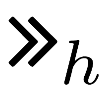

<h2>Non-EU Banks</h2>

<table style="color: black;">
	<thead style="font-weight: bold; font-size: 14pt;">
		<td>Bank name</td>
		<td>Country</td>
		<td>Enr.</td>
		<td>Authenticators</td>
		<td>Binding</td>
		<td>IPs</td>
		<td>MPs</td>
		<td>Ex.</td>
	</thead>
	<tr class="bank-row" id="icbc">
		<td><a href="banks/cn/icbc">ICBC</a></td>
		<td>CN</td>
		<td> <i class="fas fa-university"></i> </td>
		<td>  <i class="fas fa-calculator"></i>[O,K]  otp   opid  <i class="fas fa-calculator"></i>?[O]  otp   <i class="fas fa-table"></i>   otp <i class="fas fa-sim-card"></i>? otp </td>
		<td>  <i class="fas fa-university"></i>, <i class="fas fa-university"></i>, <i class="fas fa-university"></i>   <bold>E</bold>, <i class="fas fa-university"></i>, <i class="fas fa-university"></i>   <i class="fas fa-university"></i>, <i class="fas fa-university"></i>, <i class="fas fa-university"></i>   , <i class="fas fa-globe-americas"></i>, <i class="fas fa-globe-americas"></i>  </td>
		<td>  IP-2   IP-3   IP-11   IP-15   </td>
		<td>  MP-2   MP-6   MP-10  </td>
		<td> <i class="fas fa-check"></i> </td>
	</tr>
	<tr class="bank-row" id="ccb">
		<td><a href="banks/cn/ccb">CCB</a></td>
		<td>CN</td>
		<td><i class="fas fa-university"></i></td>
		<td> opid <i class="fas fa-calculator"></i>?[O,K]  otp   <i class="fas fa-table"></i>   otp <i class="fas fa-sim-card"></i>? otp  </td>
		<td> <i class="fas fa-university"></i>, <i class="fas fa-university"></i>, <i class="fas fa-university"></i>   <bold>E</bold>, <i class="fas fa-university"></i>, <i class="fas fa-university"></i>   <bold>E</bold>, <i class="fas fa-university"></i>, <i class="fas fa-university"></i>   </td>
		<td>IP-3   IP-11   IP-15  </td>
		<td> MP-6   MP-10   MP-13  </td>
		<td><i class="fas fa-check"></i></td>
	</tr>
	<tr class="bank-row" id="abc">
		<td><a href="banks/cn/abc">ABC</a></td>
		<td>CN</td>
		<td><i class="fas fa-university"></i></td>
		<td> opid <i class="fas fa-calculator"></i>[O,K]  otp   opid  <i class="fas fa-calculator"></i>?[O]  otp    <i class="fas fa-table"></i>      </td>
		<td> <bold>E</bold>, <i class="fas fa-university"></i>, <i class="fas fa-university"></i>   <i class="fas fa-university"></i>, <i class="fas fa-university"></i>, <i class="fas fa-university"></i>   <i class="fas fa-university"></i>, <i class="fas fa-university"></i>, <i class="fas fa-globe-americas"></i>  <bold>E</bold>, <i class="fas fa-university"></i>, --  </td>
		<td> IP-4   IP-9   IP-12  </td>
		<td> MP-4   MP-7   MP-11 </td>
		<td><i class="fas fa-check"></i></td>
	</tr>
	<tr class="bank-row" id="chase">
		<td><a href="banks/us/chase">Chase</a></td>
		<td>USA</td>
		<td><i class="fas fa-globe-americas"></i> </td>
		<td>otp <i class="fas fa-sim-card"></i> otp </td>
		<td><bold>E</bold>, <i class="fas fa-globe-americas"></i> , <i class="fas fa-globe-americas"></i>  </td>
		<td>IP-14 </td>
		<td></td>
		<td><i class="fas fa-check-double"></i></td>
	</tr>
	<tr class="bank-row" id="bank-of-america">
		<td><a href="banks/us/bank-of-america">Bank of America</a></td>
		<td>USA</td>
		<td><i class="fas fa-globe-americas"></i></td>
		<td>otp <i class="fas fa-sim-card"></i> otp </td>
		<td><bold>E</bold>, <i class="fas fa-globe-americas"></i> , <i class="fas fa-globe-americas"></i>  </td>
		<td>IP-14 </td>
		<td></td>
		<td><i class="fas fa-check-double"></i></td>
	</tr>
	<tr class="bank-row" id="wells-fargo">
		<td><a href="banks/us/wells-fargo">Wells Fargo</a></td>
		<td>USA</td>
		<td><i class="fas fa-globe-americas"></i> </td>
		<td>otp <i class="fas fa-sim-card"></i> otp </td>
		<td><bold>E</bold>, <i class="fas fa-globe-americas"></i> , <i class="fas fa-globe-americas"></i>  </td>
		<td>IP-14</td>
		<td></td>
		<td><i class="fas fa-check-double"></i></td>
	</tr>
	<tr class="bank-row" id="ubs">
		<td><a href="banks/ch/ubs">UBS</a></td>
		<td>CH</td>
		<td><i class="fas fa-globe-americas"></i></td>
		<td>opid <i class="fas fa-calculator"></i>[O,K]  otp   opid <i class="fas fa-calculator"></i>[O,K]  otp   opid <i class="fas fa-calculator"></i>?[O]  otp   [I]   	opid ?[O,K]  otp  
		opid ?[O,K]  otp   </td>
		<td> <bold>E</bold>, <i class="fas fa-globe-americas"></i>,    , <i class="fas fa-globe-americas"></i>,    , <i class="fas fa-globe-americas"></i>,    <i class="fas fa-globe-americas"></i>, <i class="fas fa-globe-americas"></i>, --   , <i class="fas fa-globe-americas"></i>,    , <i class="fas fa-globe-americas"></i>,   </td>
		<td> IP-3   IP-8   IP-8   IP-22 </td>
		<td> MP-3   MP-3   MP-20   MP-28 </td>
		<td> <i class="fas fa-check-double"></i></td>
	</tr>
	<tr class="bank-row" id="credit-suisse">
		<td><a href="banks/ch/credit-suisse">Credit Suisse</a></td>
		<td>CH</td>
		<td><i class="fas fa-globe-americas"></i></td>
		<td><i class="fas fa-calculator"></i>[O]  otp   otp <i class="fas fa-sim-card"></i> otp  opid [O,K]  otp   opid [O,K]  otp </td>
		<td><bold>E</bold>,<i class="fas fa-university"></i>,<i class="fas fa-university"></i>   <bold>E</bold>, <i class="fas fa-globe-americas"></i>, <i class="fas fa-globe-americas"></i>   <i class="fas fa-globe-americas"></i>, <i class="fas fa-globe-americas"></i>, <i class="fas fa-globe-americas"></i>   <i class="fas fa-globe-americas"></i>, <i class="fas fa-globe-americas"></i>, <i class="fas fa-globe-americas"></i> 	</td>
		<td>IP-1   IP-14    IP-22</td>
		<td>MP-18</td>
		<td><i class="fas fa-check-double"></i></td>
	</tr>
	<tr class="bank-row" id="raiffeisen">
		<td><a href="banks/ch/raiffeisen">Raiffeisen</a></td>
		<td>CH</td>
		<td><i class="fas fa-globe-americas"></i></td>
		<td><i class="fas fa-table"></i>   opid <i class="fas fa-calculator"></i>?[O]  otp   otp <i class="fas fa-sim-card"></i> otp   opid ?[O,K]  otp   opid ?[O,K]  otp   </td> 
		<td> <bold>E</bold>, <i class="fas fa-globe-americas"></i> , <i class="fas fa-globe-americas"></i>   <i class="fas fa-globe-americas"></i>, <i class="fas fa-globe-americas"></i>,    <bold>E</bold>, <i class="fas fa-globe-americas"></i> , <i class="fas fa-globe-americas"></i>   , <i class="fas fa-globe-americas"></i>,    , <i class="fas fa-globe-americas"></i>,  </td>
		<td>IP-6  IP-11   IP-14  IP-23 </td>
		<td>MP-12   MP-20 </td>
		<td> <i class="fas fa-times"></i> </td>
	</tr>