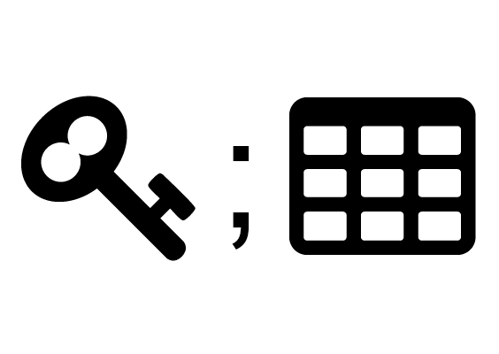
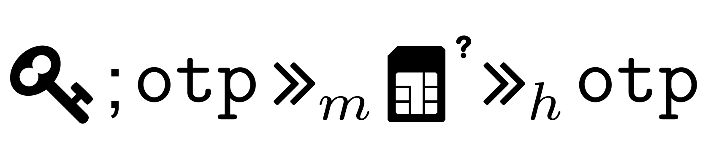
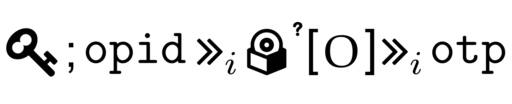
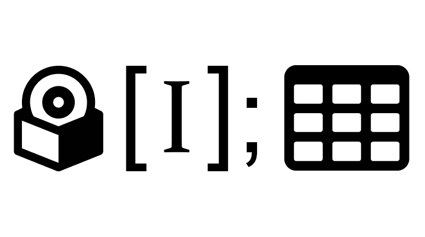
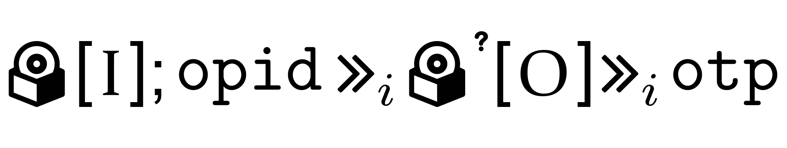

In this page, an overview on the MFA implementations adopted by each bank is given, reporting the enrollment procedure, the employed authenticators and the respective binding procedures, the employed MFA protocols (both for Internet
and Mobile Payments) and the adoption of exemptions.

<h2>EU Banks</h2>

	<table id="eu-banks-table" style="color: black;">
		<thead style="font-weight: bold; font-size: 12.5pt;">
			<td>Bank name</td>
			<td>C</td>
			<td>Enr.</td>
			<td>Authenticators</td>
			<td>Binding</td>
			<td>IPs</td>
			<td>MPs</td>
			<td>Ex.</td>
			<td>RLs</td>
			<td>BPs</td>
		</thead>
		<tr class="bank-row" id="deutsche-bank">
			<td><a href="banks/de/deutsche-bank">Deutsche Bank</a> 	</td>
			<td> DE	</td>
			<td> <i class="fas fa-university"></i> </td>
			<td> [I]   opid <i class="fas fa-calculator"></i>?[O] otp   <i class="fas fa-table"></i>   <i class="fas fa-sim-card"></i>?   opid ?[O] otp  </td>
			<td> <i class="fas fa-globe-americas"></i>,<i class="fas fa-globe-americas"></i>,--   <bold>E</bold>,<i class="fas fa-globe-americas"></i>,<i class="fas fa-globe-americas"></i>   <i class="fas fa-university"></i>,<i class="fas fa-university"></i>,<i class="fas fa-university"></i>   <i class="fas fa-globe-americas"></i>,<i class="fas fa-globe-americas"></i>,<i class="fas fa-globe-americas"></i>   <i class="fas fa-globe-americas"></i>,<i class="fas fa-globe-americas"></i>,<i class="fas fa-globe-americas"></i>(<i class="fas fa-sim-card"></i>)</td>
			<td> <a href="mfa-protocols-evaluation#IP-6"> IP-6 : </a>  <a href="mfa-protocols-evaluation#IP-11">IP-11: </a>   <a href="mfa-protocols-evaluation#IP-15">IP-15: </a>   <a href="mfa-protocols-evaluation#IP-21">IP-21: </a> </td>
			<td> MP-10:    MP-19:   MP-25:   MP-27:  </td>
			<td> <i class="fas fa-check"></i> </td>
			<td><a href="requirements-evaluation#deutsche-bank">4/9</a></td>
			<td><a href="best-practices-evaluation#deutsche-bank">3/8</a></td>
		</tr>
		<tr class="bank-row" id="vr-bank">
			<td><a href="banks/de/vr-bank">VR Bank</a> </td>
			<td> DE	</td>
			<td><i class="fas fa-university"></i> </td>
			<td>[I]   opid <i class="fas fa-calculator"></i>?[O] otp   otp <i class="fas fa-sim-card"></i>? otp   opid ?[O,K] otp   opid <i class="fas fa-mobile-alt"></i>?[O,K] otp   opid ?[O,I] otp   opid <i class="fas fa-mobile-alt"></i>?[O,I] otp </td>
			<td><i class="fas fa-globe-americas"></i>, <i class="fas fa-globe-americas"></i>, <i class="fas fa-globe-americas"></i>   <bold>E</bold>,<i class="fas fa-globe-americas"></i>,     <i class="fas fa-university"></i>, <i class="fas fa-university"></i>, <i class="fas fa-globe-americas"></i>    <i class="fas fa-globe-americas"></i>,<i class="fas fa-globe-americas"></i>,<i class="fas fa-globe-americas"></i>   <i class="fas fa-globe-americas"></i>,<i class="fas fa-globe-americas"></i>,<i class="fas fa-globe-americas"></i>   <i class="fas fa-globe-americas"></i>,<i class="fas fa-globe-americas"></i>,<i class="fas fa-globe-americas"></i>   <i class="fas fa-globe-americas"></i>,<i class="fas fa-globe-americas"></i>,<i class="fas fa-globe-americas"></i> </td>
			<td>	IP-6   IP-15   IP-31   IP-32 </td>
			<td> 	MP-8   MP-20   MP-21   MP-22  MP-28   MP-29	</td>
			<td> <i class="fas fa-check"></i> </td>
			<td><a href="requirements-evaluation#vr-bank">6/9</a></td>
			<td><a href="best-practices-evaluation#vr-bank">3/8</a></td>
		</tr>
		<tr class="bank-row" id="commerzbank">
			<td><a href="banks/de/commerzbank">Commerzbank</a></td>
			<td>DE </td>
			<td><i class="fas fa-globe-americas"></i> </td><td> [I]   opid <i class="fas fa-calculator"></i>?[O] otp   <i class="fas fa-table"></i>   otp <i class="fas fa-sim-card"></i>? otp   opid ?[O] otp   opid ?[O] otp </td>
			<td><i class="fas fa-globe-americas"></i>, <i class="fas fa-globe-americas"></i>, --   <bold>E</bold>,<i class="fas fa-globe-americas"></i>,<i class="fas fa-globe-americas"></i>    <i class="fas fa-globe-americas"></i>,<i class="fas fa-globe-americas"></i>,<i class="fas fa-globe-americas"></i>   <i class="fas fa-globe-americas"></i>,<i class="fas fa-globe-americas"></i>,<i class="fas fa-globe-americas"></i>   <i class="fas fa-globe-americas"></i>,<i class="fas fa-globe-americas"></i>,<i class="fas fa-globe-americas"></i>(<i class="fas fa-sim-card"></i>)   <i class="fas fa-globe-americas"></i>,<i class="fas fa-globe-americas"></i>,<i class="fas fa-globe-americas"></i>(<i class="fas fa-sim-card"></i>) </td>
			<td>  IP-6   IP-11   IP-15   IP-21  </td>
			<td>  MP-8   MP-19   MP-22   MP-27  </td>
			<td> <i class="fas fa-check"></i> </td>
			<td><a href="requirements-evaluation#commerzbank">3/9</a></td>
			<td><a href="best-practices-evaluation#commerzbank">2/8</a></td>
		</tr>
		<tr class="bank-row" id="hsbc">
			<td><a href="banks/uk/hsbc">HSBC</a></td>
			<td>UK	</td>
			<td><i class="fas fa-university"></i>  </td>
			<td><i class="fas fa-calculator"></i>[O,K] otp   [O,K] otp   [O,I] otp   [O,K] otp   [O,I] otp </td>
			<td><bold>E</bold>,<i class="fas fa-globe-americas"></i>,   <i class="fas fa-globe-americas"></i>,<i class="fas fa-globe-americas"></i>,   <i class="fas fa-globe-americas"></i>,<i class="fas fa-globe-americas"></i>,   <i class="fas fa-globe-americas"></i>,<i class="fas fa-globe-americas"></i>,   <i class="fas fa-globe-americas"></i>,<i class="fas fa-globe-americas"></i>, </td>
			<td> IP-2   IP-19   IP-20  </td>
			<td> MP-15   MP-16 </td>
			<td> <i class="fas fa-check-double"></i></td>
			<td><a href="requirements-evaluation#hsbc">7/9</a></td>
			<td><a href="best-practices-evaluation#hsbc">6/8</a></td>
		</tr>
		<tr class="bank-row" id="barclays">
			<td><a href="banks/uk/barclays">Barclays</a></td>
			<td>UK	</td>
			<td> <i class="fas fa-university"></i>  </td>
			<td>   <i class="fas fa-calculator"></i>[O,K] otp   [O,K] otp   [O,I] otp  </td>
			<td><bold>E</bold>, <i class="fas fa-globe-americas"></i>, <i class="fas fa-globe-americas"></i>  <i class="fas fa-globe-americas"></i>,<i class="fas fa-globe-americas"></i>,   <i class="fas fa-globe-americas"></i>, <i class="fas fa-globe-americas"></i>,     <i class="fas fa-globe-americas"></i>, <i class="fas fa-globe-americas"></i>,  </td>
			<td> IP-2   IP-19   IP-20 </td>
			<td></td>
			<td><i class="fas fa-check-double"></i></td>
			<td><a href="requirements-evaluation#barclays">5/9</a></td>
			<td><a href="best-practices-evaluation#barclays">5/8</a></td>
		</tr>
		<tr class="bank-row" id="lloyds-bank">
			<td><a href="banks/uk/lloyds-bank">LLoyds Bank</a></td>
			<td>UK</td>
			<td><i class="fas fa-university"></i>   </td>
			<td>   otp <i class="fas fa-sim-card"></i> otp   opid <i class="fas fa-mobile-alt"></i>[O,K] otp   opid <i class="fas fa-mobile-alt"></i>[O,I] otp   [I]   opid [O] otp  </td>
			<td><bold>E</bold>, <i class="fas fa-university"></i>, <i class="fas fa-university"></i>   <bold>E</bold>,<i class="fas fa-university"></i>,<i class="fas fa-university"></i>   <i class="fas fa-globe-americas"></i>,<i class="fas fa-globe-americas"></i>,<i class="fas fa-globe-americas"></i>   <i class="fas fa-globe-americas"></i>,<i class="fas fa-globe-americas"></i>,<i class="fas fa-globe-americas"></i>   <i class="fas fa-globe-americas"></i>,<i class="fas fa-globe-americas"></i>,<i class="fas fa-globe-americas"></i>   <i class="fas fa-globe-americas"></i>,<i class="fas fa-globe-americas"></i>,<i class="fas fa-globe-americas"></i> </td>
			<td> IP-17   IP-29,   IP-30 </td>
			<td>MP-17   MP-26 </td>
			<td> <i class="fas fa-check-double"></i></td>
			<td><a href="requirements-evaluation#lloyds-bank">5/9</a></td>
			<td><a href="best-practices-evaluation#lloyds-bank">5/8</a></td>
		</tr>
		<tr class="bank-row" id="bnp-paribas">
			<td><a href="banks/fr/bnp-paribas">BNP Paribas</a></td>
			<td>FR </td>
			<td><i class="fas fa-globe-americas"></i>   </td>
			<td>otp <i class="fas fa-sim-card"></i> otp  opid <i class="fas fa-mobile-alt"></i>?[O,K] otp   opid [O] otp  </td>
			<td><bold>E</bold>,<i class="fas fa-globe-americas"></i>,<i class="fas fa-globe-americas"></i>   <i class="fas fa-globe-americas"></i>,<i class="fas fa-globe-americas"></i>,<i class="fas fa-globe-americas"></i>(<i class="fas fa-sim-card"></i>)   <i class="fas fa-globe-americas"></i>,<i class="fas fa-globe-americas"></i>,<i class="fas fa-globe-americas"></i>(<i class="fas fa-sim-card"></i>)  </td>
			<td> IP-14   IP-27 </td>
			<td>MP-12   MP-20 </td>
			<td><i class="fas fa-check-double"></i></td>
			<td><a href="requirements-evaluation#bnp-paribas">5/9</a></td>
			<td><a href="best-practices-evaluation#bnp-paribas">3/8</a></td>
		</tr>
		<tr class="bank-row" id="credit-agricole">
			<td><a href="banks/fr/credit-agricole">Credit Agricole</a></td>
			<td>FR </td>
			<td> <i class="fas fa-globe-americas"></i>  </td>
			<td>otp <i class="fas fa-sim-card"></i> otp </td>
			<td><bold>E</bold>,<i class="fas fa-globe-americas"></i>,<i class="fas fa-globe-americas"></i> </td>
			<td>IP-14 </td>
			<td> </td>
			<td><i class="fas fa-check-double"></i></td>
			<td><a href="requirements-evaluation#credit-agricole">4/9</a></td>
			<td><a href="best-practices-evaluation#credit-agricole">1/8</a></td>
		</tr>
		<tr class="bank-row" id="societe-generale">
			<td><a href="banks/fr/societe-generale">Societe Generale</a></td>
			<td>FR </td>
			<td><i class="fas fa-globe-americas"></i>   </td>
			<td>otp <i class="fas fa-sim-card"></i> otp   opid ?[O,K] otp   opid <i class="fas fa-mobile-alt"></i>?[O,K] otp  </td>
			<td><bold>E</bold>,<i class="fas fa-globe-americas"></i>,<i class="fas fa-globe-americas"></i>   <i class="fas fa-globe-americas"></i>,<i class="fas fa-globe-americas"></i>,<i class="fas fa-globe-americas"></i>(<i class="fas fa-sim-card"></i>)   <i class="fas fa-globe-americas"></i>,<i class="fas fa-globe-americas"></i>,<i class="fas fa-globe-americas"></i>(<i class="fas fa-sim-card"></i>) </td>
			<td> IP-14   IP-27</td>
			<td> MP-20 </td>
			<td><i class="fas fa-check"></i></td>
			<td><a href="requirements-evaluation#societe-generale">5/9</a></td>
			<td><a href="best-practices-evaluation#societe-generale">3/8</a></td>
		</tr>
		<tr class="bank-row" id="unicredit">
			<td><a href="banks/it/unicredit">Unicredit</a></td>
			<td>IT </td>
			<td><i class="fas fa-university"></i>   </td>
			<td><i class="fas fa-calculator"></i>[O] otp   <i class="fas fa-table"></i>   opid ?[O,K] otp   opid ?[O,I] otp   opid ?[O,K] otp   opid ?[O,K] otp </td>
			<td><bold>E</bold>, <i class="fas fa-university"></i>, <i class="fas fa-university"></i>   <bold>E</bold>, <i class="fas fa-globe-americas"></i>, <i class="fas fa-globe-americas"></i>   <i class="fas fa-globe-americas"></i>,<i class="fas fa-globe-americas"></i>,   <i class="fas fa-globe-americas"></i>,<i class="fas fa-globe-americas"></i>,   <i class="fas fa-globe-americas"></i>,<i class="fas fa-globe-americas"></i>,   <i class="fas fa-globe-americas"></i>,<i class="fas fa-globe-americas"></i>, </td>
			<td>  IP-1   IP-11   IP-24   IP-25  </td>
			<td> MP-20   MP-21 </td>
			<td><i class="fas fa-check-double"></i></td>
			<td><a href="requirements-evaluation#unicredit">5/9</a></td>
			<td><a href="best-practices-evaluation#unicredit">6/8</a></td>
		</tr>
		<tr class="bank-row" id="banca-intesa">
			<td><a href="banks/it/banca-intesa">Banca Intesa</a></td>
			<td>IT </td>
			<td><i class="fas fa-university"></i>   </td>
			<td><i class="fas fa-calculator"></i>[O] otp   opid <i class="fas fa-mobile-alt"></i>?[O,K] otp   opid <i class="fas fa-mobile-alt"></i>?[O,I] otp   opid ?[O,K] otp   opid ?[O,I] otp  </td>
			<td><bold>E</bold>, <i class="fas fa-university"></i>, <i class="fas fa-university"></i>   <i class="fas fa-globe-americas"></i>, <i class="fas fa-globe-americas"></i>,    <i class="fas fa-globe-americas"></i>, <i class="fas fa-globe-americas"></i>,    <i class="fas fa-globe-americas"></i>, <i class="fas fa-globe-americas"></i>,    <i class="fas fa-globe-americas"></i>, <i class="fas fa-globe-americas"></i>,  </td>
			<td> IP-1   IP-27   IP-28  </td>
			<td> MP-1   MP-20   MP-21  </td>
			<td><i class="fas fa-check-double"></i> </td>
			<td><a href="requirements-evaluation#banca-intesa">7/9</a></td>
			<td><a href="best-practices-evaluation#banca-intesa">6/8</a></td>
		</tr>
		<tr class="bank-row" id="banco-bpm">
			<td><a href="banks/it/banco-bpm">Banco BPM</a></td>
			<td>IT </td>
			<td><i class="fas fa-university"></i>   </td>
			<td><i class="fas fa-calculator"></i>[O] otp   <i class="fas fa-calculator"></i>[O,K] otp    [O] otp  opid <i class="fas fa-mobile-alt"></i>?[O,K] otp   opid ?[O,K]  otp </td>
			<td><bold>E</bold>, <i class="fas fa-university"></i>, <i class="fas fa-university"></i>   <i class="fas fa-globe-americas"></i>, <i class="fas fa-university"></i>, <i class="fas fa-university"></i>   <i class="fas fa-globe-americas"></i>,<i class="fas fa-globe-americas"></i>,   <i class="fas fa-globe-americas"></i>,<i class="fas fa-globe-americas"></i>,   <i class="fas fa-globe-americas"></i>,<i class="fas fa-globe-americas"></i>,  </td>
			<td>IP-1   IP-2   IP-18   IP-27  </td>
			<td>MP-1   MP-20 </td>
			<td><i class="fas fa-check"></i> </td>
			<td><a href="requirements-evaluation#banco-bpm">7/9</a></td>
			<td><a href="best-practices-evaluation#banco-bpm">6/8</a></td>
		</tr>
		<tr class="bank-row" id="banco-santander">
			<td><a href="banks/es/banco-santander">Banco Santander</a></td>
			<td>ES	</td>
			<td><i class="fas fa-globe-americas"></i>   </td>
			<td>   otp <i class="fas fa-sim-card"></i> otp  </td>
			<td><bold>E</bold>,<i class="fas fa-globe-americas"></i>,<i class="fas fa-globe-americas"></i>   <bold>E</bold>,<i class="fas fa-globe-americas"></i>,<i class="fas fa-globe-americas"></i>  </td>
			<td>IP-16</td>
			<td>MP-14 </td>
			<td><i class="fas fa-check-double"></i></td>
			<td><a href="requirements-evaluation#banco-santander">5/9</a></td>
			<td><a href="best-practices-evaluation#banco-santander">1/8</a></td>
		</tr>
		<tr class="bank-row" id="bbva">
			<td><a href="banks/es/bbva">BBVA</a></td>
			<td>ES</td>
			<td><i class="fas fa-globe-americas"></i></td>
			<td>otp <i class="fas fa-sim-card"></i>? otp </td>
			<td><bold>E</bold>,<i class="fas fa-globe-americas"></i>,<i class="fas fa-globe-americas"></i>  </td>
			<td>IP-15 </td>
			<td>MP-13 </td>
			<td><i class="fas fa-check"></i></td>
			<td><a href="requirements-evaluation#bbva">6/9</a></td>
			<td><a href="best-practices-evaluation#bbva">1/8</a></td>
		</tr>
		<tr class="bank-row" id="la-caixa">
			<td><a href="banks/es/la-caixa">La Caixa</a></td>
			<td>ES </td>
			<td><i class="fas fa-globe-americas"></i> </td>
			<td><i class="fas fa-table"></i>   opid <i class="fas fa-mobile-alt"></i>?[O] otp   opid ?[O] otp </td>
			<td><bold>E</bold>,<i class="fas fa-university"></i>,<i class="fas fa-university"></i>   <i class="fas fa-globe-americas"></i>, <i class="fas fa-globe-americas"></i>,    <i class="fas fa-globe-americas"></i>, <i class="fas fa-globe-americas"></i>,   </td>
			<td>IP-11  IP-26 </td>
			<td>MP-19</td>
			<td><i class="fas fa-check-double"></i></td>
			<td><a href="requirements-evaluation#la-caixa">6/9</a></td>
			<td><a href="best-practices-evaluation#la-caixa">4/8</a></td>
		</tr>
		<tr class="bank-row" id="ing">
			<td><a href="banks/nl/ing">ING</a></td>
			<td>NL	</td>
			<td><i class="fas fa-globe-americas"></i> </td>
			<td><i class="fas fa-table"></i>   otp <i class="fas fa-sim-card"></i>? otp   opid<i class="fas fa-mobile-alt"></i>?[O,K] otp   [I]   opid ?[O] otp </td>
			<td><bold>E</bold>,<i class="fas fa-globe-americas"></i>,<i class="fas fa-globe-americas"></i>   <bold>E</bold>,<i class="fas fa-globe-americas"></i>,<i class="fas fa-globe-americas"></i>   <i class="fas fa-globe-americas"></i>,<i class="fas fa-globe-americas"></i>,<i class="fas fa-globe-americas"></i>(<i class="fas fa-sim-card"></i>)   <i class="fas fa-globe-americas"></i>, <i class="fas fa-globe-americas"></i>, --   <i class="fas fa-globe-americas"></i>,<i class="fas fa-globe-americas"></i>,<i class="fas fa-globe-americas"></i>(<i class="fas fa-sim-card"></i>) </td>
			<td> IP-11   IP-15   IP-27  </td>
			<td>MP-19   MP-27 </td>
			<td><i class="fas fa-check"></i></td>
			<td><a href="requirements-evaluation#ing">2/9</a></td>
			<td><a href="best-practices-evaluation#ing">3/8</a></td>
		</tr>
		<tr class="bank-row" id="rabobank">
			<td><a href="banks/nl/rabobank">Rabobank</a></td>
			<td>NL	</td>
			<td><i class="fas fa-globe-americas"></i> </td>
			<td>opid <i class="fas fa-calculator"></i>?[O,K] otp   opid <i class="fas fa-calculator"></i>?[O,K] otp   [I]  </td>
			<td><bold>E</bold>,<i class="fas fa-university"></i>,<i class="fas fa-university"></i>   --   <i class="fas fa-globe-americas"></i>, <i class="fas fa-globe-americas"></i>, --  </td>
			<td>IP-7   IP-10 </td>
			<td>MP-9   MP-24 </td>
			<td> <i class="fas fa-check-double"></i> </td>
			<td><a href="requirements-evaluation#rabobank">7/9</a></td>
			<td><a href="best-practices-evaluation#rabobank">3/8</a></td>
		</tr>
		<tr class="bank-row" id="abn-amro">
			<td><a href="banks/nl/abn-amro">ABN AMRO</a></td>
			<td>NL	</td>
			<td><i class="fas fa-globe-americas"></i> </td>
			<td>opid <i class="fas fa-calculator"></i>?[O,K] otp   opid <i class="fas fa-calculator"></i>?[O,K] otp   [I]  </td>
			<td><bold>E</bold>,<i class="fas fa-globe-americas"></i>,<i class="fas fa-globe-americas"></i>   --   <i class="fas fa-globe-americas"></i>, <i class="fas fa-globe-americas"></i>, --   </td>
			<td>IP-5   IP-10 </td>
			<td> MP-5   MP-5,   MP-23   MP-23  </td>
			<td><i class="fas fa-check-double"></i></td>
			<td><a href="requirements-evaluation#abn-amro">6/9</a></td>
			<td><a href="best-practices-evaluation#abn-amro">2/8</a></td>
		</tr>
		<tr class="bank-row" id="nordea">
			<td><a href="banks/sw/nordea">Nordea</a></td>
			<td>SW	</td>
			<td><i class="fas fa-globe-americas"></i> </td>
			<td>opid <i class="fas fa-calculator"></i>[O,K] otp   opid <i class="fas fa-calculator"></i>?[O,K] otp   opid ?[O,K] otp   opid <i class="fas fa-mobile-alt"></i>?[O,K] otp  opid <i class="fas fa-mobile-alt"></i>?[O,I] otp   opid ?[O,K] otp  opid ?[O,I] otp </td>
			<td><bold>E</bold>,<i class="fas fa-globe-americas"></i>,<i class="fas fa-globe-americas"></i>   <i class="fas fa-globe-americas"></i>,<i class="fas fa-globe-americas"></i>,<i class="fas fa-globe-americas"></i>   <i class="fas fa-globe-americas"></i>,<i class="fas fa-globe-americas"></i>,   <i class="fas fa-globe-americas"></i>,<i class="fas fa-globe-americas"></i>,   <i class="fas fa-globe-americas"></i>,<i class="fas fa-globe-americas"></i>,   <i class="fas fa-globe-americas"></i>,<i class="fas fa-globe-americas"></i>,   <i class="fas fa-globe-americas"></i>,<i class="fas fa-globe-americas"></i>, </td>
			<td> IP-5   IP-8   IP-13   IP-27   IP-28  </td>
			<td> MP-3   MP-20  MP-21  </td>
			<td><i class="fas fa-check-double"></i></td>
			<td><a href="requirements-evaluation#nordea">4/9</a></td>
			<td><a href="best-practices-evaluation#nordea">4/8</a></td>
		</tr>
		<tr class="bank-row" id="svenska-handelsbanken">
			<td><a href="banks/sw/svenska-handelsbanken">Svenska Handelsbanken</a></td>
			<td>SW	</td>
			<td><i class="fas fa-university"></i> </td>
			<td><i class="fas fa-table"></i>   opid <i class="fas fa-calculator"></i>[O,K] otp   opid <i class="fas fa-calculator"></i>?[O,K] otp   opid ?[O,K] otp   opid <i class="fas fa-mobile-alt"></i>?[O,K] otp  opid <i class="fas fa-mobile-alt"></i>?[O,I] otp   opid ?[O,K] otp  opid ?[O,I] otp  </td>
			<td><bold>E</bold>,<i class="fas fa-globe-americas"></i>,<i class="fas fa-globe-americas"></i>   ,<i class="fas fa-globe-americas"></i>,<i class="fas fa-globe-americas"></i>   ,<i class="fas fa-globe-americas"></i>,<i class="fas fa-globe-americas"></i>   <i class="fas fa-globe-americas"></i>,<i class="fas fa-globe-americas"></i>,   <i class="fas fa-globe-americas"></i>,<i class="fas fa-globe-americas"></i>,   <i class="fas fa-globe-americas"></i>,<i class="fas fa-globe-americas"></i>,   <i class="fas fa-globe-americas"></i>,<i class="fas fa-globe-americas"></i>,   <i class="fas fa-globe-americas"></i>,<i class="fas fa-globe-americas"></i>,  </td>
			<td> IP-5   IP-8   IP-11   IP-13 IP-27   IP-28 </td>
			<td> MP-3   MP-10   MP-20   MP-21 </td>
			<td><i class="fas fa-times"></i></td>
			<td><a href="requirements-evaluation#svenska-handelsbanken">4/9</a></td>
			<td><a href="best-practices-evaluation#svenska-handelsbanken">4/8</a></td>
		</tr>
		<tr class="bank-row" id="seb">
			<td><a href="banks/sw/seb">SEB</a></td>
			<td>SW	</td>
			<td><i class="fas fa-globe-americas"></i> </td>
			<td>opid <i class="fas fa-calculator"></i>[O,K] otp   opid <i class="fas fa-calculator"></i>?[O,K] otp   opid <i class="fas fa-mobile-alt"></i>?[O,K] otp  opid <i class="fas fa-mobile-alt"></i>?[O,I] otp   opid ?[O,K] otp  opid ?[O,I] otp </td>
			<td><bold>E</bold>,<i class="fas fa-globe-americas"></i>,<i class="fas fa-globe-americas"></i>   ,<i class="fas fa-globe-americas"></i>,<i class="fas fa-globe-americas"></i>   <i class="fas fa-globe-americas"></i>,<i class="fas fa-globe-americas"></i>,   <i class="fas fa-globe-americas"></i>,<i class="fas fa-globe-americas"></i>,   <i class="fas fa-globe-americas"></i>,<i class="fas fa-globe-americas"></i>,   <i class="fas fa-globe-americas"></i>,<i class="fas fa-globe-americas"></i>, </td>
			<td> IP-5   IP-8  IP-27   IP-28 </td>
			<td> MP-3   MP-20   MP-21 </td>
			<td> <i class="fas fa-times"></i></td>
			<td><a href="requirements-evaluation#seb">4/9</a></td>
			<td><a href="best-practices-evaluation#seb">3/8</a></td>
		</tr>
	</table>

<h2>Non-EU Banks</h2>

	<table id="non-eu-banks-table" style="color: black;">
		<thead style="font-weight: bold; font-size: 12.5pt;">
			<td>Bank name</td>
			<td>C</td>
			<td>Enr.</td>
			<td>Authenticators</td>
			<td>Binding</td>
			<td>IPs</td>
			<td>MPs</td>
			<td>Ex.</td>
			<td>RLs</td>
			<td>BPs</td>
		</thead>
		<tr class="bank-row" id="icbc">
			<td><a href="banks/cn/icbc">ICBC</a></td>
			<td>CN</td>
			<td> <i class="fas fa-university"></i> </td>
			<td>  <i class="fas fa-calculator"></i>[O,K]  otp   opid  <i class="fas fa-calculator"></i>?[O]  otp   <i class="fas fa-table"></i>   otp <i class="fas fa-sim-card"></i>? otp </td>
			<td>  <i class="fas fa-university"></i>, <i class="fas fa-university"></i>, <i class="fas fa-university"></i>   <bold>E</bold>, <i class="fas fa-university"></i>, <i class="fas fa-university"></i>   <i class="fas fa-university"></i>, <i class="fas fa-university"></i>, <i class="fas fa-university"></i>   , <i class="fas fa-globe-americas"></i>, <i class="fas fa-globe-americas"></i>  </td>
			<td>  IP-2   IP-3   IP-11   IP-15   </td>
			<td>  MP-2   MP-6   MP-10  </td>
			<td> <i class="fas fa-check"></i> </td>
			<td><a href="requirements-evaluation#icbc">6/9</a></td>
			<td><a href="best-practices-evaluation#icbc">4/8</a></td>
		</tr>
		<tr class="bank-row" id="ccb">
			<td><a href="banks/cn/ccb">CCB</a></td>
			<td>CN</td>
			<td><i class="fas fa-university"></i></td>
			<td> opid <i class="fas fa-calculator"></i>?[O,K]  otp   <i class="fas fa-table"></i>   otp <i class="fas fa-sim-card"></i>? otp  </td>
			<td> <i class="fas fa-university"></i>, <i class="fas fa-university"></i>, <i class="fas fa-university"></i>   <bold>E</bold>, <i class="fas fa-university"></i>, <i class="fas fa-university"></i>   <bold>E</bold>, <i class="fas fa-university"></i>, <i class="fas fa-university"></i>   </td>
			<td>IP-3   IP-11   IP-15  </td>
			<td> MP-6   MP-10   MP-13  </td>
			<td><i class="fas fa-check"></i></td>
			<td><a href="requirements-evaluation#ccb">6/9</a></td>
			<td><a href="best-practices-evaluation#ccb">4/8</a></td>
		</tr>
		<tr class="bank-row" id="abc">
			<td><a href="banks/cn/abc">ABC</a></td>
			<td>CN</td>
			<td><i class="fas fa-university"></i></td>
			<td> opid <i class="fas fa-calculator"></i>[O,K]  otp   opid  <i class="fas fa-calculator"></i>?[O]  otp    <i class="fas fa-table"></i>      </td>
			<td> <bold>E</bold>, <i class="fas fa-university"></i>, <i class="fas fa-university"></i>   <i class="fas fa-university"></i>, <i class="fas fa-university"></i>, <i class="fas fa-university"></i>   <i class="fas fa-university"></i>, <i class="fas fa-university"></i>, <i class="fas fa-globe-americas"></i>  <bold>E</bold>, <i class="fas fa-university"></i>, --  </td>
			<td> IP-4   IP-9   IP-12  </td>
			<td> MP-4   MP-7   MP-11 </td>
			<td><i class="fas fa-check"></i></td>
			<td><a href="requirements-evaluation#abc">6/9</a></td>
			<td><a href="best-practices-evaluation#abc">5/8</a></td>
		</tr>
		<tr class="bank-row" id="chase">
			<td><a href="banks/us/chase">Chase</a></td>
			<td>USA</td>
			<td><i class="fas fa-globe-americas"></i> </td>
			<td>otp <i class="fas fa-sim-card"></i> otp </td>
			<td><bold>E</bold>, <i class="fas fa-globe-americas"></i> , <i class="fas fa-globe-americas"></i>  </td>
			<td>IP-14 </td>
			<td></td>
			<td><i class="fas fa-check-double"></i></td>
			<td><a href="requirements-evaluation#chase">2/9</a></td>
			<td><a href="best-practices-evaluation#chase">2/8</a></td>
		</tr>
		<tr class="bank-row" id="bank-of-america">
			<td><a href="banks/us/bank-of-america">Bank of America</a></td>
			<td>USA</td>
			<td><i class="fas fa-globe-americas"></i></td>
			<td>otp <i class="fas fa-sim-card"></i> otp </td>
			<td><bold>E</bold>, <i class="fas fa-globe-americas"></i> , <i class="fas fa-globe-americas"></i>  </td>
			<td>IP-14 </td>
			<td></td>
			<td><i class="fas fa-check-double"></i></td>
			<td><a href="requirements-evaluation#bank-of-america">2/9</a></td>
			<td><a href="best-practices-evaluation#bank-of-america">1/8</a></td>
		</tr>
		<tr class="bank-row" id="wells-fargo">
			<td><a href="banks/us/wells-fargo">Wells Fargo</a></td>
			<td>USA</td>
			<td><i class="fas fa-globe-americas"></i> </td>
			<td>otp <i class="fas fa-sim-card"></i> otp </td>
			<td><bold>E</bold>, <i class="fas fa-globe-americas"></i> , <i class="fas fa-globe-americas"></i>  </td>
			<td>IP-14</td>
			<td></td>
			<td><i class="fas fa-check-double"></i></td>
			<td><a href="requirements-evaluation#wells-fargo">2/9</a></td>
			<td><a href="best-practices-evaluation#wells-fargo">2/8</a></td>
		</tr>
		<tr class="bank-row" id="ubs">
			<td><a href="banks/ch/ubs">UBS</a></td>
			<td>CH</td>
			<td><i class="fas fa-globe-americas"></i></td>
			<td>opid <i class="fas fa-calculator"></i>[O,K]  otp   opid <i class="fas fa-calculator"></i>[O,K]  otp   opid <i class="fas fa-calculator"></i>?[O]  otp   [I]   	opid ?[O,K]  otp  
			opid ?[O,K]  otp   </td>
			<td> <bold>E</bold>, <i class="fas fa-globe-americas"></i>,    , <i class="fas fa-globe-americas"></i>,    , <i class="fas fa-globe-americas"></i>,    <i class="fas fa-globe-americas"></i>, <i class="fas fa-globe-americas"></i>, --   , <i class="fas fa-globe-americas"></i>,    , <i class="fas fa-globe-americas"></i>,   </td>
			<td> IP-3   IP-8   IP-8   IP-22 </td>
			<td> MP-3   MP-3   MP-20   MP-28 </td>
			<td> <i class="fas fa-check-double"></i></td>
			<td><a href="requirements-evaluation#ubs">6/9</a></td>
			<td><a href="best-practices-evaluation#ubs">4/8</a></td>
		</tr>
		<tr class="bank-row" id="credit-suisse">
			<td><a href="banks/ch/credit-suisse">Credit Suisse</a></td>
			<td>CH</td>
			<td><i class="fas fa-globe-americas"></i></td>
			<td><i class="fas fa-calculator"></i>[O]  otp   otp <i class="fas fa-sim-card"></i> otp  opid [O,K]  otp   opid [O,K]  otp </td>
			<td><bold>E</bold>,<i class="fas fa-university"></i>,<i class="fas fa-university"></i>   <bold>E</bold>, <i class="fas fa-globe-americas"></i>, <i class="fas fa-globe-americas"></i>   <i class="fas fa-globe-americas"></i>, <i class="fas fa-globe-americas"></i>, <i class="fas fa-globe-americas"></i>   <i class="fas fa-globe-americas"></i>, <i class="fas fa-globe-americas"></i>, <i class="fas fa-globe-americas"></i> 	</td>
			<td>IP-1   IP-14    IP-22</td>
			<td>MP-18</td>
			<td><i class="fas fa-check-double"></i></td>
			<td><a href="requirements-evaluation#credit-suisse">4/9</a></td>
			<td><a href="best-practices-evaluation#credit-suisse">2/8</a></td>
		</tr>
		<tr class="bank-row" id="raiffeisen">
			<td><a href="banks/ch/raiffeisen">Raiffeisen</a></td>
			<td>CH</td>
			<td><i class="fas fa-globe-americas"></i></td>
			<td><i class="fas fa-table"></i>   opid <i class="fas fa-calculator"></i>?[O]  otp   otp <i class="fas fa-sim-card"></i> otp   opid ?[O,K]  otp   opid ?[O,K]  otp   </td> 
			<td> <bold>E</bold>, <i class="fas fa-globe-americas"></i> , <i class="fas fa-globe-americas"></i>   <i class="fas fa-globe-americas"></i>, <i class="fas fa-globe-americas"></i>,    <bold>E</bold>, <i class="fas fa-globe-americas"></i> , <i class="fas fa-globe-americas"></i>   , <i class="fas fa-globe-americas"></i>,    , <i class="fas fa-globe-americas"></i>,  </td>
			<td>IP-6  IP-11   IP-14  IP-23 </td>
			<td>MP-12   MP-20 </td>
			<td> <i class="fas fa-times"></i> </td>
			<td><a href="requirements-evaluation#raiffeisen">4/9</a></td>
			<td><a href="best-practices-evaluation#raiffeisen">1/8</a></td>
		</tr>
	</table>

