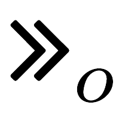
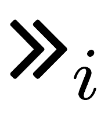

<table style="color: black;">
	<thead style="font-weight: bold; font-size: 14pt;">
		<td>Bank name</td>
		<td>Country</td>
		<td>Enrollment</td>
		<td>Authenticators</td>
		<td>Binding</td>
		<td>IPs</td>
		<td>MPs</td>
		<td>Exemptions</td>
	</thead>
	<tr class="bank-row" id="deutsche-bank">
		<td><a href="banks/de/deutsche-bank">Deutsche Bank</a> 	</td>
		<td> DE	</td>
		<td> <i class="fas fa-university"></i> </td>
		<td> }[I]   opid <i class="fas fa-calculator"></i>?}[O] otp   <i class="fas fa-table"></i>   <i class="fas fa-sim-card"></i>?   opid ?}[O] otp  </td>
		<td> <i class="fas fa-globe-americas"></i>,<i class="fas fa-globe-americas"></i>,--   <bold>E</bold>,<i class="fas fa-globe-americas"></i>,<i class="fas fa-globe-americas"></i>   <i class="fas fa-university"></i>,<i class="fas fa-university"></i>,<i class="fas fa-university"></i>   <i class="fas fa-globe-americas"></i>,<i class="fas fa-globe-americas"></i>,<i class="fas fa-globe-americas"></i>   <i class="fas fa-globe-americas"></i>,<i class="fas fa-globe-americas"></i>,<i class="fas fa-globe-americas"></i>(<i class="fas fa-sim-card"></i>)</td>
		<td>  IP-6   IP-11   IP-15   IP-21  </td>
		<td>  MP-10   MP-19   MP-25   MP-27  </td>
		<td> <i class="fas fa-check"></i> </td>
	</tr>
	<tr class="bank-row" id="vr-bank">
		<td><a href="banks/de/vr-bank">VR Bank</a> </td>
		<td> DE	</td>
		<td><i class="fas fa-university"></i> </td>
		<td>}[I]   opid <i class="fas fa-calculator"></i>?}[O] otp   otp <i class="fas fa-sim-card"></i>? otp   opid ?}[O,K] otp   opid <i class="fas fa-mobile-alt"></i>?}[O,K] otp   opid ?}[O,I] otp   opid <i class="fas fa-mobile-alt"></i>?}[O,I] otp </td>
		<td><i class="fas fa-globe-americas"></i>, <i class="fas fa-globe-americas"></i>, <i class="fas fa-globe-americas"></i>   <bold>E</bold>,<i class="fas fa-globe-americas"></i>,     <i class="fas fa-university"></i>, <i class="fas fa-university"></i>, <i class="fas fa-globe-americas"></i>    <i class="fas fa-globe-americas"></i>,<i class="fas fa-globe-americas"></i>,<i class="fas fa-globe-americas"></i>   <i class="fas fa-globe-americas"></i>,<i class="fas fa-globe-americas"></i>,<i class="fas fa-globe-americas"></i>   <i class="fas fa-globe-americas"></i>,<i class="fas fa-globe-americas"></i>,<i class="fas fa-globe-americas"></i>   <i class="fas fa-globe-americas"></i>,<i class="fas fa-globe-americas"></i>,<i class="fas fa-globe-americas"></i> </td>
		<td>	IP-6   IP-15   IP-31   IP-32 </td>
		<td> 	MP-8   MP-20,  MP-21   MP-22, MP-28   MP-29	</td>
		<td> <i class="fas fa-check"></i> </td>
	</tr>
	<tr class="bank-row" id="commerzbank">
		<td><a href="banks/de/commerzbank">Commerzbank</a>  </td>
		<td>DE   </td>
		<td><i class="fas fa-globe-americas"></i> </td><td> }[I]   opid <i class="fas fa-calculator"></i>?}[O] otp   <i class="fas fa-table"></i>   \chanin{\otp{}m} <i class="fas fa-sim-card"></i>? otp   opid ?}[O] otp   opid ?}[O] otp </td>
		<td><i class="fas fa-globe-americas"></i>, <i class="fas fa-globe-americas"></i>, --   <bold>E</bold>,<i class="fas fa-globe-americas"></i>,<i class="fas fa-globe-americas"></i>    <i class="fas fa-globe-americas"></i>,<i class="fas fa-globe-americas"></i>,<i class="fas fa-globe-americas"></i>   <i class="fas fa-globe-americas"></i>,<i class="fas fa-globe-americas"></i>,<i class="fas fa-globe-americas"></i>   <i class="fas fa-globe-americas"></i>,<i class="fas fa-globe-americas"></i>,<i class="fas fa-globe-americas"></i>(\bS)   <i class="fas fa-globe-americas"></i>,<i class="fas fa-globe-americas"></i>,<i class="fas fa-globe-americas"></i>(\bS) </td>
		<td>  IP-6   IP-11   IP-15   IP-21  </td>
		<td>  MP-8   MP-19   MP-22   MP-27  </td>
		<td> <i class="fas fa-check"></i> </td>
	</tr>
	<tr class="bank-row" id="hsbc">
		<td><a href="banks/uk/hsbc">HSBC</a></td>
		<td>UK	</td>
		<td><i class="fas fa-university"></i>  </td>
		<td><i class="fas fa-calculator"></i>}[O,K] otp   }[O,K] otp   }[O,I] otp   }[O,K] otp   }[O,I] otp </td>
		<td><bold>E</bold>,<i class="fas fa-globe-americas"></i>,   <i class="fas fa-globe-americas"></i>,<i class="fas fa-globe-americas"></i>,   <i class="fas fa-globe-americas"></i>,<i class="fas fa-globe-americas"></i>,   <i class="fas fa-globe-americas"></i>,<i class="fas fa-globe-americas"></i>,   <i class="fas fa-globe-americas"></i>,<i class="fas fa-globe-americas"></i>, </td>
		<td> IP-2   IP-19   IP-20  </td>
		<td> MP-15   MP-16 </td>
		<td> <i class="fas fa-check-double"></i></td>
	</tr>
	<tr class="bank-row" id="barclays">
		<td><a href="banks/uk/barclays">Barclays</a></td>
		<td>UK	</td>
		<td> <i class="fas fa-university"></i>  </td>
		<td>\aK   <i class="fas fa-calculator"></i>}[O,K] otp   }[O,K] otp   }[O,I] otp  </td>
		<td><bold>E</bold>, <i class="fas fa-globe-americas"></i>, <i class="fas fa-globe-americas"></i>  <i class="fas fa-globe-americas"></i>,<i class="fas fa-globe-americas"></i>,   <i class="fas fa-globe-americas"></i>, <i class="fas fa-globe-americas"></i>,     <i class="fas fa-globe-americas"></i>, <i class="fas fa-globe-americas"></i>,  </td>
		<td> IP-2   IP-19,   IP-20 </td>
		<td></td>
		<td><i class="fas fa-check-double"></i></td>
	</tr>
	<tr class="bank-row" id="lloyds-bank">
		<td><a href="banks/uk/lloyds-bank">LLoyds Bank</a></td>
		<td>UK</td>
		<td><i class="fas fa-university"></i>   </td>
		<td>\aK   \chanin{\otp{}h} <i class="fas fa-sim-card"></i> \chanout{\otpm}   opid <i class="fas fa-mobile-alt"></i>}[O,K] \chanout{\otp{}n}   opid <i class="fas fa-mobile-alt"></i>}[O,I] \chanout{\otp{}n}   }[I]   opid }[O] \chanout{otpi}  </td>
		<td><bold>E</bold>, <i class="fas fa-university"></i>, <i class="fas fa-university"></i>   <bold>E</bold>,<i class="fas fa-university"></i>,<i class="fas fa-university"></i>   <i class="fas fa-globe-americas"></i>,<i class="fas fa-globe-americas"></i>,<i class="fas fa-globe-americas"></i>   <i class="fas fa-globe-americas"></i>,<i class="fas fa-globe-americas"></i>,<i class="fas fa-globe-americas"></i>   <i class="fas fa-globe-americas"></i>,<i class="fas fa-globe-americas"></i>,<i class="fas fa-globe-americas"></i>   <i class="fas fa-globe-americas"></i>,<i class="fas fa-globe-americas"></i>,<i class="fas fa-globe-americas"></i> </td>
		<td> IP-17   IP-29,   IP-30 </td>
		<td>MP-17   MP-26 </td>
		<td> <i class="fas fa-check-double"></i></td>
	</tr>
	<tr class="bank-row" id="bnp-paribas">
		<td><a href="banks/fr/bnp-paribas">BNP Paribas</a></td>
		<td>FR </td>
		<td><i class="fas fa-globe-americas"></i>   </td>
		<td>otp <i class="fas fa-sim-card"></i> otp  opid <i class="fas fa-mobile-alt"></i>?}[O,K] otp   \chanin{\otpi} }[O] otp  </td>
		<td><bold>E</bold>,<i class="fas fa-globe-americas"></i>,<i class="fas fa-globe-americas"></i>   <i class="fas fa-globe-americas"></i>,<i class="fas fa-globe-americas"></i>,<i class="fas fa-globe-americas"></i>(<i class="fas fa-sim-card"></i>)   <i class="fas fa-globe-americas"></i>,<i class="fas fa-globe-americas"></i>,<i class="fas fa-globe-americas"></i>(<i class="fas fa-sim-card"></i>)  </td>
		<td> IP-14   IP-27 </td>
		<td>MP-12,MP-20 </td>
		<td><i class="fas fa-check-double"></i></td>
	</tr>
	<tr class="bank-row" id="credit-agricole">
		<td><a href="banks/fr/credit-agricole">Credit Agricole</a></td>
		<td>FR </td>
		<td> <i class="fas fa-globe-americas"></i>  </td>
		<td>\chanin{\otp{}m} <i class="fas fa-sim-card"></i> otp </td>
		<td><bold>E</bold>,<i class="fas fa-globe-americas"></i>,<i class="fas fa-globe-americas"></i> </td>
		<td>IP-14 </td>
		<td> </td>
		<td><i class="fas fa-check-double"></i></td>
	</tr>
	<tr class="bank-row" id="societe-generale">
		<td><a href="banks/fr/societe-generale">Societe Generale</a></td>
		<td>FR </td>
		<td><i class="fas fa-globe-americas"></i>   </td>
		<td>\chanin{\otp{}m} <i class="fas fa-sim-card"></i> otp   \chanin{\opid{}i} ?}[O,K] otp   opid <i class="fas fa-mobile-alt"></i>?}[O,K] otp  </td>
		<td><bold>E</bold>,<i class="fas fa-globe-americas"></i>,<i class="fas fa-globe-americas"></i>   <i class="fas fa-globe-americas"></i>,<i class="fas fa-globe-americas"></i>,<i class="fas fa-globe-americas"></i>(<i class="fas fa-sim-card"></i>)   <i class="fas fa-globe-americas"></i>,<i class="fas fa-globe-americas"></i>,<i class="fas fa-globe-americas"></i>(<i class="fas fa-sim-card"></i>) </td>
		<td> IP-14   IP-27</td>
		<td> MP-20 </td>
		<td><i class="fas fa-check"></i></td>
	</tr>
	<tr class="bank-row" id="unicredit">
		<td><a href="banks/it/unicredit">Unicredit</a></td>
		<td>IT </td>
		<td><i class="fas fa-university"></i>   </td>
		<td><i class="fas fa-calculator"></i>}[O] otp   <i class="fas fa-table"></i>   opid ?}[O,K] otp   opid ?}[O,I] otp   opid ?}[O,K] otp   opid ?}[O,K] otp </td>
		<td><bold>E</bold>, <i class="fas fa-university"></i>, <i class="fas fa-university"></i>   <bold>E</bold>, <i class="fas fa-globe-americas"></i>, <i class="fas fa-globe-americas"></i>   <i class="fas fa-globe-americas"></i>,<i class="fas fa-globe-americas"></i>,   <i class="fas fa-globe-americas"></i>,<i class="fas fa-globe-americas"></i>,   <i class="fas fa-globe-americas"></i>,<i class="fas fa-globe-americas"></i>,   <i class="fas fa-globe-americas"></i>,<i class="fas fa-globe-americas"></i>, </td>
		<td>  IP-1   IP-11,   IP-24   IP-25  </td>
		<td> MP-20   MP-21 </td>
		<td><i class="fas fa-check-double"></i></td>
	</tr>
	<tr class="bank-row" id="banca-intesa">
		<td><a href="banks/it/banca-intesa">Banca Intesa</a></td>
		<td>IT </td>
		<td><i class="fas fa-university"></i>   </td>
		<td><i class="fas fa-calculator"></i>}[O] otp   opid <i class="fas fa-mobile-alt"></i>?}[O,K] otp   opid <i class="fas fa-mobile-alt"></i>?}[O,I] otp   opid ?}[O,K] otp   opid ?}[O,I] otp  </td>
		<td><bold>E</bold>, <i class="fas fa-university"></i>, <i class="fas fa-university"></i>   <i class="fas fa-globe-americas"></i>, <i class="fas fa-globe-americas"></i>,    <i class="fas fa-globe-americas"></i>, <i class="fas fa-globe-americas"></i>,    <i class="fas fa-globe-americas"></i>, <i class="fas fa-globe-americas"></i>,    <i class="fas fa-globe-americas"></i>, <i class="fas fa-globe-americas"></i>,  </td>
		<td> IP-1   IP-27,   IP-28  </td>
		<td> MP-1   MP-20,   MP-21  </td>
		<td><i class="fas fa-check-double"></i> </td>
	</tr>
	<tr class="bank-row" id="banco-bpm">
		<td><a href="banks/it/banco-bpm">Banco BPM</a></td>
		<td>IT </td>
		<td><i class="fas fa-university"></i>   </td>
		<td><i class="fas fa-calculator"></i>}[O] otp   <i class="fas fa-calculator"></i>}[O,K] otp    {}}[O] otp  opid <i class="fas fa-mobile-alt"></i>?}[O,K] otp   opid ?}[O,K]  otp </td>
		<td><bold>E</bold>, <i class="fas fa-university"></i>, <i class="fas fa-university"></i>   <i class="fas fa-globe-americas"></i>, <i class="fas fa-university"></i>, <i class="fas fa-university"></i>   <i class="fas fa-globe-americas"></i>,<i class="fas fa-globe-americas"></i>,   <i class="fas fa-globe-americas"></i>,<i class="fas fa-globe-americas"></i>,   <i class="fas fa-globe-americas"></i>,<i class="fas fa-globe-americas"></i>,  </td>
		<td>IP-1   IP-2,   IP-18   IP-27  </td>
		<td>MP-1   MP-20 </td>
		<td><i class="fas fa-check"></i> </td>
	</tr>
	<tr class="bank-row" id="banco-santander">
		<td><a href="banks/es/banco-santander">Banco Santander</a></td>
		<td>ES	</td>
		<td><i class="fas fa-globe-americas"></i>   </td>
		<td>\aK   otp <i class="fas fa-sim-card"></i> otp  </td>
		<td><bold>E</bold>,<i class="fas fa-globe-americas"></i>,<i class="fas fa-globe-americas"></i>   <bold>E</bold>,<i class="fas fa-globe-americas"></i>,<i class="fas fa-globe-americas"></i>  </td>
		<td>IP-16</td>
		<td>MP-14 </td>
		<td><i class="fas fa-check-double"></i></td>
	</tr>
	<tr class="bank-row" id="bbva">
		<td><a href="banks/es/bbva">BBVA</a></td>
		<td>ES</td>
		<td><i class="fas fa-globe-americas"></i></td>
		<td>otp <i class="fas fa-sim-card"></i>? otp </td>
		<td><bold>E</bold>,<i class="fas fa-globe-americas"></i>,<i class="fas fa-globe-americas"></i>  </td>
		<td>IP-15 </td>
		<td>MP-13 </td>
		<td><i class="fas fa-check"></i></td>
	</tr>
	<tr class="bank-row" id="la-caixa">
		<td><a href="banks/es/la-caixa">La Caixa</a></td>
		<td>ES </td>
		<td><i class="fas fa-globe-americas"></i> </td>
		<td><i class="fas fa-table"></i>   opid <i class="fas fa-mobile-alt"></i>{}?}[O] otp   opid ?}[O] otp </td>
		<td><bold>E</bold>,<i class="fas fa-university"></i>,<i class="fas fa-university"></i>   <i class="fas fa-globe-americas"></i>, <i class="fas fa-globe-americas"></i>,    <i class="fas fa-globe-americas"></i>, <i class="fas fa-globe-americas"></i>,   </td>
		<td>IP-11  IP-26 </td>
		<td>MP-19</td>
		<td><i class="fas fa-check-double"></i></td>
	</tr>
	<tr class="bank-row" id="ing">
		<td><a href="banks/nl/ing">ING</a></td>
		<td>NL	</td>
		<td><i class="fas fa-globe-americas"></i> </td>
		<td><i class="fas fa-table"></i>   otp <i class="fas fa-sim-card"></i>? otp   opid<i class="fas fa-mobile-alt"></i>{}?}[O,K] otp   }[I]   opid {}?}[O] otp </td>
		<td><bold>E</bold>,<i class="fas fa-globe-americas"></i>,<i class="fas fa-globe-americas"></i>   <bold>E</bold>,<i class="fas fa-globe-americas"></i>,<i class="fas fa-globe-americas"></i>   <i class="fas fa-globe-americas"></i>,<i class="fas fa-globe-americas"></i>,<i class="fas fa-globe-americas"></i>(<i class="fas fa-sim-card"></i>)   <i class="fas fa-globe-americas"></i>, <i class="fas fa-globe-americas"></i>, --   <i class="fas fa-globe-americas"></i>,<i class="fas fa-globe-americas"></i>,<i class="fas fa-globe-americas"></i>(<i class="fas fa-sim-card"></i>) </td>
		<td> IP-11   IP-15,   IP-27  </td>
		<td>MP-19   MP-27 </td>
		<td><i class="fas fa-check"></i></td>
	</tr>
	<tr class="bank-row" id="rabobank">
		<td><a href="banks/nl/rabobank">Rabobank</a></td>
		<td>NL	</td>
		<td><i class="fas fa-globe-americas"></i> </td>
		<td>opid <i class="fas fa-calculator"></i>?}[O,K] otp   opid <i class="fas fa-calculator"></i>?}[O,K] otp   }[I]  </td>
		<td><bold>E</bold>,<i class="fas fa-university"></i>,<i class="fas fa-university"></i>   --   <i class="fas fa-globe-americas"></i>, <i class="fas fa-globe-americas"></i>, --  </td>
		<td>IP-7   IP-10 </td>
		<td>MP-9   MP-24 </td>
		<td> <i class="fas fa-check-double"></i> </td>
	</tr>
	<tr class="bank-row" id="abn-amro">
		<td><a href="banks/nl/abn-amro">ABN AMRO</a></td>
		<td>NL	</td>
		<td><i class="fas fa-globe-americas"></i> </td>
		<td>opid <i class="fas fa-calculator"></i>?}[O,K] otp   opid <i class="fas fa-calculator"></i>?}[O,K] otp   }[I]  </td>
		<td><bold>E</bold>,<i class="fas fa-globe-americas"></i>,<i class="fas fa-globe-americas"></i>   --   <i class="fas fa-globe-americas"></i>, <i class="fas fa-globe-americas"></i>, --   </td>
		<td>IP-5   IP-10 </td>
		<td> MP-5   MP-5,   MP-23   MP-23  </td>
		<td><i class="fas fa-check-double"></i></td>
	</tr>
	<tr class="bank-row" id="nordea">
		<td><a href="banks/sw/nordea">Nordea</a></td>
		<td>SW	</td>
		<td><i class="fas fa-globe-americas"></i> </td>
		<td>opid <i class="fas fa-calculator"></i>}[O,K] otp   opid <i class="fas fa-calculator"></i>?}[O,K] otp   opid ?}[O,K] otp   opid <i class="fas fa-mobile-alt"></i>?}[O,K] otp  opid <i class="fas fa-mobile-alt"></i>?}[O,I] otp   opid ?}[O,K] otp  opid ?}[O,I] otp </td>
		<td><bold>E</bold>,<i class="fas fa-globe-americas"></i>,<i class="fas fa-globe-americas"></i>   <i class="fas fa-globe-americas"></i>,<i class="fas fa-globe-americas"></i>,<i class="fas fa-globe-americas"></i>   <i class="fas fa-globe-americas"></i>,<i class="fas fa-globe-americas"></i>,   <i class="fas fa-globe-americas"></i>,<i class="fas fa-globe-americas"></i>,   <i class="fas fa-globe-americas"></i>,<i class="fas fa-globe-americas"></i>,   <i class="fas fa-globe-americas"></i>,<i class="fas fa-globe-americas"></i>,   <i class="fas fa-globe-americas"></i>,<i class="fas fa-globe-americas"></i>, </td>
		<td> IP-5   IP-8,   IP-13   IP-27,   IP-28  </td>
		<td> MP-3   MP-20,  MP-21  </td>
		<td><i class="fas fa-check-double"></i></td>
	</tr>
	<tr class="bank-row" id="svenska-handelsbanken">
		<td><a href="banks/sw/svenska-handelsbanken">Svenska Handelsbanken</a></td>
		<td>SW	</td>
		<td><i class="fas fa-university"></i> </td>
		<td><i class="fas fa-table"></i>   opid <i class="fas fa-calculator"></i>}[O,K] otp   opid <i class="fas fa-calculator"></i>?}[O,K] otp   opid ?}[O,K] otp   opid <i class="fas fa-mobile-alt"></i>?}[O,K] otp  opid <i class="fas fa-mobile-alt"></i>?}[O,I] otp   opid ?}[O,K] otp  opid ?}[O,I] otp  </td>
		<td><bold>E</bold>,<i class="fas fa-globe-americas"></i>,<i class="fas fa-globe-americas"></i>   ,<i class="fas fa-globe-americas"></i>,<i class="fas fa-globe-americas"></i>   ,<i class="fas fa-globe-americas"></i>,<i class="fas fa-globe-americas"></i>   <i class="fas fa-globe-americas"></i>,<i class="fas fa-globe-americas"></i>,   <i class="fas fa-globe-americas"></i>,<i class="fas fa-globe-americas"></i>,   <i class="fas fa-globe-americas"></i>,<i class="fas fa-globe-americas"></i>,   <i class="fas fa-globe-americas"></i>,<i class="fas fa-globe-americas"></i>,   <i class="fas fa-globe-americas"></i>,<i class="fas fa-globe-americas"></i>,  </td>
		<td> IP-5   IP-8,   IP-11   IP-13, IP-27   IP-28 </td>
		<td> MP-3   MP-10,   MP-20   MP-21 </td>
		<td><i class="fas fa-times"></i></td>
	</tr>
	<tr class="bank-row" id="seb">
		<td><a href="banks/sw/seb">SEB</a></td>
		<td>SW	</td>
		<td><i class="fas fa-globe-americas"></i> </td>
		<td>opid <i class="fas fa-calculator"></i>}[O,K] otp   opid <i class="fas fa-calculator"></i>?}[O,K] otp   opid <i class="fas fa-mobile-alt"></i>?}[O,K] otp  opid <i class="fas fa-mobile-alt"></i>?}[O,I] otp   opid ?}[O,K] otp  opid ?}[O,I] otp </td>
		<td><bold>E</bold>,<i class="fas fa-globe-americas"></i>,<i class="fas fa-globe-americas"></i>   ,<i class="fas fa-globe-americas"></i>,<i class="fas fa-globe-americas"></i>   <i class="fas fa-globe-americas"></i>,<i class="fas fa-globe-americas"></i>,   <i class="fas fa-globe-americas"></i>,<i class="fas fa-globe-americas"></i>,   <i class="fas fa-globe-americas"></i>,<i class="fas fa-globe-americas"></i>,   <i class="fas fa-globe-americas"></i>,<i class="fas fa-globe-americas"></i>, </td>
		<td> IP-5   IP-8,  IP-27   IP-28 </td>
		<td> MP-3   MP-20,   MP-21 </td>
		<td> <i class="fas fa-times"></i></td>
	</tr>
</table>
