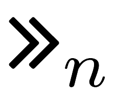

In this page, an overview on the MFA implementations adopted by each bank is given, reporting the enrollment procedure, the employed authenticators and the respective binding procedures, the employed MFA protocols (both for Internet
and Mobile Payments), the adoption of exemptions and the compliance with a given set of requirements and best practices.

<h2>EU Banks</h2>

	<table id="eu-banks-table" style="color: black;">
		<thead style="font-weight: bold; font-size: 12.5pt; background-color:white;">
			<td>Bank name</td>
			<td>C</td>
			<td>Enr.</td>
			<td>Authenticators</td>
			<td>Binding</td>
			<td>IPs</td>
			<td>MPs</td>
			<td>Ex.</td>
			<td>RLs</td>
			<td>BPs</td>
		</thead>
		<tr class="bank-row" id="deutsche-bank">
			<td><a class="bank-anchor" href="banks/de/deutsche-bank">Deutsche Bank</a> 	</td>
			<td> DE	</td>
			<td> <i class="fas fa-university"></i> </td>
			<td class="authenticator-spec"> [I]   opid <i class="fas fa-calculator"></i>?[O] otp   <i class="fas fa-table"></i>   <i class="fas fa-sim-card"></i>?   opid ?[O] otp   opid ?[O] otp </td>
			<td> <i class="fas fa-globe-americas"></i>,<i class="fas fa-globe-americas"></i>,--   <bold>E</bold>,<i class="fas fa-globe-americas"></i>,<i class="fas fa-globe-americas"></i>   <i class="fas fa-university"></i>,<i class="fas fa-university"></i>,<i class="fas fa-university"></i>   <i class="fas fa-globe-americas"></i>,<i class="fas fa-globe-americas"></i>,<i class="fas fa-globe-americas"></i>   <i class="fas fa-globe-americas"></i>,<i class="fas fa-globe-americas"></i>,<i class="fas fa-globe-americas"></i>(<i class="fas fa-sim-card"></i>)</td>
			<td> <a class="MFAP-link-IP" href="mfa-protocols-evaluation#IP-6"> IP-6 </a>   <a class="MFAP-link-IP" href="mfa-protocols-evaluation#IP-11"> IP-11 </a>   <a class="MFAP-link-IP" href="mfa-protocols-evaluation#IP-15"> IP-15 </a>   <a class="MFAP-link-IP" href="mfa-protocols-evaluation#IP-21"> IP-21 </a> </td>
			<td> <a class="MFAP-link-MP" href="mfa-protocols-evaluation#MP-10"> MP-10</a>   <a class="MFAP-link-MP" href="mfa-protocols-evaluation#MP-19"> MP-19</a>  <a class="MFAP-link-MP" href="mfa-protocols-evaluation#MP-25"> MP-25 </a>  <a class="MFAP-link-MP" href="mfa-protocols-evaluation#MP-27"> MP-27 </a> </td>
			<td> <i class="fas fa-check"></i> </td>
			<td><a class="reqs-anchor" href="requirements-evaluation#deutsche-bank">4/9</a></td>
			<td><a class="bps-anchor" href="best-practices-evaluation#deutsche-bank"><canvas class="chart-container" height="80" width="40"  id="bps-chart-container-deutsche-bank"></canvas>3/8</a></td>
			<td><a href="requirements-evaluation#deutsche-bank">4/9</a></td>
			<td><a href="best-practices-evaluation#deutsche-bank">3/8</a></td>
		</tr>
		<tr class="bank-row" id="vr-bank">
			<td><a class="bank-anchor" href="banks/de/vr-bank">VR Bank</a> </td>
			<td> DE	</td>
			<td><i class="fas fa-university"></i> </td>
			<td class="authenticator-spec">[I]   opid <i class="fas fa-calculator"></i>?[O] otp   otp <i class="fas fa-sim-card"></i>? otp   opid ?[O,K] otp   opid <i class="fas fa-mobile-alt"></i>?[O,K] otp   opid ?[O,I] otp   opid <i class="fas fa-mobile-alt"></i>?[O,I] otp </td>
			<td><i class="fas fa-globe-americas"></i>, <i class="fas fa-globe-americas"></i>, <i class="fas fa-globe-americas"></i>   <bold>E</bold>,<i class="fas fa-globe-americas"></i>,     <i class="fas fa-university"></i>, <i class="fas fa-university"></i>, <i class="fas fa-globe-americas"></i>    <i class="fas fa-globe-americas"></i>,<i class="fas fa-globe-americas"></i>,<i class="fas fa-globe-americas"></i>   <i class="fas fa-globe-americas"></i>,<i class="fas fa-globe-americas"></i>,<i class="fas fa-globe-americas"></i>   <i class="fas fa-globe-americas"></i>,<i class="fas fa-globe-americas"></i>,<i class="fas fa-globe-americas"></i>   <i class="fas fa-globe-americas"></i>,<i class="fas fa-globe-americas"></i>,<i class="fas fa-globe-americas"></i> </td>
			<td>	<a class="MFAP-link-IP" href="mfa-protocols-evaluation#IP-6"> IP-6 </a>   <a class="MFAP-link-IP" href="mfa-protocols-evaluation#IP-15"> IP-15 </a>   <a class="MFAP-link-IP" href="mfa-protocols-evaluation#IP-1"> IP-31 </a>   <a class="MFAP-link-IP" href="mfa-protocols-evaluation#IP-32"> IP-32 </a> </td>
			<td> 	<a class="MFAP-link-MP" href="mfa-protocols-evaluation#MP-8"> MP-8</a>   <a class="MFAP-link-MP" href="mfa-protocols-evaluation#MP-20"> MP-20</a>   <a class="MFAP-link-MP" href="mfa-protocols-evaluation#MP-21"> MP-21</a>   <a class="MFAP-link-MP" href="mfa-protocols-evaluation#MP-22"> MP-22</a>  <a class="MFAP-link-MP" href="mfa-protocols-evaluation#MP-28"> MP-28 </a>   <a class="MFAP-link-MP" href="mfa-protocols-evaluation#MP-29"> MP-29 </a>	</td>
			<td> <i class="fas fa-check"></i> </td>
			<td><a class="reqs-anchor" href="requirements-evaluation#vr-bank">6/9</a></td>
			<td><a class="bps-anchor" href="best-practices-evaluation#vr-bank"><canvas class="chart-container" height="80" width="40"  id="bps-chart-container-vr-bank"></canvas>3/8</a></td>
			<td><a href="requirements-evaluation#vr-bank">6/9</a></td>
			<td><a href="best-practices-evaluation#vr-bank">3/8</a></td>
		</tr>
		<tr class="bank-row" id="commerzbank">
			<td><a class="bank-anchor" href="banks/de/commerzbank">Commerzbank</a></td>
			<td>DE </td>
			<td><i class="fas fa-globe-americas"></i> </td>
			<td class="authenticator-spec"> [I]   opid <i class="fas fa-calculator"></i>?[O] otp   <i class="fas fa-table"></i>   otp <i class="fas fa-sim-card"></i>? otp   opid ?[O] otp   opid ?[O] otp </td>
			<td><i class="fas fa-globe-americas"></i>, <i class="fas fa-globe-americas"></i>, --   <bold>E</bold>,<i class="fas fa-globe-americas"></i>,<i class="fas fa-globe-americas"></i>    <i class="fas fa-globe-americas"></i>,<i class="fas fa-globe-americas"></i>,<i class="fas fa-globe-americas"></i>   <i class="fas fa-globe-americas"></i>,<i class="fas fa-globe-americas"></i>,<i class="fas fa-globe-americas"></i>   <i class="fas fa-globe-americas"></i>,<i class="fas fa-globe-americas"></i>,<i class="fas fa-globe-americas"></i>(<i class="fas fa-sim-card"></i>)   <i class="fas fa-globe-americas"></i>,<i class="fas fa-globe-americas"></i>,<i class="fas fa-globe-americas"></i>(<i class="fas fa-sim-card"></i>) </td>
			<td>  <a class="MFAP-link-IP" href="mfa-protocols-evaluation#IP-6"> IP-6 </a>   <a class="MFAP-link-IP" href="mfa-protocols-evaluation#IP-11"> IP-11 </a>   <a class="MFAP-link-IP" href="mfa-protocols-evaluation#IP-15"> IP-15 </a>   <a class="MFAP-link-IP" href="mfa-protocols-evaluation#IP-21"> IP-21 </a>  </td>
			<td>  <a class="MFAP-link-MP" href="mfa-protocols-evaluation#MP-8"> MP-8</a>   <a class="MFAP-link-MP" href="mfa-protocols-evaluation#MP-19"> MP-19</a>   <a class="MFAP-link-MP" href="mfa-protocols-evaluation#MP-22"> MP-22</a>   <a class="MFAP-link-MP" href="mfa-protocols-evaluation#MP-27"> MP-27 </a>  </td>
			<td> <i class="fas fa-check"></i> </td>
			<td><a class="reqs-anchor" href="requirements-evaluation#commerzbank">3/9</a></td>
			<td><a class="bps-anchor" href="best-practices-evaluation#commerzbank"><canvas class="chart-container" height="80" width="40"  id="bps-chart-container-commerzbank"></canvas>2/8</a></td>
			<td><a href="requirements-evaluation#commerzbank">3/9</a></td>
			<td><a href="best-practices-evaluation#commerzbank">2/8</a></td>
		</tr>
		<tr class="bank-row" id="hsbc">
			<td><a class="bank-anchor" href="banks/uk/hsbc">HSBC</a></td>
			<td>UK	</td>
			<td><i class="fas fa-university"></i>  </td>
			<td class="authenticator-spec"><i class="fas fa-calculator"></i>[O,K] otp   [O,K] otp   [O,I] otp   [O,K] otp   [O,I] otp </td>
			<td><bold>E</bold>,<i class="fas fa-globe-americas"></i>,   <i class="fas fa-globe-americas"></i>,<i class="fas fa-globe-americas"></i>,   <i class="fas fa-globe-americas"></i>,<i class="fas fa-globe-americas"></i>,   <i class="fas fa-globe-americas"></i>,<i class="fas fa-globe-americas"></i>,   <i class="fas fa-globe-americas"></i>,<i class="fas fa-globe-americas"></i>, </td>
			<td> <a class="MFAP-link-IP" href="mfa-protocols-evaluation#IP-2"> IP-2 </a>  <a class="MFAP-link-IP" href="mfa-protocols-evaluation#IP-19"> IP-19 </a>   <a class="MFAP-link-IP" href="mfa-protocols-evaluation#IP-20"> IP-20 </a>  </td>
			<td> <a class="MFAP-link-MP" href="mfa-protocols-evaluation#MP-15"> MP-15</a>   <a class="MFAP-link-MP" href="mfa-protocols-evaluation#MP-16"> MP-16</a> </td>
			<td> <i class="fas fa-check-double"></i></td>
			<td><a class="reqs-anchor" href="requirements-evaluation#hsbc">7/9</a></td>
			<td><a class="bps-anchor" href="best-practices-evaluation#hsbc"><canvas class="chart-container" height="80" width="40"  id="bps-chart-container-hsbc"></canvas>6/8</a></td>
			<td><a href="requirements-evaluation#hsbc">7/9</a></td>
			<td><a href="best-practices-evaluation#hsbc">6/8</a></td>
		</tr>
		<tr class="bank-row" id="barclays">
			<td><a class="bank-anchor" href="banks/uk/barclays">Barclays</a></td>
			<td>UK	</td>
			<td> <i class="fas fa-university"></i>  </td>
			<td class="authenticator-spec">   <i class="fas fa-calculator"></i>[O,K] otp   [O,K] otp   [O,I] otp  </td>
			<td><bold>E</bold>, <i class="fas fa-globe-americas"></i>, <i class="fas fa-globe-americas"></i>  <i class="fas fa-globe-americas"></i>,<i class="fas fa-globe-americas"></i>,   <i class="fas fa-globe-americas"></i>, <i class="fas fa-globe-americas"></i>,     <i class="fas fa-globe-americas"></i>, <i class="fas fa-globe-americas"></i>,  </td>
			<td> <a class="MFAP-link-IP" href="mfa-protocols-evaluation#IP-2"> IP-2 </a>  <a class="MFAP-link-IP" href="mfa-protocols-evaluation#IP-19"> IP-19 </a>   <a class="MFAP-link-IP" href="mfa-protocols-evaluation#IP-20"> IP-20 </a> </td>
			<td></td>
			<td><i class="fas fa-check-double"></i></td>
			<td><a class="reqs-anchor" href="requirements-evaluation#barclays">5/9</a></td>
			<td><a class="bps-anchor" href="best-practices-evaluation#barclays"><canvas class="chart-container" height="80" width="40"  id="bps-chart-container-barclays"></canvas>5/8</a></td>
			<td><a href="requirements-evaluation#barclays">5/9</a></td>
			<td><a href="best-practices-evaluation#barclays">5/8</a></td>
		</tr>
		<tr class="bank-row" id="lloyds-bank">
			<td><a class="bank-anchor" href="banks/uk/lloyds-bank">LLoyds Bank</a></td>
			<td>UK</td>
			<td><i class="fas fa-university"></i>   </td>
			<td class="authenticator-spec">   otp <i class="fas fa-sim-card"></i> otp   opid <i class="fas fa-mobile-alt"></i>[O,K] otp   opid <i class="fas fa-mobile-alt"></i>[O,I] otp   [I]   opid [O] otp  </td>
			<td><bold>E</bold>, <i class="fas fa-university"></i>, <i class="fas fa-university"></i>   <bold>E</bold>,<i class="fas fa-university"></i>,<i class="fas fa-university"></i>   <i class="fas fa-globe-americas"></i>,<i class="fas fa-globe-americas"></i>,<i class="fas fa-globe-americas"></i>   <i class="fas fa-globe-americas"></i>,<i class="fas fa-globe-americas"></i>,<i class="fas fa-globe-americas"></i>   <i class="fas fa-globe-americas"></i>,<i class="fas fa-globe-americas"></i>,<i class="fas fa-globe-americas"></i>   <i class="fas fa-globe-americas"></i>,<i class="fas fa-globe-americas"></i>,<i class="fas fa-globe-americas"></i> </td>
			<td> <a class="MFAP-link-IP" href="mfa-protocols-evaluation#IP-17"> IP-17 </a>   <a class="MFAP-link-IP" href="mfa-protocols-evaluation#IP-29"> IP-29 </a>   <a class="MFAP-link-IP" href="mfa-protocols-evaluation#IP-30"> IP-30 </a> </td>
			<td><a class="MFAP-link-MP" href="mfa-protocols-evaluation#MP-17"> MP-17</a>   <a class="MFAP-link-MP" href="mfa-protocols-evaluation#MP-26"> MP-26 </a> </td>
			<td> <i class="fas fa-check-double"></i></td>
			<td><a class="reqs-anchor" href="requirements-evaluation#lloyds-bank">5/9</a></td>
			<td><a class="bps-anchor" href="best-practices-evaluation#lloyds-bank"><canvas class="chart-container" height="80" width="40"  id="bps-chart-container-lloyds-bank"></canvas>5/8</a></td>
			<td><a href="requirements-evaluation#lloyds-bank">5/9</a></td>
			<td><a href="best-practices-evaluation#lloyds-bank">5/8</a></td>
		</tr>
		<tr class="bank-row" id="bnp-paribas">
			<td><a class="bank-anchor" href="banks/fr/bnp-paribas">BNP Paribas</a></td>
			<td>FR </td>
			<td><i class="fas fa-globe-americas"></i>   </td>
			<td class="authenticator-spec">otp <i class="fas fa-sim-card"></i> otp  opid <i class="fas fa-mobile-alt"></i>?[O,K] otp   opid [O] otp  </td>
			<td><bold>E</bold>,<i class="fas fa-globe-americas"></i>,<i class="fas fa-globe-americas"></i>   <i class="fas fa-globe-americas"></i>,<i class="fas fa-globe-americas"></i>,<i class="fas fa-globe-americas"></i>(<i class="fas fa-sim-card"></i>)   <i class="fas fa-globe-americas"></i>,<i class="fas fa-globe-americas"></i>,<i class="fas fa-globe-americas"></i>(<i class="fas fa-sim-card"></i>)  </td>
			<td> <a class="MFAP-link-IP" href="mfa-protocols-evaluation#IP-14"> IP-14 </a>   <a class="MFAP-link-IP" href="mfa-protocols-evaluation#IP-27"> IP-27 </a> </td>
			<td><a class="MFAP-link-MP" href="mfa-protocols-evaluation#MP-12"> MP-12</a>   <a class="MFAP-link-MP" href="mfa-protocols-evaluation#MP-20"> MP-20</a> </td>
			<td><i class="fas fa-check-double"></i></td>
			<td><a class="reqs-anchor" href="requirements-evaluation#bnp-paribas">5/9</a></td>
			<td><a class="bps-anchor" href="best-practices-evaluation#bnp-paribas"><canvas class="chart-container" height="80" width="40"  id="bps-chart-container-bnp-paribas"></canvas>3/8</a></td>
			<td><a href="requirements-evaluation#bnp-paribas">5/9</a></td>
			<td><a href="best-practices-evaluation#bnp-paribas">3/8</a></td>
		</tr>
		<tr class="bank-row" id="credit-agricole">
			<td><a class="bank-anchor" href="banks/fr/credit-agricole">Credit Agricole</a></td>
			<td>FR </td>
			<td> <i class="fas fa-globe-americas"></i>  </td>
			<td class="authenticator-spec">otp <i class="fas fa-sim-card"></i> otp </td>
			<td><bold>E</bold>,<i class="fas fa-globe-americas"></i>,<i class="fas fa-globe-americas"></i> </td>
			<td><a class="MFAP-link-IP" href="mfa-protocols-evaluation#IP-14"> IP-14 </a> </td>
			<td> </td>
			<td><i class="fas fa-check-double"></i></td>
			<td><a class="reqs-anchor" href="requirements-evaluation#credit-agricole">4/9</a></td>
			<td><a class="bps-anchor" href="best-practices-evaluation#credit-agricole"><canvas class="chart-container" height="80" width="40"  id="bps-chart-container-credit-agricole"></canvas>1/8</a></td>
			<td><a href="requirements-evaluation#credit-agricole">4/9</a></td>
			<td><a href="best-practices-evaluation#credit-agricole">1/8</a></td>
		</tr>
		<tr class="bank-row" id="societe-generale">
			<td><a class="bank-anchor" href="banks/fr/societe-generale">Societe Generale</a></td>
			<td>FR </td>
			<td><i class="fas fa-globe-americas"></i>   </td>
			<td class="authenticator-spec">otp <i class="fas fa-sim-card"></i> otp   opid ?[O,K] otp   opid <i class="fas fa-mobile-alt"></i>?[O,K] otp  </td>
			<td><bold>E</bold>,<i class="fas fa-globe-americas"></i>,<i class="fas fa-globe-americas"></i>   <i class="fas fa-globe-americas"></i>,<i class="fas fa-globe-americas"></i>,<i class="fas fa-globe-americas"></i>(<i class="fas fa-sim-card"></i>)   <i class="fas fa-globe-americas"></i>,<i class="fas fa-globe-americas"></i>,<i class="fas fa-globe-americas"></i>(<i class="fas fa-sim-card"></i>) </td>
			<td> <a class="MFAP-link-IP" href="mfa-protocols-evaluation#IP-14"> IP-14 </a>   <a class="MFAP-link-IP" href="mfa-protocols-evaluation#IP-27"> IP-27 </a></td>
			<td> <a class="MFAP-link-MP" href="mfa-protocols-evaluation#MP-20"> MP-20</a> </td>
			<td><i class="fas fa-check"></i></td>
			<td><a class="reqs-anchor" href="requirements-evaluation#societe-generale">5/9</a></td>
			<td><a class="bps-anchor" href="best-practices-evaluation#societe-generale"><canvas class="chart-container" height="80" width="40"  id="bps-chart-container-societe-generale"></canvas>3/8</a></td>
			<td><a href="requirements-evaluation#societe-generale">5/9</a></td>
			<td><a href="best-practices-evaluation#societe-generale">3/8</a></td>
		</tr>
		<tr class="bank-row" id="unicredit">
			<td><a class="bank-anchor" href="banks/it/unicredit">Unicredit</a></td>
			<td>IT </td>
			<td><i class="fas fa-university"></i>   </td>
			<td class="authenticator-spec"><i class="fas fa-calculator"></i>[O] otp   <i class="fas fa-table"></i>   opid ?[O,K] otp   opid ?[O,I] otp   opid ?[O,K] otp   opid ?[O,K] otp </td>
			<td><bold>E</bold>, <i class="fas fa-university"></i>, <i class="fas fa-university"></i>   <bold>E</bold>, <i class="fas fa-globe-americas"></i>, <i class="fas fa-globe-americas"></i>   <i class="fas fa-globe-americas"></i>,<i class="fas fa-globe-americas"></i>,   <i class="fas fa-globe-americas"></i>,<i class="fas fa-globe-americas"></i>,   <i class="fas fa-globe-americas"></i>,<i class="fas fa-globe-americas"></i>,   <i class="fas fa-globe-americas"></i>,<i class="fas fa-globe-americas"></i>, </td>
			<td>  <a class="MFAP-link-IP" href="mfa-protocols-evaluation#IP-1"> IP-1 </a>  <a class="MFAP-link-IP" href="mfa-protocols-evaluation#IP-11"> IP-11 </a>   <a class="MFAP-link-IP" href="mfa-protocols-evaluation#IP-24"> IP-24 </a>   <a class="MFAP-link-IP" href="mfa-protocols-evaluation#IP-25"> IP-25 </a>  </td>
			<td> <a class="MFAP-link-MP" href="mfa-protocols-evaluation#MP-20"> MP-20</a>   <a class="MFAP-link-MP" href="mfa-protocols-evaluation#MP-21"> MP-21</a> </td>
			<td><i class="fas fa-check-double"></i></td>
			<td><a class="reqs-anchor" href="requirements-evaluation#unicredit">5/9</a></td>
			<td><a class="bps-anchor" href="best-practices-evaluation#unicredit"><canvas class="chart-container" height="80" width="40"  id="bps-chart-container-unicredit"></canvas>6/8</a></td>
			<td><a href="requirements-evaluation#unicredit">5/9</a></td>
			<td><a href="best-practices-evaluation#unicredit">6/8</a></td>
		</tr>
		<tr class="bank-row" id="banca-intesa">
			<td><a class="bank-anchor" href="banks/it/banca-intesa">Banca Intesa</a></td>
			<td>IT </td>
			<td><i class="fas fa-university"></i>   </td>
			<td class="authenticator-spec"><i class="fas fa-calculator"></i>[O] otp   opid <i class="fas fa-mobile-alt"></i>?[O,K] otp   opid <i class="fas fa-mobile-alt"></i>?[O,I] otp   opid ?[O,K] otp   opid ?[O,I] otp  </td>
			<td><bold>E</bold>, <i class="fas fa-university"></i>, <i class="fas fa-university"></i>   <i class="fas fa-globe-americas"></i>, <i class="fas fa-globe-americas"></i>,    <i class="fas fa-globe-americas"></i>, <i class="fas fa-globe-americas"></i>,    <i class="fas fa-globe-americas"></i>, <i class="fas fa-globe-americas"></i>,    <i class="fas fa-globe-americas"></i>, <i class="fas fa-globe-americas"></i>,  </td>
			<td> <a class="MFAP-link-IP" href="mfa-protocols-evaluation#IP-1"> IP-1 </a>  <a class="MFAP-link-IP" href="mfa-protocols-evaluation#IP-27"> IP-27 </a>   <a class="MFAP-link-IP" href="mfa-protocols-evaluation#IP-28"> IP-28 </a>  </td>
			<td> <a class="MFAP-link-MP" href="mfa-protocols-evaluation#MP-1"> MP-1</a>  <a class="MFAP-link-MP" href="mfa-protocols-evaluation#MP-20"> MP-20</a>   <a class="MFAP-link-MP" href="mfa-protocols-evaluation#MP-21"> MP-21</a>  </td>
			<td><i class="fas fa-check-double"></i> </td>
			<td><a class="reqs-anchor" href="requirements-evaluation#banca-intesa">7/9</a></td>
			<td><a class="bps-anchor" href="best-practices-evaluation#banca-intesa"><canvas class="chart-container" height="80" width="40"  id="bps-chart-container-banca-intesa"></canvas>6/8</a></td>
			<td><a href="requirements-evaluation#banca-intesa">7/9</a></td>
			<td><a href="best-practices-evaluation#banca-intesa">6/8</a></td>
		</tr>
		<tr class="bank-row" id="banco-bpm">
			<td><a class="bank-anchor" href="banks/it/banco-bpm">Banco BPM</a></td>
			<td>IT </td>
			<td><i class="fas fa-university"></i>   </td>
			<td class="authenticator-spec"><i class="fas fa-calculator"></i>[O] otp   <i class="fas fa-calculator"></i>[O,K] otp    [O] otp  opid <i class="fas fa-mobile-alt"></i>?[O,K] otp   opid ?[O,K]  otp </td>
			<td><bold>E</bold>, <i class="fas fa-university"></i>, <i class="fas fa-university"></i>   <i class="fas fa-globe-americas"></i>, <i class="fas fa-university"></i>, <i class="fas fa-university"></i>   <i class="fas fa-globe-americas"></i>,<i class="fas fa-globe-americas"></i>,   <i class="fas fa-globe-americas"></i>,<i class="fas fa-globe-americas"></i>,   <i class="fas fa-globe-americas"></i>,<i class="fas fa-globe-americas"></i>,  </td>
			<td><a class="MFAP-link-IP" href="mfa-protocols-evaluation#IP-1"> IP-1 </a>  <a class="MFAP-link-IP" href="mfa-protocols-evaluation#IP-2"> IP-2 </a>  <a class="MFAP-link-IP" href="mfa-protocols-evaluation#IP-18"> IP-18 </a>   <a class="MFAP-link-IP" href="mfa-protocols-evaluation#IP-27"> IP-27 </a>  </td>
			<td><a class="MFAP-link-MP" href="mfa-protocols-evaluation#MP-1"> MP-1</a>  <a class="MFAP-link-MP" href="mfa-protocols-evaluation#MP-20"> MP-20</a> </td>
			<td><i class="fas fa-check"></i> </td>
			<td><a class="reqs-anchor" href="requirements-evaluation#banco-bpm">7/9</a></td>
			<td><a class="bps-anchor" href="best-practices-evaluation#banco-bpm"><canvas class="chart-container" height="80" width="40"  id="bps-chart-container-banco-bpm"></canvas>6/8</a></td>
			<td><a href="requirements-evaluation#banco-bpm">7/9</a></td>
			<td><a href="best-practices-evaluation#banco-bpm">6/8</a></td>
		</tr>
		<tr class="bank-row" id="banco-santander">
			<td><a class="bank-anchor" href="banks/es/banco-santander">Banco Santander</a></td>
			<td>ES	</td>
			<td><i class="fas fa-globe-americas"></i>   </td>
			<td class="authenticator-spec">   otp <i class="fas fa-sim-card"></i> otp  </td>
			<td><bold>E</bold>,<i class="fas fa-globe-americas"></i>,<i class="fas fa-globe-americas"></i>   <bold>E</bold>,<i class="fas fa-globe-americas"></i>,<i class="fas fa-globe-americas"></i>  </td>
			<td><a class="MFAP-link-IP" href="mfa-protocols-evaluation#IP-16"> IP-16 </a></td>
			<td><a class="MFAP-link-MP" href="mfa-protocols-evaluation#MP-14"> MP-14</a> </td>
			<td><i class="fas fa-check-double"></i></td>
			<td><a class="reqs-anchor" href="requirements-evaluation#banco-santander">5/9</a></td>
			<td><a class="bps-anchor" href="best-practices-evaluation#banco-santander"><canvas class="chart-container" height="80" width="40"  id="bps-chart-container-banco-santander"></canvas>1/8</a></td>
			<td><a href="requirements-evaluation#banco-santander">5/9</a></td>
			<td><a href="best-practices-evaluation#banco-santander">1/8</a></td>
		</tr>
		<tr class="bank-row" id="bbva">
			<td><a class="bank-anchor" href="banks/es/bbva">BBVA</a></td>
			<td>ES</td>
			<td><i class="fas fa-globe-americas"></i></td>
			<td class="authenticator-spec">otp <i class="fas fa-sim-card"></i>? otp </td>
			<td><bold>E</bold>,<i class="fas fa-globe-americas"></i>,<i class="fas fa-globe-americas"></i>  </td>
			<td><a class="MFAP-link-IP" href="mfa-protocols-evaluation#IP-15"> IP-15 </a> </td>
			<td><a class="MFAP-link-MP" href="mfa-protocols-evaluation#MP-13"> MP-13</a> </td>
			<td><i class="fas fa-check"></i></td>
			<td><a class="reqs-anchor" href="requirements-evaluation#bbva">6/9</a></td>
			<td><a class="bps-anchor" href="best-practices-evaluation#bbva"><canvas class="chart-container" height="80" width="40"  id="bps-chart-container-bbva"></canvas>1/8</a></td>
			<td><a href="requirements-evaluation#bbva">6/9</a></td>
			<td><a href="best-practices-evaluation#bbva">1/8</a></td>
		</tr>
		<tr class="bank-row" id="la-caixa">
			<td><a class="bank-anchor" href="banks/es/la-caixa">La Caixa</a></td>
			<td>ES </td>
			<td><i class="fas fa-globe-americas"></i> </td>
			<td class="authenticator-spec"><i class="fas fa-table"></i>   opid <i class="fas fa-mobile-alt"></i>?[O] otp   opid ?[O] otp </td>
			<td><bold>E</bold>,<i class="fas fa-university"></i>,<i class="fas fa-university"></i>   <i class="fas fa-globe-americas"></i>, <i class="fas fa-globe-americas"></i>,    <i class="fas fa-globe-americas"></i>, <i class="fas fa-globe-americas"></i>,   </td>
			<td><a class="MFAP-link-IP" href="mfa-protocols-evaluation#IP-11"> IP-11 </a>  <a class="MFAP-link-IP" href="mfa-protocols-evaluation#IP-26"> IP-26 </a> </td>
			<td><a class="MFAP-link-MP" href="mfa-protocols-evaluation#MP-19"> MP-19</a></td>
			<td><i class="fas fa-check-double"></i></td>
			<td><a class="reqs-anchor" href="requirements-evaluation#la-caixa">6/9</a></td>
			<td><a class="bps-anchor" href="best-practices-evaluation#la-caixa"><canvas class="chart-container" height="80" width="40"  id="bps-chart-container-la-caixa"></canvas>4/8</a></td>
			<td><a href="requirements-evaluation#la-caixa">6/9</a></td>
			<td><a href="best-practices-evaluation#la-caixa">4/8</a></td>
		</tr>
		<tr class="bank-row" id="ing">
			<td><a class="bank-anchor" href="banks/nl/ing">ING</a></td>
			<td>NL	</td>
			<td><i class="fas fa-globe-americas"></i> </td>
			<td class="authenticator-spec"><i class="fas fa-table"></i>   otp <i class="fas fa-sim-card"></i>? otp   opid<i class="fas fa-mobile-alt"></i>?[O,K] otp   [I]   opid ?[O] otp </td>
			<td><bold>E</bold>,<i class="fas fa-globe-americas"></i>,<i class="fas fa-globe-americas"></i>   <bold>E</bold>,<i class="fas fa-globe-americas"></i>,<i class="fas fa-globe-americas"></i>   <i class="fas fa-globe-americas"></i>,<i class="fas fa-globe-americas"></i>,<i class="fas fa-globe-americas"></i>(<i class="fas fa-sim-card"></i>)   <i class="fas fa-globe-americas"></i>, <i class="fas fa-globe-americas"></i>, --   <i class="fas fa-globe-americas"></i>,<i class="fas fa-globe-americas"></i>,<i class="fas fa-globe-americas"></i>(<i class="fas fa-sim-card"></i>) </td>
			<td> <a class="MFAP-link-IP" href="mfa-protocols-evaluation#IP-11"> IP-11 </a>   <a class="MFAP-link-IP" href="mfa-protocols-evaluation#IP-15"> IP-15 </a>   <a class="MFAP-link-IP" href="mfa-protocols-evaluation#IP-27"> IP-27 </a>  </td>
			<td><a class="MFAP-link-MP" href="mfa-protocols-evaluation#MP-19"> MP-19</a>   <a class="MFAP-link-MP" href="mfa-protocols-evaluation#MP-27"> MP-27 </a> </td>
			<td><i class="fas fa-check"></i></td>
			<td><a class="reqs-anchor" href="requirements-evaluation#ing">2/9</a></td>
			<td><a class="bps-anchor" href="best-practices-evaluation#ing"><canvas class="chart-container" height="80" width="40"  id="bps-chart-container-ing"></canvas>3/8</a></td>
			<td><a href="requirements-evaluation#ing">2/9</a></td>
			<td><a href="best-practices-evaluation#ing">3/8</a></td>
		</tr>
		<tr class="bank-row" id="rabobank">
			<td><a class="bank-anchor" href="banks/nl/rabobank">Rabobank</a></td>
			<td>NL	</td>
			<td><i class="fas fa-globe-americas"></i> </td>
			<td class="authenticator-spec">opid <i class="fas fa-calculator"></i>?[O,K] otp   opid <i class="fas fa-calculator"></i>?[O,K] otp   [I]  </td>
			<td><bold>E</bold>,<i class="fas fa-university"></i>,<i class="fas fa-university"></i>   --   <i class="fas fa-globe-americas"></i>, <i class="fas fa-globe-americas"></i>, --  </td>
			<td><a class="MFAP-link-IP" href="mfa-protocols-evaluation#IP-7"> IP-7 </a>   <a class="MFAP-link-IP" href="mfa-protocols-evaluation#IP-10"> IP-10 </a> </td>
			<td><a class="MFAP-link-MP" href="mfa-protocols-evaluation#MP-9"> MP-9</a>   <a class="MFAP-link-MP" href="mfa-protocols-evaluation#MP-24"> MP-24 </a> </td>
			<td> <i class="fas fa-check-double"></i> </td>
			<td><a class="reqs-anchor" href="requirements-evaluation#rabobank">7/9</a></td>
			<td><a class="bps-anchor" href="best-practices-evaluation#rabobank"><canvas class="chart-container" height="80" width="40"  id="bps-chart-container-rabobank"></canvas>3/8</a></td>
			<td><a href="requirements-evaluation#rabobank">7/9</a></td>
			<td><a href="best-practices-evaluation#rabobank">3/8</a></td>
		</tr>
		<tr class="bank-row" id="abn-amro">
			<td><a class="bank-anchor" href="banks/nl/abn-amro">ABN AMRO</a></td>
			<td>NL	</td>
			<td><i class="fas fa-globe-americas"></i> </td>
			<td class="authenticator-spec">opid <i class="fas fa-calculator"></i>?[O,K] otp   opid <i class="fas fa-calculator"></i>?[O,K] otp   [I]  </td>
			<td><bold>E</bold>,<i class="fas fa-globe-americas"></i>,<i class="fas fa-globe-americas"></i>   --   <i class="fas fa-globe-americas"></i>, <i class="fas fa-globe-americas"></i>, --   </td>
			<td><a class="MFAP-link-IP" href="mfa-protocols-evaluation#IP-5"> IP-5 </a>   <a class="MFAP-link-IP" href="mfa-protocols-evaluation#IP-10"> IP-10 </a> </td>
			<td> <a class="MFAP-link-MP" href="mfa-protocols-evaluation#MP-5"> MP-5</a>   <a class="MFAP-link-MP" href="mfa-protocols-evaluation#MP-5"> MP-5</a>   <a class="MFAP-link-MP" href="mfa-protocols-evaluation#MP-23"> MP-23</a>   <a class="MFAP-link-MP" href="mfa-protocols-evaluation#MP-23"> MP-23</a>  </td>
			<td><i class="fas fa-check-double"></i></td>
			<td><a class="reqs-anchor" href="requirements-evaluation#abn-amro">6/9</a></td>
			<td><a class="bps-anchor" href="best-practices-evaluation#abn-amro"><canvas class="chart-container" height="80" width="40"  id="bps-chart-container-abn-amro"></canvas>2/8</a></td>
			<td><a href="requirements-evaluation#abn-amro">6/9</a></td>
			<td><a href="best-practices-evaluation#abn-amro">2/8</a></td>
		</tr>
		<tr class="bank-row" id="nordea">
			<td><a class="bank-anchor" href="banks/sw/nordea">Nordea</a></td>
			<td>SW	</td>
			<td><i class="fas fa-globe-americas"></i> </td>
			<td class="authenticator-spec">opid <i class="fas fa-calculator"></i>[O,K] otp   opid <i class="fas fa-calculator"></i>?[O,K] otp   opid ?[O,K] otp   opid <i class="fas fa-mobile-alt"></i>?[O,K] otp  opid <i class="fas fa-mobile-alt"></i>?[O,I] otp   opid ?[O,K] otp  opid ?[O,I] otp </td>
			<td><bold>E</bold>,<i class="fas fa-globe-americas"></i>,<i class="fas fa-globe-americas"></i>   <i class="fas fa-globe-americas"></i>,<i class="fas fa-globe-americas"></i>,<i class="fas fa-globe-americas"></i>   <i class="fas fa-globe-americas"></i>,<i class="fas fa-globe-americas"></i>,   <i class="fas fa-globe-americas"></i>,<i class="fas fa-globe-americas"></i>,   <i class="fas fa-globe-americas"></i>,<i class="fas fa-globe-americas"></i>,   <i class="fas fa-globe-americas"></i>,<i class="fas fa-globe-americas"></i>,   <i class="fas fa-globe-americas"></i>,<i class="fas fa-globe-americas"></i>, </td>
			<td> <a class="MFAP-link-IP" href="mfa-protocols-evaluation#IP-5"> IP-5 </a>   <a class="MFAP-link-IP" href="mfa-protocols-evaluation#IP-8"> IP-8 </a>   <a class="MFAP-link-IP" href="mfa-protocols-evaluation#IP-13"> IP-13 </a>   <a class="MFAP-link-IP" href="mfa-protocols-evaluation#IP-27"> IP-27 </a>   <a class="MFAP-link-IP" href="mfa-protocols-evaluation#IP-28"> IP-28 </a>  </td>
			<td> <a class="MFAP-link-MP" href="mfa-protocols-evaluation#MP-3"> MP-3</a>  <a class="MFAP-link-MP" href="mfa-protocols-evaluation#MP-20"> MP-20</a>  <a class="MFAP-link-MP" href="mfa-protocols-evaluation#MP-21"> MP-21</a>  </td>
			<td><i class="fas fa-check-double"></i></td>
			<td><a class="reqs-anchor" href="requirements-evaluation#nordea">4/9</a></td>
			<td><a class="bps-anchor" href="best-practices-evaluation#nordea"><canvas class="chart-container" height="80" width="40"  id="bps-chart-container-nordea"></canvas>4/8</a></td>
			<td><a href="requirements-evaluation#nordea">4/9</a></td>
			<td><a href="best-practices-evaluation#nordea">4/8</a></td>
		</tr>
		<tr class="bank-row" id="svenska-handelsbanken">
			<td><a class="bank-anchor" href="banks/sw/svenska-handelsbanken">Svenska Handelsbanken</a></td>
			<td>SW	</td>
			<td><i class="fas fa-university"></i> </td>
			<td class="authenticator-spec"><i class="fas fa-table"></i>   opid <i class="fas fa-calculator"></i>[O,K] otp   opid <i class="fas fa-calculator"></i>?[O,K] otp   opid ?[O,K] otp   opid <i class="fas fa-mobile-alt"></i>?[O,K] otp  opid <i class="fas fa-mobile-alt"></i>?[O,I] otp   opid ?[O,K] otp  opid ?[O,I] otp  </td>
			<td><bold>E</bold>,<i class="fas fa-globe-americas"></i>,<i class="fas fa-globe-americas"></i>   ,<i class="fas fa-globe-americas"></i>,<i class="fas fa-globe-americas"></i>   ,<i class="fas fa-globe-americas"></i>,<i class="fas fa-globe-americas"></i>   <i class="fas fa-globe-americas"></i>,<i class="fas fa-globe-americas"></i>,   <i class="fas fa-globe-americas"></i>,<i class="fas fa-globe-americas"></i>,   <i class="fas fa-globe-americas"></i>,<i class="fas fa-globe-americas"></i>,   <i class="fas fa-globe-americas"></i>,<i class="fas fa-globe-americas"></i>,   <i class="fas fa-globe-americas"></i>,<i class="fas fa-globe-americas"></i>,  </td>
			<td> <a class="MFAP-link-IP" href="mfa-protocols-evaluation#IP-5"> IP-5 </a>   <a class="MFAP-link-IP" href="mfa-protocols-evaluation#IP-8"> IP-8 </a>   <a class="MFAP-link-IP" href="mfa-protocols-evaluation#IP-11"> IP-11 </a>   <a class="MFAP-link-IP" href="mfa-protocols-evaluation#IP-13"> IP-13 </a> <a class="MFAP-link-IP" href="mfa-protocols-evaluation#IP-27"> IP-27 </a>   <a class="MFAP-link-IP" href="mfa-protocols-evaluation#IP-28"> IP-28 </a> </td>
			<td> <a class="MFAP-link-MP" href="mfa-protocols-evaluation#MP-3"> MP-3</a>  <a class="MFAP-link-MP" href="mfa-protocols-evaluation#MP-10"> MP-10</a>   <a class="MFAP-link-MP" href="mfa-protocols-evaluation#MP-20"> MP-20</a>   <a class="MFAP-link-MP" href="mfa-protocols-evaluation#MP-21"> MP-21</a> </td>
			<td><i class="fas fa-times"></i></td>
			<td><a class="reqs-anchor" href="requirements-evaluation#svenska-handelsbanken">4/9</a></td>
			<td><a class="bps-anchor" href="best-practices-evaluation#svenska-handelsbanken"><canvas class="chart-container" height="80" width="40"  id="bps-chart-container-svenska-handelsbanken"></canvas>4/8</a></td>
			<td><a href="requirements-evaluation#svenska-handelsbanken">4/9</a></td>
			<td><a href="best-practices-evaluation#svenska-handelsbanken">4/8</a></td>
		</tr>
		<tr class="bank-row" id="seb">
			<td><a class="bank-anchor" href="banks/sw/seb">SEB</a></td>
			<td>SW	</td>
			<td><i class="fas fa-globe-americas"></i> </td>
			<td class="authenticator-spec">opid <i class="fas fa-calculator"></i>[O,K] otp   opid <i class="fas fa-calculator"></i>?[O,K] otp   opid <i class="fas fa-mobile-alt"></i>?[O,K] otp  opid <i class="fas fa-mobile-alt"></i>?[O,I] otp   opid ?[O,K] otp  opid ?[O,I] otp </td>
			<td><bold>E</bold>,<i class="fas fa-globe-americas"></i>,<i class="fas fa-globe-americas"></i>   ,<i class="fas fa-globe-americas"></i>,<i class="fas fa-globe-americas"></i>   <i class="fas fa-globe-americas"></i>,<i class="fas fa-globe-americas"></i>,   <i class="fas fa-globe-americas"></i>,<i class="fas fa-globe-americas"></i>,   <i class="fas fa-globe-americas"></i>,<i class="fas fa-globe-americas"></i>,   <i class="fas fa-globe-americas"></i>,<i class="fas fa-globe-americas"></i>, </td>
			<td> <a class="MFAP-link-IP" href="mfa-protocols-evaluation#IP-5"> IP-5 </a>   <a class="MFAP-link-IP" href="mfa-protocols-evaluation#IP-8"> IP-8 </a>  <a class="MFAP-link-IP" href="mfa-protocols-evaluation#IP-27"> IP-27 </a>   <a class="MFAP-link-IP" href="mfa-protocols-evaluation#IP-28"> IP-28 </a> </td>
			<td> <a class="MFAP-link-MP" href="mfa-protocols-evaluation#MP-3"> MP-3</a>  <a class="MFAP-link-MP" href="mfa-protocols-evaluation#MP-20"> MP-20</a>   <a class="MFAP-link-MP" href="mfa-protocols-evaluation#MP-21"> MP-21</a> </td>
			<td> <i class="fas fa-times"></i></td>
			<td><a class="reqs-anchor" href="requirements-evaluation#seb">4/9</a></td>
			<td><a class="bps-anchor" href="best-practices-evaluation#seb"><canvas class="chart-container" height="80" width="40"  id="bps-chart-container-seb"></canvas>3/8</a></td>
			<td><a href="requirements-evaluation#seb">4/9</a></td>
			<td><a href="best-practices-evaluation#seb">3/8</a></td>
		</tr>
	</table>

<h2 style="margin-top: 60px;">Non-EU Banks</h2>

	<table id="non-eu-banks-table" style="color: black;">
		<thead style="font-weight: bold; font-size: 12.5pt; background-color: white;">
			<td>Bank name</td>
			<td>C</td>
			<td>Enr.</td>
			<td>Authenticators</td>
			<td>Binding</td>
			<td>IPs</td>
			<td>MPs</td>
			<td>Ex.</td>
			<td>RLs</td>
			<td>BPs</td>
		</thead>
		<tr class="bank-row" id="icbc">
			<td><a class="bank-anchor" href="banks/cn/icbc">ICBC</a></td>
			<td>CN</td>
			<td> <i class="fas fa-university"></i> </td>
			<td class="authenticator-spec">  <i class="fas fa-calculator"></i>[O,K]  otp   opid  <i class="fas fa-calculator"></i>?[O]  otp   <i class="fas fa-table"></i>   otp <i class="fas fa-sim-card"></i>? otp </td>
			<td>  <i class="fas fa-university"></i>, <i class="fas fa-university"></i>, <i class="fas fa-university"></i>   <bold>E</bold>, <i class="fas fa-university"></i>, <i class="fas fa-university"></i>   <i class="fas fa-university"></i>, <i class="fas fa-university"></i>, <i class="fas fa-university"></i>   , <i class="fas fa-globe-americas"></i>, <i class="fas fa-globe-americas"></i>  </td>
			<td>  <a class="MFAP-link-IP" href="mfa-protocols-evaluation#IP-2"> IP-2 </a>  <a class="MFAP-link-IP" href="mfa-protocols-evaluation#IP-3">IP-3</a>   <a class="MFAP-link-IP" href="mfa-protocols-evaluation#IP-11"> IP-11 </a>   <a class="MFAP-link-IP" href="mfa-protocols-evaluation#IP-15"> IP-15 </a>   </td>
			<td>  <a class="MFAP-link-MP" href="mfa-protocols-evaluation#MP-2"> MP-2</a>  <a class="MFAP-link-MP" href="mfa-protocols-evaluation#MP-6"> MP-6</a>   <a class="MFAP-link-MP" href="mfa-protocols-evaluation#MP-10"> MP-10</a>  </td>
			<td> <i class="fas fa-check"></i> </td>
			<td><a class="reqs-anchor" href="requirements-evaluation#icbc">6/9</a></td>
			<td><a class="bps-anchor" href="best-practices-evaluation#icbc"><canvas class="chart-container" height="80" width="40"  id="bps-chart-container-"></canvas>4/8</a></td>
			<td><a href="requirements-evaluation#icbc">6/9</a></td>
			<td><a href="best-practices-evaluation#icbc">4/8</a></td>
		</tr>
		<tr class="bank-row" id="ccb">
			<td><a class="bank-anchor" href="banks/cn/ccb">CCB</a></td>
			<td>CN</td>
			<td><i class="fas fa-university"></i></td>
			<td class="authenticator-spec"> opid <i class="fas fa-calculator"></i>?[O,K]  otp   <i class="fas fa-table"></i>   otp <i class="fas fa-sim-card"></i>? otp  </td>
			<td> <i class="fas fa-university"></i>, <i class="fas fa-university"></i>, <i class="fas fa-university"></i>   <bold>E</bold>, <i class="fas fa-university"></i>, <i class="fas fa-university"></i>   <bold>E</bold>, <i class="fas fa-university"></i>, <i class="fas fa-university"></i>   </td>
			<td> <a class="MFAP-link-IP" href="mfa-protocols-evaluation#IP-3">IP-3</a>   <a class="MFAP-link-IP" href="mfa-protocols-evaluation#IP-11"> IP-11 </a>   <a class="MFAP-link-IP" href="mfa-protocols-evaluation#IP-15"> IP-15 </a>  </td>
			<td> <a class="MFAP-link-MP" href="mfa-protocols-evaluation#MP-6"> MP-6</a>   <a class="MFAP-link-MP" href="mfa-protocols-evaluation#MP-10"> MP-10</a>   <a class="MFAP-link-MP" href="mfa-protocols-evaluation#MP-13"> MP-13</a>  </td>
			<td><i class="fas fa-check"></i></td>
			<td><a class="reqs-anchor" href="requirements-evaluation#ccb">6/9</a></td>
			<td><a class="bps-anchor" href="best-practices-evaluation#ccb"><canvas class="chart-container" height="80" width="40"  id="bps-chart-container-"></canvas>4/8</a></td>
			<td><a href="requirements-evaluation#ccb">6/9</a></td>
			<td><a href="best-practices-evaluation#ccb">4/8</a></td>
		</tr>
		<tr class="bank-row" id="abc">
			<td><a class="bank-anchor" href="banks/cn/abc">ABC</a></td>
			<td>CN</td>
			<td><i class="fas fa-university"></i></td>
			<td class="authenticator-spec"> opid <i class="fas fa-calculator"></i>[O,K]  otp   opid  <i class="fas fa-calculator"></i>?[O]  otp    <i class="fas fa-table"></i>      </td>
			<td> <bold>E</bold>, <i class="fas fa-university"></i>, <i class="fas fa-university"></i>   <i class="fas fa-university"></i>, <i class="fas fa-university"></i>, <i class="fas fa-university"></i>   <i class="fas fa-university"></i>, <i class="fas fa-university"></i>, <i class="fas fa-globe-americas"></i>  <bold>E</bold>, <i class="fas fa-university"></i>, --  </td>
			<td> <a class="MFAP-link-IP" href="mfa-protocols-evaluation#IP-4"> IP-4 </a>   <a class="MFAP-link-IP" href="mfa-protocols-evaluation#IP-9"> IP-9 </a>   <a class="MFAP-link-IP" href="mfa-protocols-evaluation#IP-12"> IP-12 </a>  </td>
			<td> <a class="MFAP-link-MP" href="mfa-protocols-evaluation#MP-4"> MP-4</a>   <a class="MFAP-link-MP" href="mfa-protocols-evaluation#MP-7"> MP-7</a>   <a class="MFAP-link-MP" href="mfa-protocols-evaluation#MP-11"> MP-11</a> </td>
			<td><i class="fas fa-check"></i></td>
			<td><a class="reqs-anchor" href="requirements-evaluation#abc">6/9</a></td>
			<td><a class="bps-anchor" href="best-practices-evaluation#abc"><canvas class="chart-container" height="80" width="40"  id="bps-chart-container-"></canvas>5/8</a></td>
			<td><a href="requirements-evaluation#abc">6/9</a></td>
			<td><a href="best-practices-evaluation#abc">5/8</a></td>
		</tr>
		<tr class="bank-row" id="chase">
			<td><a class="bank-anchor" href="banks/us/chase">Chase</a></td>
			<td>USA</td>
			<td><i class="fas fa-globe-americas"></i> </td>
			<td class="authenticator-spec">otp <i class="fas fa-sim-card"></i> otp </td>
			<td><bold>E</bold>, <i class="fas fa-globe-americas"></i> , <i class="fas fa-globe-americas"></i>  </td>
			<td><a class="MFAP-link-IP" href="mfa-protocols-evaluation#IP-14"> IP-14 </a> </td>
			<td></td>
			<td><i class="fas fa-check-double"></i></td>
			<td><a class="reqs-anchor" href="requirements-evaluation#chase">2/9</a></td>
			<td><a class="bps-anchor" href="best-practices-evaluation#chase"><canvas class="chart-container" height="80" width="40"  id="bps-chart-container-"></canvas>2/8</a></td>
			<td><a href="requirements-evaluation#chase">2/9</a></td>
			<td><a href="best-practices-evaluation#chase">2/8</a></td>
		</tr>
		<tr class="bank-row" id="bank-of-america">
			<td><a class="bank-anchor" href="banks/us/bank-of-america">Bank of America</a></td>
			<td>USA</td>
			<td><i class="fas fa-globe-americas"></i></td>
			<td class="authenticator-spec">otp <i class="fas fa-sim-card"></i> otp </td>
			<td><bold>E</bold>, <i class="fas fa-globe-americas"></i> , <i class="fas fa-globe-americas"></i>  </td>
			<td><a class="MFAP-link-IP" href="mfa-protocols-evaluation#IP-14"> IP-14 </a> </td>
			<td></td>
			<td><i class="fas fa-check-double"></i></td>
			<td><a class="reqs-anchor" href="requirements-evaluation#bank-of-america">2/9</a></td>
			<td><a class="bps-anchor" href="best-practices-evaluation#bank-of-america"><canvas class="chart-container" height="80" width="40"  id="bps-chart-container-bank-of-america"></canvas>1/8</a></td>
			<td><a href="requirements-evaluation#bank-of-america">2/9</a></td>
			<td><a href="best-practices-evaluation#bank-of-america">1/8</a></td>
		</tr>
		<tr class="bank-row" id="wells-fargo">
			<td><a class="bank-anchor" href="banks/us/wells-fargo">Wells Fargo</a></td>
			<td>USA</td>
			<td><i class="fas fa-globe-americas"></i> </td>
			<td class="authenticator-spec">otp <i class="fas fa-sim-card"></i> otp </td>
			<td><bold>E</bold>, <i class="fas fa-globe-americas"></i> , <i class="fas fa-globe-americas"></i>  </td>
			<td><a class="MFAP-link-IP" href="mfa-protocols-evaluation#IP-14"> IP-14 </a></td>
			<td></td>
			<td><i class="fas fa-check-double"></i></td>
			<td><a class="reqs-anchor" href="requirements-evaluation#wells-fargo">2/9</a></td>
			<td><a class="bps-anchor" href="best-practices-evaluation#wells-fargo"><canvas class="chart-container" height="80" width="40"  id="bps-chart-container-wells-fargo"></canvas>2/8</a></td>
			<td><a href="requirements-evaluation#wells-fargo">2/9</a></td>
			<td><a href="best-practices-evaluation#wells-fargo">2/8</a></td>
		</tr>
		<tr class="bank-row" id="ubs">
			<td><a class="bank-anchor" href="banks/ch/ubs">UBS</a></td>
			<td>CH</td>
			<td><i class="fas fa-globe-americas"></i></td>
			<td class="authenticator-spec">opid <i class="fas fa-calculator"></i>[O,K]  otp   opid <i class="fas fa-calculator"></i>[O,K]  otp   opid <i class="fas fa-calculator"></i>?[O]  otp   [I]   	opid ?[O,K]  otp  
			opid ?[O,K]  otp   </td>
			<td> <bold>E</bold>, <i class="fas fa-globe-americas"></i>,    , <i class="fas fa-globe-americas"></i>,    , <i class="fas fa-globe-americas"></i>,    <i class="fas fa-globe-americas"></i>, <i class="fas fa-globe-americas"></i>, --   , <i class="fas fa-globe-americas"></i>,    , <i class="fas fa-globe-americas"></i>,   </td>
			<td> <a class="MFAP-link-IP" href="mfa-protocols-evaluation#IP-3">IP-3</a>   <a class="MFAP-link-IP" href="mfa-protocols-evaluation#IP-8"> IP-8 </a>   <a class="MFAP-link-IP" href="mfa-protocols-evaluation#IP-8"> IP-8 </a>   <a class="MFAP-link-IP" href="mfa-protocols-evaluation#IP-22"> IP-22 </a> </td>
			<td> <a class="MFAP-link-MP" href="mfa-protocols-evaluation#MP-3"> MP-3</a>  <a class="MFAP-link-MP" href="mfa-protocols-evaluation#MP-3"> MP-3</a>  <a class="MFAP-link-MP" href="mfa-protocols-evaluation#MP-20"> MP-20</a>   <a class="MFAP-link-MP" href="mfa-protocols-evaluation#MP-28"> MP-28 </a> </td>
			<td> <i class="fas fa-check-double"></i></td>
			<td><a class="reqs-anchor" href="requirements-evaluation#ubs">6/9</a></td>
			<td><a class="bps-anchor" href="best-practices-evaluation#ubs"><canvas class="chart-container" height="80" width="40"  id="bps-chart-container-ubs"></canvas>4/8</a></td
			<td><a href="requirements-evaluation#ubs">6/9</a></td>
			<td><a href="best-practices-evaluation#ubs">4/8</a></td>
		</tr>
		<tr class="bank-row" id="credit-suisse">
			<td><a class="bank-anchor" href="banks/ch/credit-suisse">Credit Suisse</a></td>
			<td>CH</td>
			<td><i class="fas fa-globe-americas"></i></td>
			<td class="authenticator-spec"><i class="fas fa-calculator"></i>[O]  otp   otp <i class="fas fa-sim-card"></i> otp  opid [O,K]  otp   opid [O,K]  otp </td>
			<td><bold>E</bold>,<i class="fas fa-university"></i>,<i class="fas fa-university"></i>   <bold>E</bold>, <i class="fas fa-globe-americas"></i>, <i class="fas fa-globe-americas"></i>   <i class="fas fa-globe-americas"></i>, <i class="fas fa-globe-americas"></i>, <i class="fas fa-globe-americas"></i>   <i class="fas fa-globe-americas"></i>, <i class="fas fa-globe-americas"></i>, <i class="fas fa-globe-americas"></i> 	</td>
			<td><a class="MFAP-link-IP" href="mfa-protocols-evaluation#IP-1"> IP-1 </a>  <a class="MFAP-link-IP" href="mfa-protocols-evaluation#IP-14"> IP-14 </a>    <a class="MFAP-link-IP" href="mfa-protocols-evaluation#IP-22"> IP-22 </a></td>
			<td><a class="MFAP-link-MP" href="mfa-protocols-evaluation#MP-18"> MP-18</a></td>
			<td><i class="fas fa-check-double"></i></td>
			<td><a class="reqs-anchor" href="requirements-evaluation#credit-suisse">4/9</a></td>
			<td><a class="bps-anchor" href="best-practices-evaluation#credit-suisse"><canvas class="chart-container" height="80" width="40" id="bps-chart-container-credit-suisse"></canvas>2/8</a></td>
			<td><a href="requirements-evaluation#credit-suisse">4/9</a></td>
			<td><a href="best-practices-evaluation#credit-suisse">2/8</a></td>
		</tr>
		<tr class="bank-row" id="raiffeisen">
			<td><a class="bank-anchor" href="banks/ch/raiffeisen">Raiffeisen</a></td>
			<td>CH</td>
			<td><i class="fas fa-globe-americas"></i></td>
			<td class="authenticator-spec"><i class="fas fa-table"></i>   opid <i class="fas fa-calculator"></i>?[O]  otp   otp <i class="fas fa-sim-card"></i> otp   opid ?[O,K]  otp   opid ?[O,K]  otp   </td> 
			<td> <bold>E</bold>, <i class="fas fa-globe-americas"></i> , <i class="fas fa-globe-americas"></i>   <i class="fas fa-globe-americas"></i>, <i class="fas fa-globe-americas"></i>,    <bold>E</bold>, <i class="fas fa-globe-americas"></i> , <i class="fas fa-globe-americas"></i>   , <i class="fas fa-globe-americas"></i>,    , <i class="fas fa-globe-americas"></i>,  </td>
			<td><a class="MFAP-link-IP" href="mfa-protocols-evaluation#IP-6"> IP-6 </a>  <a class="MFAP-link-IP" href="mfa-protocols-evaluation#IP-11"> IP-11 </a>   <a class="MFAP-link-IP" href="mfa-protocols-evaluation#IP-14"> IP-14 </a>  <a class="MFAP-link-IP" href="mfa-protocols-evaluation#IP-23"> IP-23 </a> </td>
			<td><a class="MFAP-link-MP" href="mfa-protocols-evaluation#MP-12"> MP-12</a>   <a class="MFAP-link-MP" href="mfa-protocols-evaluation#MP-20"> MP-20</a> </td>
			<td> <i class="fas fa-times"></i> </td>
			<td><a class="reqs-anchor" href="requirements-evaluation#raiffeisen">
</canvas>4/9</a></td>
			<td><a class="bps-anchor" href="best-practices-evaluation#raiffeisen"><canvas class="chart-container" height="80" width="40"  id="bps-chart-container-raiffeisen">
1/8</a></td>
			<td><a href="requirements-evaluation#raiffeisen">4/9</a></td>
			<td><a href="best-practices-evaluation#raiffeisen">1/8</a></td>
		</tr>
	</table>

